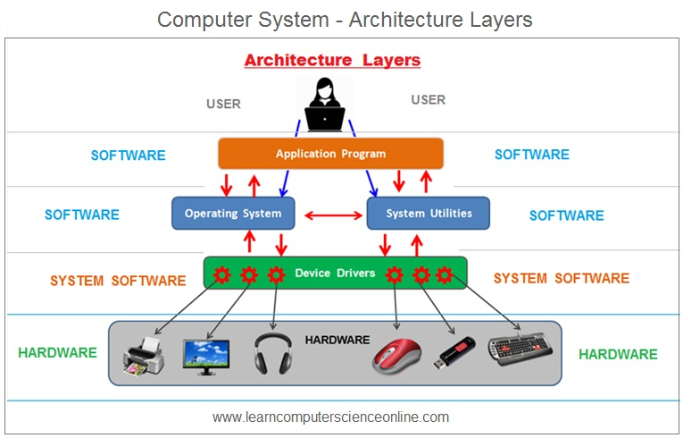
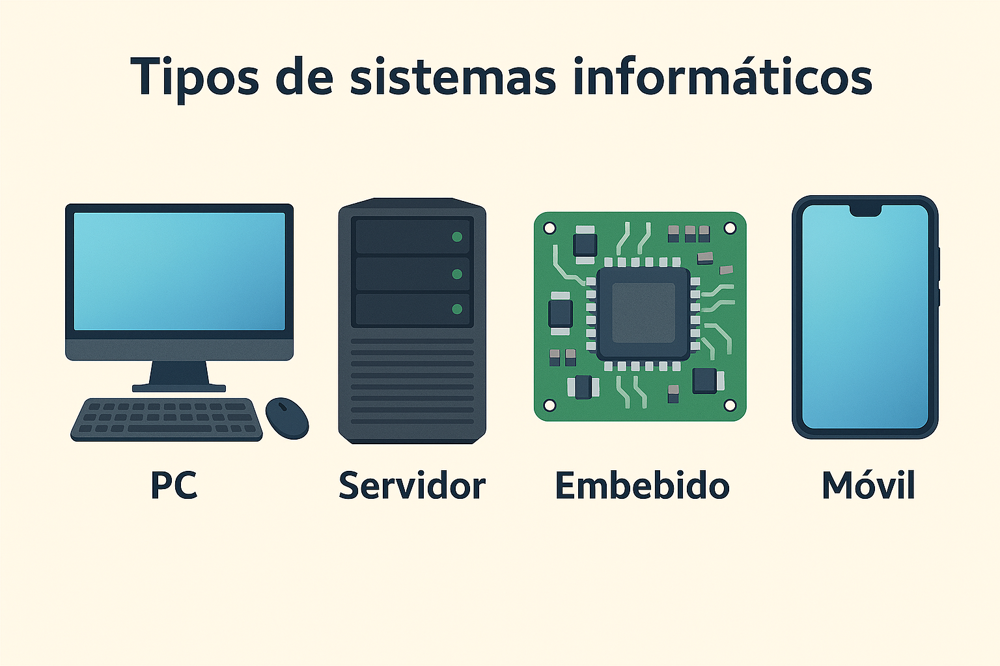

Un **sistema informático** es un conjunto de elementos interrelacionados cuyo objetivo es almacenar, procesar y transmitir información de forma automática. No es simplemente un ordenador: es la combinación de hardware, software y las personas que lo utilizan trabajando de forma coordinada.

<figure markdown="span" align="center">
  { width="70%" }
  <figcaption>Componentes de un sistema informático</figcaption>
</figure>

## Hardware y software

La distinción más fundamental en cualquier sistema informático es la que existe entre hardware y software:

- **Hardware** es todo aquello que podemos tocar físicamente: el procesador, la memoria, el disco duro, el teclado, el monitor... Es la "maquinaria" del sistema.
- **Software** es el componente lógico e intangible: el sistema operativo, las aplicaciones, los drivers... Son las instrucciones que le dicen al hardware qué tiene que hacer.

Ninguno de los dos tiene sentido sin el otro. El hardware sin software es un conjunto de piezas inertes. El software sin hardware no tiene donde ejecutarse.

!!! example "Ejemplo"
    Cuando escribes código en tu IDE, el **hardware** (CPU, RAM, disco) ejecuta y almacena ese código, mientras que el **software** (el IDE, el compilador, el sistema operativo) interpreta y gestiona todo el proceso.

## Tipos de sistemas informáticos

No todos los sistemas informáticos son iguales. Según su propósito y características podemos clasificarlos en:

- **Ordenador personal (PC)**: diseñado para uso individual. Equilibrio entre rendimiento y coste.
- **Servidor**: optimizado para dar servicio a otros equipos en red de forma continua. Prioriza fiabilidad y rendimiento sostenido sobre coste.
- **Sistema embebido**: integrado dentro de otro dispositivo (una lavadora, un coche, un router). Hardware muy específico para una tarea concreta.
- **Dispositivo móvil**: smartphones y tablets. Priorizan bajo consumo energético y tamaño reducido.

<figure markdown="span" align="center">
  { width="70%" }
  <figcaption>Tipos de sistemas informáticos según su propósito</figcaption>
</figure>

## El ordenador como conjunto interrelacionado

La clave para entender el hardware es comprender que **todos los componentes están relacionados entre sí** y que la elección de uno condiciona al resto. No puedes elegir un procesador sin tener en cuenta la placa base que lo soporta, ni la placa base sin considerar el tipo de memoria RAM que acepta.

<figure markdown="span" align="center">
  { width="80%" }
  <figcaption>Relación entre los componentes principales de un ordenador</figcaption>
</figure>

Esta cadena de dependencias es central en la UD01:

- La **CPU** determina el **socket** y el **chipset** de la **placa base**
- La placa base determina el **tipo y velocidad de la RAM**
- El **almacenamiento** se conecta según las interfaces disponibles (SATA, M.2)
- La **fuente de alimentación** debe cubrir el consumo de todos los componentes

!!! tip "Consejo"
    Antes de comprar o montar cualquier sistema, hay que verificar siempre la compatibilidad entre componentes. La web [PCPartPicker](https://pcpartpicker.com) es una herramienta muy útil para esto.

## El software del sistema

Dentro del software, es importante distinguir tres niveles:

- **Firmware**: software de muy bajo nivel grabado en los chips del hardware (BIOS/UEFI). Es el primero en ejecutarse al encender el equipo.
- **Sistema operativo**: gestiona el hardware y proporciona una plataforma para las aplicaciones (Windows, Linux, macOS).
- **Aplicaciones**: programas diseñados para el usuario final (navegador, IDE, suite ofimática).

<figure markdown="span" align="center">
  { width="70%" }
  <figcaption>Capas del software: firmware, SO y aplicaciones</figcaption>
</figure>

Como futuros desarrolladores de aplicaciones, vuestro trabajo se sitúa en la capa más alta, pero entender las capas inferiores os permitirá desarrollar software más eficiente y resolver problemas que de otro modo serían inexplicables.
