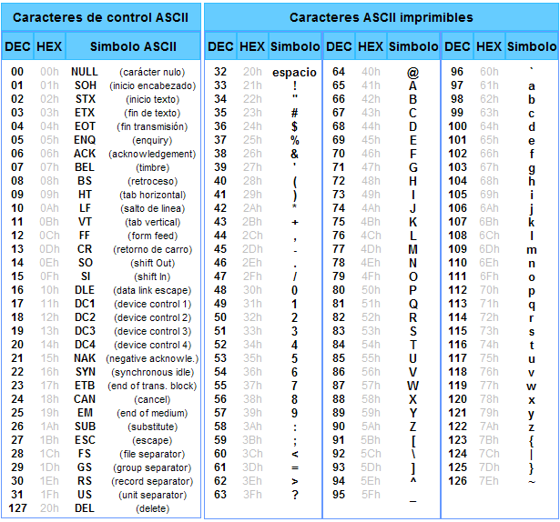
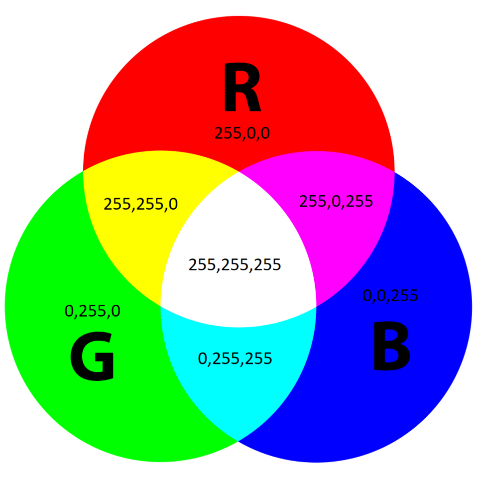

Los ordenadores son máquinas electrónicas que solo entienden dos estados: **tensión** (1) o **ausencia de tensión** (0). Todo lo que procesamos — textos, imágenes, vídeos, programas — se reduce internamente a combinaciones de estos dos valores. Entender cómo se realiza esa representación es fundamental para comprender cómo funciona cualquier sistema informático.

## El sistema binario

El sistema binario es un sistema de numeración en **base 2**. Solo utiliza dos dígitos: `0` y `1`. Cada uno de estos dígitos se denomina **bit** (*binary digit*), y es la unidad mínima de información que puede manejar un ordenador.

Para entender el binario es útil compararlo con el sistema decimal que usamos a diario. En decimal, cada posición de un número representa una potencia de 10: las unidades, las decenas, las centenas... En binario ocurre exactamente lo mismo, pero con potencias de 2.

Por ejemplo, el número decimal `182` lo descomponemos así:

```
1×100 + 8×10 + 2×1  =  182
```

En binario, el número `10110110` se descompone de la siguiente manera, donde cada posición vale el doble que la anterior empezando desde la derecha:

| Posición | Valor (2ⁿ) | Bit | Resultado |
|----------|-----------|-----|-----------|
| 7 | 128 | 1 | 128 |
| 6 | 64  | 0 | 0 |
| 5 | 32  | 1 | 32 |
| 4 | 16  | 1 | 16 |
| 3 | 8   | 0 | 0 |
| 2 | 4   | 1 | 4 |
| 1 | 2   | 1 | 2 |
| 0 | 1   | 0 | 0 |

```
128 + 32 + 16 + 4 + 2 = 182
```

### Conversión de binario a decimal

Para convertir un número binario a decimal simplemente hay que multiplicar cada bit por su valor posicional y sumar los resultados.

!!!example "Ejemplo resuelto: 1011 0110 → decimal"

    Identificamos cada bit y su posición:

    ```
    Bit:      1    0    1    1    0    1    1    0
    Posición: 7    6    5    4    3    2    1    0
    Valor:   128   64   32   16    8    4    2    1
    ```

    Solo sumamos las posiciones donde el bit es `1`:

    ```
    128 + 32 + 16 + 4 + 2 = 182
    ```

    Por tanto `1011 0110` en binario equivale a `182` en decimal.

### Conversión de decimal a binario

El método más habitual para convertir de decimal a binario es la **división sucesiva entre 2**. Se divide el número entre 2 repetidamente y se van anotando los restos. Al final se leen los restos de abajo a arriba.

!!!example "Ejemplo resuelto: 45 → binario"

    ```
    45 ÷ 2 = 22  resto 1   ↑
    22 ÷ 2 = 11  resto 0   ↑
    11 ÷ 2 =  5  resto 1   ↑
     5 ÷ 2 =  2  resto 1   ↑
     2 ÷ 2 =  1  resto 0   ↑
     1 ÷ 2 =  0  resto 1   ↑
    ```

    Leyendo los restos de abajo a arriba: `101101`

    Verificación: `32 + 8 + 4 + 1 = 45` ✓

## Unidades de medida

A partir del bit se construyen unidades mayores para medir cantidades de información. La unidad base es el **byte**, que agrupa 8 bits y permite representar 256 valores diferentes (2⁸).

| Unidad | Símbolo | Equivalencia exacta |
|--------|---------|---------------------|
| Bit | b | unidad mínima |
| Byte | B | 8 bits |
| Kilobyte | KB | 1.024 bytes (2¹⁰) |
| Megabyte | MB | 1.024 KB |
| Gigabyte | GB | 1.024 MB |
| Terabyte | TB | 1.024 GB |
| Petabyte | PB | 1.024 TB |

!!!warning "Decimal vs binario en los fabricantes"
    Los fabricantes de discos duros y memorias USB usan el sistema **decimal** (1 KB = 1.000 bytes) para que las capacidades parezcan mayores. Los sistemas operativos, en cambio, usan el sistema **binario** (1 KB = 1.024 bytes). Por eso un disco de "1 TB" aparece en Windows como aproximadamente 931 GB. No es que el sistema operativo te quite espacio — es simplemente que cuentan de forma diferente.

## El sistema hexadecimal

El sistema hexadecimal es un sistema de numeración en **base 16**. Utiliza los dígitos del 0 al 9 y las letras A, B, C, D, E y F para representar los valores del 10 al 15. Su utilidad principal es que permite expresar de forma compacta valores binarios que de otro modo serían muy largos y difíciles de leer.

La razón de esta comodidad es matemática: **un dígito hexadecimal equivale exactamente a 4 bits**, ya que 2⁴ = 16. Esto significa que un byte (8 bits) siempre se puede expresar con exactamente 2 dígitos hexadecimales, lo que resulta mucho más manejable.

La tabla de equivalencias entre los tres sistemas es:

| Decimal | Binario | Hexadecimal |
|---------|---------|-------------|
| 0  | 0000 | 0 |
| 1  | 0001 | 1 |
| 2  | 0010 | 2 |
| 3  | 0011 | 3 |
| 4  | 0100 | 4 |
| 5  | 0101 | 5 |
| 6  | 0110 | 6 |
| 7  | 0111 | 7 |
| 8  | 1000 | 8 |
| 9  | 1001 | 9 |
| 10 | 1010 | A |
| 11 | 1011 | B |
| 12 | 1100 | C |
| 13 | 1101 | D |
| 14 | 1110 | E |
| 15 | 1111 | F |

En programación, los valores hexadecimales se suelen escribir con el prefijo `0x` para distinguirlos de los decimales. Por ejemplo, `0xFF` equivale a 255 en decimal.

!!!example "Ejemplo resuelto: binario a hexadecimal"

    Para convertir `1011 0110` a hexadecimal, simplemente agrupamos los bits de 4 en 4 empezando por la derecha y convertimos cada grupo:

    ```
    1011  →  B
    0110  →  6
    ```

    Resultado: `0xB6`

!!!example "Ejemplo resuelto: hexadecimal a decimal"

    Convertir `0xFF` a decimal. Igual que en binario, cada posición vale una potencia de la base (16):

    ```
    F × 16¹  +  F × 16⁰
    15 × 16  +  15 × 1
    240      +  15
    = 255
    ```

!!!tip "¿Dónde usamos el hexadecimal en el día a día?"
    - **Colores en HTML/CSS**: `#FF5733` (rojo=FF, verde=57, azul=33)
    - **Direcciones MAC** de tarjetas de red: `A4:C3:F0:85:AC:2D`
    - **Direcciones de memoria** en depuración: `0x7FFF0000`
    - **Valores de error** en Windows (pantalla azul): `0x0000007B`

## Representación de enteros con signo: complemento a 2

Hasta ahora hemos visto cómo representar números enteros positivos. Pero ¿cómo representa el ordenador los números negativos? La solución más utilizada se llama **complemento a 2**.

En un sistema de n bits, el bit más significativo (el de más a la izquierda) actúa como **bit de signo**: si vale `0` el número es positivo, si vale `1` es negativo. El resto de bits representan el valor según el sistema de complemento a 2.

**¿Por qué complemento a 2 y no simplemente cambiar el bit de signo?** La ventaja del complemento a 2 es que permite sumar números positivos y negativos usando exactamente el mismo circuito que suma positivos, sin necesitar circuitos especiales para la resta.

### Cómo obtener el complemento a 2

Para representar un número negativo en complemento a 2 se siguen tres pasos:

1. Escribir el valor absoluto del número en binario con n bits
2. Invertir todos los bits (cambiar 0 por 1 y viceversa) — esto se llama complemento a 1
3. Sumar 1 al resultado

!!!example "Ejemplo resuelto: representar -45 en 8 bits"

    ```
    Paso 1 - 45 en binario (8 bits):   0010 1101
    Paso 2 - Invertir todos los bits:  1101 0010
    Paso 3 - Sumar 1:                  1101 0011
    ```

    `-45` en complemento a 2 con 8 bits es `1101 0011`.

    **Verificación:** Si sumamos `0010 1101` (+45) y `1101 0011` (-45):
    ```
      0010 1101
    + 1101 0011
    -----------
      0000 0000  (el bit de acarreo se descarta)
    ```
    El resultado es 0. ✓

!!!example "Ejemplo resuelto: interpretar 1111 0000"

    El bit de signo es `1`, así que es negativo. Para saber su valor absoluto aplicamos complemento a 2 al revés:

    ```
    Número original:   1111 0000
    Invertir bits:     0000 1111
    Sumar 1:           0001 0000  =  16
    ```

    Por tanto `1111 0000` representa el valor `-16`.

El rango de valores que se puede representar depende del número de bits:

| Bits | Mínimo | Máximo | Tipo en Java/C |
|------|--------|--------|----------------|
| 8 bits | -128 | 127 | `byte` |
| 16 bits | -32.768 | 32.767 | `short` |
| 32 bits | -2.147.483.648 | 2.147.483.647 | `int` |
| 64 bits | -9.223.372.036.854.775.808 | 9.223.372.036.854.775.807 | `long` |

!!!warning "Desbordamiento (overflow)"
    Si intentas almacenar un valor fuera del rango permitido, se produce un **overflow**. Por ejemplo, si sumas 1 al valor máximo de un `byte` (127), el resultado no es 128 sino -128. Este es un error clásico en programación que puede provocar comportamientos inesperados y es importante tenerlo en cuenta en DAM.

## Representación de texto

### ASCII

El código **ASCII** (*American Standard Code for Information Interchange*) fue el primer estándar ampliamente aceptado para representar texto en ordenadores. Fue creado en 1963 y asigna un número del 0 al 127 a cada carácter usando 7 bits.

Los primeros 32 valores (0-31) son **caracteres de control** no imprimibles, como el salto de línea (`\n` = 10), el retorno de carro (`\r` = 13) o el tabulador (`\t` = 9). Estos caracteres no se ven pero tienen un significado especial para los programas. A partir del valor 32 comienzan los caracteres imprimibles: números, letras mayúsculas y minúsculas, signos de puntuación...

<!-- IMG: tabla ASCII completa con los 128 caracteres -->
<figure markdown="span" align="center">
  { width="95%" }
  <figcaption>Tabla ASCII. Representación de caracteres del 0 al 127</figcaption>
</figure>

!!!example "Ejemplo"
    La letra `A` tiene el valor ASCII `65`:

    - En binario: `0100 0001`
    - En hexadecimal: `0x41`

    La palabra `DAM` en ASCII: `D`=68, `A`=65, `M`=77. En hexadecimal: `0x44 0x41 0x4D`.

    Fíjate en un detalle curioso: las letras mayúsculas van del 65 al 90 y las minúsculas del 97 al 122. La diferencia entre una mayúscula y su minúscula es siempre 32, exactamente el bit 5. Por eso convertir entre mayúsculas y minúsculas es una operación muy sencilla a nivel de bits.

La **limitación principal de ASCII** es que solo cubre el inglés básico. No incluye letras acentuadas, la ñ, caracteres del alfabeto griego, árabe, chino ni ningún otro sistema de escritura no anglosajón. Para resolver esto surgieron extensiones como Latin-1 (ISO-8859-1) que añadían 128 caracteres más con acentos y símbolos europeos, pero cada extensión era incompatible con las demás, lo que generaba constantes problemas al intercambiar ficheros entre sistemas.

### Unicode y UTF-8

**Unicode** es el estándar moderno que resuelve definitivamente el problema de la representación de texto. Asigna un número único llamado ***code point*** a cada carácter de todos los sistemas de escritura del mundo, incluyendo emojis. Actualmente cubre más de 140.000 caracteres de más de 150 sistemas de escritura.

**UTF-8** es la codificación de Unicode más utilizada en internet y en el desarrollo de software. Su gran ventaja es que usa un número **variable de bytes** por carácter:

| Tipo de carácter | Bytes necesarios | Ejemplos |
|------------------|-----------------|---------|
| ASCII básico | 1 byte | A, b, 1, @, espacio |
| Caracteres latinos extendidos | 2 bytes | á, é, ñ, ü, ç |
| Caracteres asiáticos y otros | 3 bytes | 中, 日, 한, Ω |
| Emojis y símbolos especiales | 4 bytes | 😀, 🎉, 🔥 |

Esta codificación variable tiene dos ventajas importantes: es completamente compatible con ASCII (un fichero ASCII es también un fichero UTF-8 válido) y es eficiente para textos en español ya que la mayoría de caracteres ocupan 1 o 2 bytes.

!!!tip "¿Por qué importa esto en programación?"
    Los problemas de codificación son una fuente habitual de errores en el desarrollo. Cuando un fichero guardado en UTF-8 se abre con Latin-1 (o viceversa), los caracteres especiales se muestran corruptos: la `ñ` aparece como `ñ`, la `á` como `á`. En DAM os encontraréis con este problema frecuentemente al trabajar con bases de datos, ficheros de configuración, APIs externas y formularios web. La solución siempre es asegurarse de que todo el sistema usa la misma codificación, preferiblemente UTF-8.

## Representación de imágenes

Una imagen digital es una cuadrícula rectangular de **píxeles** (*picture elements*). Cada píxel es el elemento mínimo de la imagen y tiene asignado un color que se representa mediante valores numéricos.

### Imágenes en escala de grises

En una imagen en escala de grises, cada píxel se representa con **1 byte** (8 bits). El valor 0 representa el negro absoluto, el valor 255 representa el blanco puro, y los valores intermedios representan los distintos tonos de gris. Con 8 bits tenemos 256 tonos de gris distintos, suficientes para que el ojo humano no perciba diferencias entre ellos.

### Imágenes en color: modelo RGB

En imágenes en color se usa habitualmente el **modelo RGB** (*Red, Green, Blue*). Cada píxel se representa con **3 bytes**, uno por cada canal de color primario. Mezclando distintas intensidades de rojo, verde y azul se puede obtener cualquier color visible por el ojo humano.

<!-- IMG: cubo de color RGB mostrando la mezcla de los tres canales -->
<figure markdown="span" align="center">
  { width="60%" }
  <figcaption>Modelo de color RGB. Cada canal toma valores de 0 a 255</figcaption>
</figure>

Algunos ejemplos de colores en RGB:

| Color | R | G | B | Hexadecimal |
|-------|---|---|---|-------------|
| Blanco | 255 | 255 | 255 | `#FFFFFF` |
| Negro | 0 | 0 | 0 | `#000000` |
| Rojo puro | 255 | 0 | 0 | `#FF0000` |
| Verde puro | 0 | 255 | 0 | `#00FF00` |
| Azul puro | 0 | 0 | 255 | `#0000FF` |
| Naranja | 255 | 87 | 51 | `#FF5733` |

!!!example "Cálculo del tamaño de una imagen sin comprimir"

    Una imagen de resolución **1920×1080** píxeles en color RGB ocupa:

    ```
    1920 píxeles × 1080 píxeles × 3 bytes/píxel
    = 6.220.800 bytes
    ≈ 5,9 MB
    ```

    Esto explica por qué se inventaron los formatos de compresión: **JPEG** reduce el tamaño descartando información poco perceptible al ojo humano (compresión con pérdida), **PNG** usa compresión sin pérdida de calidad, y **WebP** es el formato moderno que combina alta compresión con buena calidad.

### Resolución y profundidad de color

Dos parámetros definen la calidad de una imagen digital:

- **Resolución**: número total de píxeles, expresado como ancho × alto (por ejemplo, 1920×1080). A mayor resolución, más detalle pero mayor tamaño de fichero.
- **Profundidad de color**: número de bits por píxel. Con 8 bits por canal RGB tenemos 24 bits por píxel, lo que permite representar más de 16 millones de colores diferentes (2²⁴ = 16.777.216).

---

## Ejercicios propuestos

!!!example "Ejercicio 1 — Conversión de bases"

    Convierte los siguientes números decimales a binario y hexadecimal:

    - `255`
    - `100`
    - `16`
    - `200`

    ??? "Solución"
        **255:**
        ```
        255 en binario:  1111 1111
        255 en hex:      0xFF
        ```
        **100:**
        ```
        100 en binario:  0110 0100
        100 en hex:      0x64
        ```
        **16:**
        ```
        16 en binario:   0001 0000
        16 en hex:       0x10
        ```
        **200:**
        ```
        200 en binario:  1100 1000
        200 en hex:      0xC8
        ```

!!!example "Ejercicio 2 — Complemento a 2"

    Representa los siguientes números negativos en complemento a 2 con 8 bits:

    - `-10`
    - `-1`
    - `-128`

    ??? "Solución"
        **-10:**
        ```
        10 en binario:   0000 1010
        Invertir:        1111 0101
        Sumar 1:         1111 0110
        ```
        **-1:**
        ```
        1 en binario:    0000 0001
        Invertir:        1111 1110
        Sumar 1:         1111 1111
        ```
        Curioso: -1 se representa como todos los bits a 1.

        **-128:**
        ```
        128 en binario:  1000 0000
        Invertir:        0111 1111
        Sumar 1:         1000 0000
        ```
        El mínimo de un byte con signo tiene la misma representación binaria que 128 sin signo.

!!!example "Ejercicio 3 — Codificación de texto"

    ¿Cuántos bytes ocupa cada una de las siguientes cadenas en UTF-8?

    - `"Hola"`
    - `"Adiós"`
    - `"¡Buenos días!"`

    ??? "Solución"
        - `"Hola"` → H(1) + o(1) + l(1) + a(1) = **4 bytes**
        - `"Adiós"` → A(1) + d(1) + i(1) + ó(2) + s(1) = **6 bytes**
        - `"¡Buenos días!"` → ¡(2) + B(1) + u(1) + e(1) + n(1) + o(1) + s(1) + _(1) + d(1) + í(2) + a(1) + s(1) + !(1) = **16 bytes**

!!!example "Ejercicio 4 — Tamaño de imagen"

    Calcula el tamaño sin comprimir de una imagen de **800×600** píxeles en color RGB. ¿Y en escala de grises?

    ??? "Solución"
        **Color RGB:**
        ```
        800 × 600 × 3 bytes = 1.440.000 bytes ≈ 1,37 MB
        ```
        **Escala de grises:**
        ```
        800 × 600 × 1 byte = 480.000 bytes ≈ 469 KB
        ```