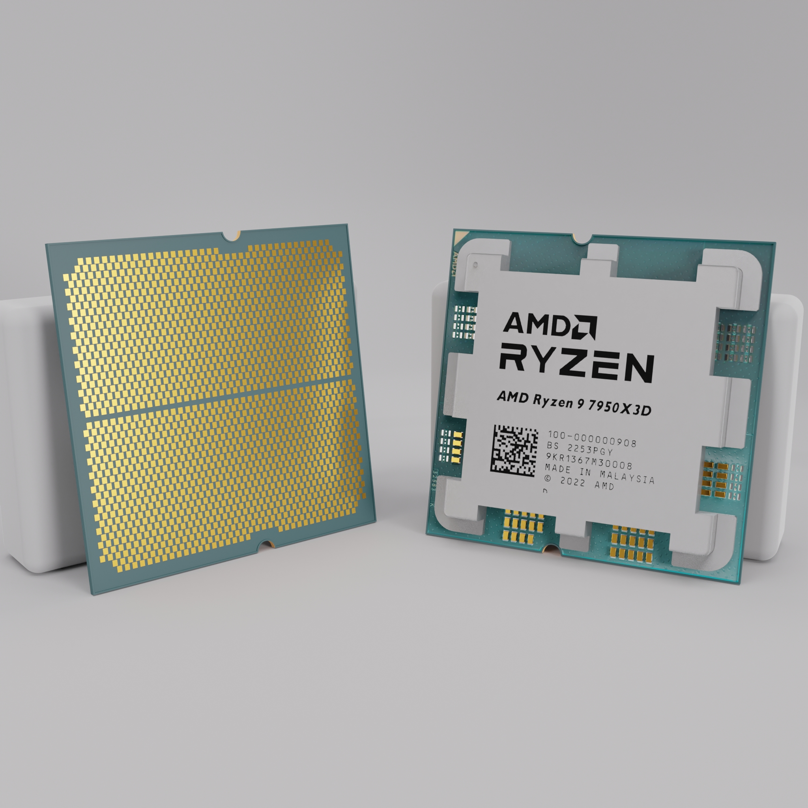
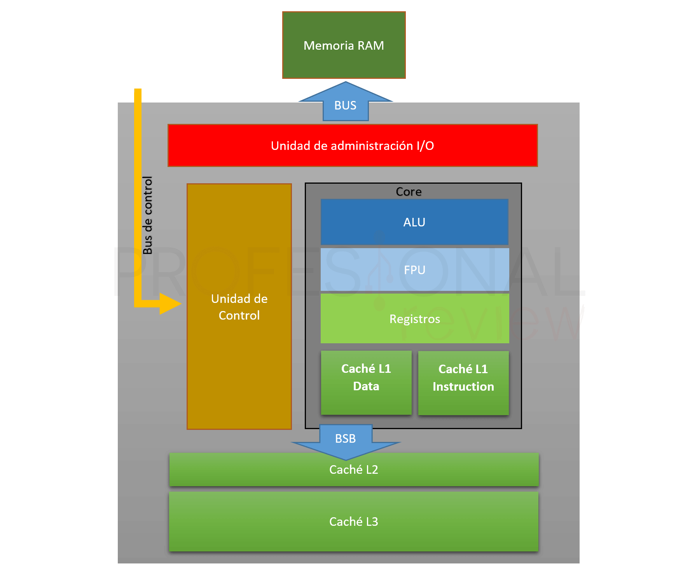
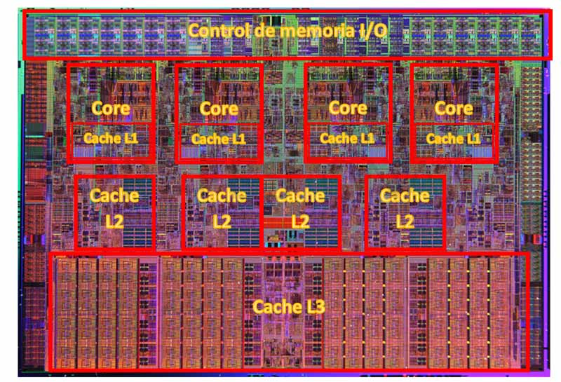
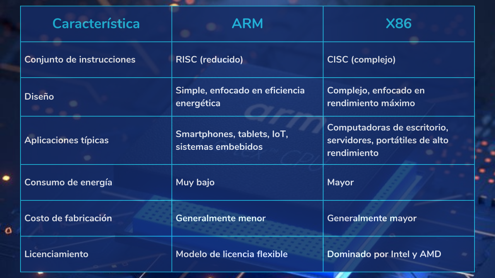
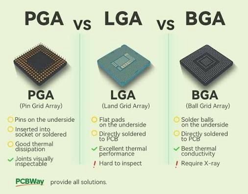

La **CPU** (*Central Processing Unit*) o procesador es el componente central de cualquier sistema informático. Es el "cerebro" del ordenador: interpreta y ejecuta las instrucciones de los programas y coordina el resto de componentes. Comprender cómo ha evolucionado la CPU es fundamental para entender por qué los componentes de un ordenador no son intercambiables libremente: **cada generación de procesador define una plataforma completa** que incluye socket, chipset y tipo de memoria.

<!-- IMG: fotografía de una CPU moderna Intel o AMD sobre su socket -->
<figure markdown="span" align="center">
  { width="60%" }
  <figcaption>CPU moderna. El procesador es el componente central de cualquier sistema informático</figcaption>
</figure>

## Componentes internos de la CPU

Aunque desde fuera la CPU es simplemente un chip, en su interior contiene miles de millones de transistores organizados en circuitos con funciones muy específicas.

<!-- IMG: diagrama simplificado con UC, ALU, registros y niveles de caché L1/L2/L3 -->
<figure markdown="span" align="center">
  { width="70%" }
  <figcaption>Componentes internos principales de una CPU y jerarquía de memoria</figcaption>
</figure>

### Unidad de Control (UC)

La **Unidad de Control** dirige y coordina el funcionamiento de toda la CPU. Lee las instrucciones del programa desde la memoria, las decodifica para entender qué operación hay que realizar, y envía las señales necesarias al resto de componentes para que las ejecuten. No realiza cálculos por sí misma, pero sin ella nada funcionaría: es el "director de orquesta" del procesador.

### Unidad Aritmético-Lógica (ALU)

La **Unidad Aritmético-Lógica** realiza las operaciones matemáticas y lógicas:

- **Operaciones aritméticas**: suma, resta, multiplicación, división
- **Operaciones lógicas**: AND, OR, NOT, XOR
- **Comparaciones**: mayor que, menor que, igual que

Cualquier cálculo que realiza un programa, por complejo que parezca, se descompone en estas operaciones básicas. Los procesadores modernos incluyen también unidades especializadas para operaciones en coma flotante (FPU) y para cálculos vectoriales (SIMD).

### Registros

Los **registros** son pequeñas memorias integradas directamente en la CPU, extremadamente rápidas. Son el lugar donde la CPU almacena temporalmente los datos con los que está trabajando: el dato que acaba de leer de memoria, el resultado de la última operación, la dirección de la siguiente instrucción... Su velocidad es muy superior a cualquier otro tipo de memoria porque están físicamente dentro del procesador.

### Caché

La **memoria caché** es una memoria de alta velocidad integrada en la CPU que actúa como intermediaria entre los registros y la RAM. Su función es guardar copias de los datos e instrucciones que se usan con más frecuencia para que la CPU no tenga que ir a buscarlos a la RAM cada vez, ya que la RAM es mucho más lenta que el procesador.

Los procesadores modernos organizan la caché en varios niveles:

| Nivel | Tamaño típico | Velocidad | Compartida entre |
|-------|--------------|-----------|-----------------|
| L1 | 32 – 128 KB por núcleo | Muy alta (~1-4 ciclos) | Solo ese núcleo |
| L2 | 256 KB – 2 MB por núcleo | Alta (~10-20 ciclos) | Solo ese núcleo |
| L3 | 8 – 64 MB | Media (~40-60 ciclos) | Todos los núcleos |

Cuanto más cerca está la caché del núcleo (L1), más rápida es pero menos capacidad tiene. Cuando un dato no se encuentra en caché se produce un **cache miss** y la CPU debe esperar a que llegue desde la RAM, lo que ralentiza la ejecución.

<!-- IMG: diagrama simplificado con UC, ALU, registros y niveles de caché L1/L2/L3 -->
<figure markdown="span" align="center">
  { width="70%" }
  <figcaption>Caches de una procesador con 4 núcleos</figcaption>
</figure>

## Núcleos y multithreading

Los procesadores modernos tienen varios **núcleos** (*cores*). Cada núcleo es una unidad de procesamiento completa e independiente con su propia UC, ALU, registros y caché L1/L2. Un procesador con 8 núcleos puede ejecutar 8 tareas completamente en paralelo.

Además, muchos procesadores implementan **Hyper-Threading** (Intel) o **SMT** (AMD), tecnología que permite a cada núcleo físico ejecutar dos hilos (*threads*) de forma simultánea. El sistema operativo ve el doble de núcleos lógicos: un procesador de 8 núcleos con HT aparece como 16 núcleos lógicos.

Intel introdujo a partir de la 12ª generación una arquitectura **híbrida** con dos tipos de núcleos:

- **P-cores** (*Performance cores*): núcleos de alto rendimiento para tareas exigentes
- **E-cores** (*Efficiency cores*): núcleos de alta eficiencia para tareas en segundo plano

Esta idea, inspirada en los diseños ARM, permite combinar alto rendimiento cuando se necesita con bajo consumo cuando no.

### Tecnología Boost: frecuencia dinámica

Un procesador tiene dos frecuencias de funcionamiento:

- **Frecuencia base**: la velocidad garantizada a la que funciona el procesador de forma continua dentro de su TDP (consumo máximo de diseño).
- **Frecuencia boost** (o turbo): la velocidad máxima que puede alcanzar de forma temporal cuando la carga de trabajo y las condiciones térmicas lo permiten.

La tecnología Boost permite que el procesador "acelere" automáticamente cuando hay tareas exigentes y la temperatura y el consumo están dentro de los límites. Cuando se calienta demasiado o supera el TDP, reduce la frecuencia de vuelta a la base.

#### Intel Turbo Boost

Intel llama a esta tecnología **Turbo Boost**. En los procesadores actuales, con arquitectura híbrida, el sistema operativo (a través del *Thread Director* de Intel) decide qué tareas van a los P-cores (que tienen mayor frecuencia boost) y cuáles a los E-cores.

#### AMD Precision Boost 2

AMD implementa la misma idea con **Precision Boost 2**, pero con una diferencia importante: el algoritmo de AMD es más granular. En lugar de aplicar boost a todos los núcleos por igual, Precision Boost 2 ajusta la frecuencia **núcleo a núcleo** en incrementos de 25 MHz cada milisegundo, según la temperatura, el voltaje y la carga de cada núcleo individualmente. El resultado es que los núcleos menos cargados pueden alcanzar frecuencias más altas mientras los más ocupados trabajan a menor velocidad.

AMD también ofrece **Precision Boost Overdrive (PBO)**, una función avanzada disponible en procesadores y placas base compatibles que permite al procesador superar los límites de fábrica de forma controlada, aprovechando mejores sistemas de refrigeración para extraer más rendimiento sin overclocking manual.

| Tecnología | Fabricante | Granularidad | Control manual |
|------------|-----------|-------------|----------------|
| Turbo Boost | Intel | Por grupo de núcleos | No (automático) |
| Precision Boost 2 | AMD | Por núcleo individual (25 MHz) | PBO (opcional) |

!!! tip "¿Qué significa esto en la práctica?"
    Cuando ves en las especificaciones de un procesador "Base: 4,3 GHz / Boost: 5,7 GHz", el procesador **no** funciona siempre a 5,7 GHz. Esa es la frecuencia máxima que puede alcanzar un núcleo en condiciones ideales durante un instante. La frecuencia real depende constantemente de la temperatura, el número de núcleos activos y la calidad del sistema de refrigeración. Un buen disipador no solo evita el calentamiento — también permite que el procesador mantenga frecuencias boost más altas durante más tiempo.

!!!example "Ejemplo de especificaciones de procesadores"

    [Especificaciones Intel® Core™ Ultra 7 265K](https://ark.intel.com/content/www/us/en/ark/products/236847/intel-core-ultra-7-processor-265k-30m-cache-up-to-5-50-ghz.html)

    [Especificaciones AMD Ryzen 9 9950X](https://www.amd.com/en/products/processors/desktops/ryzen/9000-series/amd-ryzen-9-9950x.html)

    [Especificaciones AMD Ryzen 7 9700X](https://www.amd.com/en/products/processors/desktops/ryzen/9000-series/amd-ryzen-7-9700x.html)

    Practica leyendo las especificaciones oficiales e identifica: frecuencia base, frecuencia boost, número de núcleos, caché L3, socket y chipsets compatibles.

## Arquitecturas: x86-64 y ARM

La **arquitectura** de un procesador define el conjunto de instrucciones que puede ejecutar. Las dos arquitecturas más importantes hoy en día son:

### x86-64

La arquitectura **x86-64** es la dominante en ordenadores de escritorio, portátiles y servidores. Originalmente x86 era una arquitectura de 32 bits creada por Intel en 1978; AMD la extendió a 64 bits en 2003 y hoy todos los procesadores de escritorio Intel y AMD la implementan.

Es una arquitectura **CISC** (*Complex Instruction Set Computer*): tiene un conjunto de instrucciones muy amplio y complejo, lo que ofrece máxima compatibilidad con software existente pero requiere circuitos más complejos y consume más energía.

### ARM

La arquitectura **ARM** es la dominante en dispositivos móviles y está ganando terreno rápidamente en portátiles y servidores. Es una arquitectura **RISC** (*Reduced Instruction Set Computer*): instrucciones más simples y uniformes que permiten diseños más eficientes energéticamente.

El gran cambio de los últimos años es que ARM ha dejado de ser sinónimo de "menos potente". Los chips **Apple Silicon** y los **Snapdragon X** de Qualcomm basados en ARM ofrecen un rendimiento excelente con un consumo energético muy inferior a x86-64.

<!-- IMG: comparativa consumo vs rendimiento x86 vs ARM -->
<figure markdown="span" align="center">
  { width="90%" }
  <figcaption>Comparativa de arquitecturas: x86-64 (Intel/AMD) vs ARM (Apple/Qualcomm)</figcaption>
</figure>

## El socket: la clave de la compatibilidad

El **socket** es el conector físico de la placa base donde se instala el procesador. Es **el primer elemento que define la compatibilidad**: una CPU solo funciona en una placa base que tenga exactamente el mismo socket. No hay adaptadores ni trucos posibles.

Existen tres tipos de montaje:

| Tipo | Pines en | Uso típico | Reemplazable |
|------|----------|-----------|--------------|
| **LGA** (*Land Grid Array*) | Socket (placa base) | Intel desktop y servidor | Sí |
| **PGA** (*Pin Grid Array*) | CPU | AMD desktop hasta AM4 | Sí |
| **BGA** (*Ball Grid Array*) | Soldado a la placa | Portátiles, móviles, Apple | No |

<!-- IMG: comparativa visual LGA vs PGA vs BGA con detalle de pines -->
<figure markdown="span" align="center">
  { width="90%" }
  <figcaption>Tipos de montaje: LGA (Intel desktop), PGA (AMD hasta AM4), BGA (soldado en portátiles)</figcaption>
</figure>

!!! warning "Compatibilidad: socket + chipset + memoria RAM"
    El socket es solo el primer nivel de compatibilidad. Además del socket, hay que verificar:

    - Que el **chipset** de la placa base soporte esa CPU concreta (dentro de un mismo socket puede haber restricciones por chipset o por versión de BIOS)
    - Que el **tipo de RAM** que acepta la placa base sea el correcto (DDR4 o DDR5 según la generación)

    Veremos esto en detalle en el tema de la placa base. Por ahora, lo importante es entender que **CPU, placa base y RAM forman una triada inseparable**.

---

## Evolución de procesadores Intel

Intel organiza sus procesadores de consumo en generaciones numeradas. Cada salto de generación suele traer mejoras en rendimiento, eficiencia y a menudo un cambio de socket o chipset. Comprender esta evolución ayuda a entender qué equipos son modernos, qué piezas son compatibles entre sí y qué tiene sentido comprar hoy.

| Generación | Nombre clave | Año | Socket | RAM | Núcleos máx. | Litografía |
|------------|-------------|-----|--------|-----|--------------|-----------|
| 6ª gen | Skylake | 2015 | LGA 1151 | DDR4 / DDR3L | 4 | 14 nm |
| 7ª gen | Kaby Lake | 2017 | LGA 1151 | DDR4 / DDR3L | 4 | 14 nm |
| 8ª gen | Coffee Lake | 2017 | LGA 1151 v2 | DDR4 | 6 | 14 nm |
| 9ª gen | Coffee Lake Refresh | 2018 | LGA 1151 v2 | DDR4 | 8 | 14 nm |
| 10ª gen | Comet Lake | 2020 | LGA 1200 | DDR4 | 10 | 14 nm |
| 11ª gen | Rocket Lake | 2021 | LGA 1200 | DDR4 | 8 | 14 nm |
| 12ª gen | Alder Lake | 2021 | LGA 1700 | DDR4 / DDR5 | 16 (8P+8E) | Intel 7 (10 nm) |
| 13ª gen | Raptor Lake | 2022 | LGA 1700 | DDR4 / DDR5 | 24 (8P+16E) | Intel 7 (10 nm) |
| 14ª gen | Raptor Lake Refresh | 2023 | LGA 1700 | DDR4 / DDR5 | 24 (8P+16E) | Intel 7 (10 nm) |
| Core Ultra 200S | Arrow Lake | 2024 | LGA 1851 | DDR5 | 24 (8P+16E) | Intel 3 (7 nm) |

!!! info "Puntos clave de la evolución Intel"
    - **LGA 1151** duró de 6ª a 9ª gen, pero **ojo**: 6ª/7ª y 8ª/9ª usan el mismo conector físico pero no son compatibles eléctricamente entre sí.
    - **LGA 1200** fue exclusivo de 10ª y 11ª gen (solo 2 generaciones).
    - **LGA 1700** fue el más longevo reciente: compatible con 12ª, 13ª y 14ª gen.
    - **LGA 1851** es el socket actual para Arrow Lake (Core Ultra 200S).
    - La arquitectura **híbrida P-cores + E-cores** llegó con la 12ª generación.
    - DDR5 se introdujo con la 12ª gen, pero LGA 1700 también acepta DDR4 dependiendo de la placa.

### Gamas actuales Intel — Core Ultra Serie 200 (Arrow Lake)

| Modelo | Núcleos | P-cores | E-cores | Caché L3 | TDP base |
|--------|---------|---------|---------|----------|----------|
| Core Ultra 9 285K | 24 | 8 | 16 | 36 MB | 125 W |
| Core Ultra 7 265K | 20 | 8 | 12 | 30 MB | 125 W |
| Core Ultra 7 265KF | 20 | 8 | 12 | 30 MB | 125 W |
| Core Ultra 5 245K | 14 | 6 | 8 | 24 MB | 125 W |
| Core Ultra 5 245KF | 14 | 6 | 8 | 24 MB | 125 W |

---

## Evolución de procesadores AMD

AMD ha seguido una estrategia diferente a Intel: ha apostado por mantener el socket AM4 durante muchos años (2016-2022), lo que permitió actualizar el procesador sin cambiar la placa base. Esto ha generado mucha fidelidad entre sus usuarios.

| Generación | Arquitectura | Año | Socket | RAM | Núcleos máx. | Litografía |
|------------|-------------|-----|--------|-----|--------------|-----------|
| Ryzen 1000 | Zen | 2017 | AM4 | DDR4 | 8 | 14 nm |
| Ryzen 2000 | Zen+ | 2018 | AM4 | DDR4 | 16 | 12 nm |
| Ryzen 3000 | Zen 2 | 2019 | AM4 | DDR4 | 16 | 7 nm |
| Ryzen 4000G | Zen 2 (APU) | 2020 | AM4 | DDR4 | 8 | 7 nm |
| Ryzen 5000 | Zen 3 | 2020 | AM4 | DDR4 | 16 | 7 nm |
| Ryzen 5000X3D | Zen 3 + 3D V-Cache | 2022 | AM4 | DDR4 | 8 | 7 nm |
| Ryzen 7000 | Zen 4 | 2022 | AM5 | DDR5 | 16 | 5 nm |
| Ryzen 7000X3D | Zen 4 + 3D V-Cache | 2023 | AM5 | DDR5 | 16 | 5 nm |
| Ryzen 8000G | Zen 4 (APU) | 2024 | AM4/AM5 | DDR5 | 8 | 4 nm |
| Ryzen 9000 | Zen 5 | 2024 | AM5 | DDR5 | 16 | 4 nm |

!!! info "Puntos clave de la evolución AMD"
    - **AM4** fue el socket más longevo de la historia reciente: 6 años y compatibilidad desde Zen hasta Zen 3.
    - **AM5** llegó con Ryzen 7000 en 2022 y AMD ha prometido mantenerlo hasta al menos 2027.
    - El salto de AM4 a AM5 implicó también el salto obligatorio a **DDR5** (AM5 no acepta DDR4).
    - La tecnología **3D V-Cache** (apilamiento de caché L3 adicional encima del die) es exclusiva de AMD y supone una mejora enorme en gaming y aplicaciones con mucho acceso a datos.
    - AMD cambió de **PGA** (pines en la CPU en AM4) a **LGA** (pines en el socket en AM5).

### Gamas actuales AMD — Ryzen 9000 (Zen 5)

| Modelo | Núcleos / Hilos | Caché L3 | Frecuencia boost | TDP |
|--------|----------------|----------|-----------------|-----|
| Ryzen 9 9950X | 16 / 32 | 64 MB | 5,7 GHz | 170 W |
| Ryzen 9 9900X | 12 / 24 | 64 MB | 5,6 GHz | 120 W |
| Ryzen 7 9700X | 8 / 16 | 32 MB | 5,5 GHz | 65 W |
| Ryzen 5 9600X | 6 / 12 | 32 MB | 5,4 GHz | 65 W |
| Ryzen 5 9600 | 6 / 12 | 32 MB | 5,1 GHz | 65 W |

---

## Apple Silicon

Apple diseña sus propios procesadores basados en ARM para sus Mac, iPad e iPhone desde 2020, cuando abandonó los procesadores Intel. La familia **Apple M** ha redefinido las expectativas de rendimiento por vatio en el segmento de portátiles y sobremesa compactos.

La característica más destacada de Apple Silicon es la **memoria unificada** (*Unified Memory Architecture*): CPU, GPU y el resto de unidades comparten el mismo pool de memoria de muy alta velocidad y muy alto ancho de banda, integrado en el mismo chip. Esto elimina la necesidad de copiar datos entre memorias separadas y es especialmente beneficioso para edición de vídeo, diseño y desarrollo.

| Chip | Año | Núcleos CPU | Núcleos GPU | Memoria unificada | Proceso |
|------|-----|-------------|-------------|-------------------|---------|
| M1 | 2020 | 8 (4P+4E) | 7-8 | 8-16 GB | 5 nm |
| M1 Pro | 2021 | 10 (8P+2E) | 16 | 16-32 GB | 5 nm |
| M1 Max | 2021 | 10 (8P+2E) | 32 | 32-64 GB | 5 nm |
| M1 Ultra | 2022 | 20 (16P+4E) | 64 | 64-128 GB | 5 nm |
| M2 | 2022 | 8 (4P+4E) | 10 | 8-24 GB | 5 nm (2ª gen) |
| M2 Pro | 2023 | 12 (8P+4E) | 19 | 16-32 GB | 5 nm (2ª gen) |
| M2 Max | 2023 | 12 (8P+4E) | 38 | 32-96 GB | 5 nm (2ª gen) |
| M2 Ultra | 2023 | 24 (16P+8E) | 76 | 64-192 GB | 5 nm (2ª gen) |
| M3 | 2023 | 8 (4P+4E) | 10 | 8-24 GB | 3 nm |
| M3 Pro | 2023 | 12 (6P+6E) | 18 | 18-36 GB | 3 nm |
| M3 Max | 2023 | 16 (12P+4E) | 40 | 36-128 GB | 3 nm |
| M4 | 2024 | 10 (4P+6E) | 10 | 16-32 GB | 3 nm (2ª gen) |
| M4 Pro | 2024 | 14 (10P+4E) | 20 | 24-64 GB | 3 nm (2ª gen) |
| M4 Max | 2024 | 16 (12P+4E) | 40 | 36-128 GB | 3 nm (2ª gen) |

!!! warning "Limitación importante de Apple Silicon"
    Los chips Apple Silicon solo funcionan en hardware Apple (Mac, iPad). No existe ninguna placa base de mercado que los soporte. Además, al estar soldados en formato BGA no son actualizables ni reemplazables. Si necesitas más RAM o más CPU en el futuro, tendrás que comprar un equipo nuevo.

---

## Qualcomm Snapdragon X (Windows ARM)

Qualcomm ha llevado la eficiencia de ARM al ecosistema Windows con los procesadores **Snapdragon X**, que incorporan núcleos propios **Oryon** diseñados por el equipo que anteriormente trabajaba en Apple Silicon:

| Chip | Núcleos | Frecuencia | GPU | Proceso |
|------|---------|-----------|-----|---------|
| Snapdragon X Elite X1E-84-100 | 12 Oryon | hasta 4,3 GHz | Adreno X1 | 4 nm |
| Snapdragon X Elite X1E-80-100 | 12 Oryon | hasta 4,0 GHz | Adreno X1 | 4 nm |
| Snapdragon X Plus X1P-64-100 | 10 Oryon | hasta 3,4 GHz | Adreno X1 | 4 nm |
| Snapdragon X Plus X1P-46-100 | 8 Oryon | hasta 3,4 GHz | Adreno X1 | 4 nm |

!!! info "El reto de Snapdragon X en Windows"
    El principal desafío es la **compatibilidad de software**: Windows ARM ejecuta aplicaciones x86 mediante una capa de emulación que reduce el rendimiento. Las aplicaciones compiladas nativamente para ARM64 (cada vez más) funcionan a pleno rendimiento. En el ámbito del desarrollo, herramientas como VS Code, Android Studio, IntelliJ y Docker ya tienen versiones ARM64 nativas.

---

## Comparativa general de plataformas

| Plataforma | Arq. | Socket | RAM | Punto fuerte | Punto débil |
|------------|------|--------|-----|--------------|-------------|
| Intel Core Ultra 200S | x86-64 | LGA 1851 | DDR5 | Compatibilidad total, ecosistema maduro | Mayor consumo que ARM |
| AMD Ryzen 9000 | x86-64 | AM5 | DDR5 | Precio/rendimiento, socket duradero | Gaming monohilo vs Intel |
| Apple M4 | ARM | BGA (soldado) | Unificada | Eficiencia, rendimiento/vatio | Solo macOS, no ampliable |
| Snapdragon X | ARM | BGA (soldado) | LPDDR5X | Batería, conectividad 5G | Compatibilidad software |

---

## La triada CPU-Placa base-RAM

Para terminar este tema, es fundamental interiorizar esta idea que guiará todo el estudio del hardware:

```
CPU  ──────────►  Socket  ──────────►  Placa base
                                           │
                                           ▼
                                        Chipset
                                           │
                                           ▼
                                    Tipo de RAM
                               (DDR4 o DDR5, velocidad)
```

**No puedes elegir una CPU sin saber qué socket usa, y ese socket determina qué placas base son compatibles, y la placa base determina qué tipo de RAM admite.** En el siguiente tema veremos la placa base y el chipset en detalle, completando este puzzle de compatibilidades.

!!! tip "¿Qué procesador elegir para un equipo de desarrollo DAM?"
    Para virtualización intensiva (lo que haremos en este curso) se recomienda mínimo 6 núcleos y 16 GB de RAM. Un **Ryzen 5 9600X** con placa AM5 y 32 GB DDR5 es una opción excelente de precio/rendimiento. Un **Core Ultra 5 245K** con placa LGA 1851 es la alternativa Intel equivalente. Si el presupuesto lo permite y trabajas en macOS, un **MacBook con M3 o M4** es imbatible en autonomía y rendimiento silencioso para desarrollo.
