La **placa base** (*motherboard*) es el componente que interconecta todos los elementos del sistema informático. Es el "sistema nervioso" del ordenador: todos los componentes — CPU, RAM, almacenamiento, tarjetas de expansión — se conectan a ella y se comunican a través de sus circuitos. Elegir una placa base no es solo elegir un soporte físico: es elegir una plataforma completa que determina qué CPU podemos usar, qué RAM admite, cuántos dispositivos podemos conectar y con qué rendimiento.

<!-- IMG: fotografía de una placa base ATX moderna con sus componentes identificados -->
<figure markdown="span" align="center">
  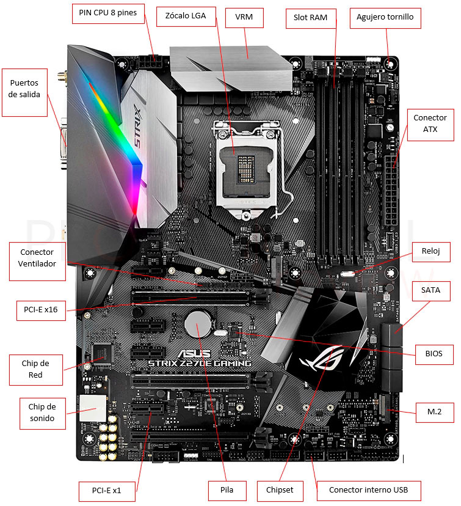{ width="90%" }
  <figcaption>Placa base ATX moderna con sus principales componentes identificados</figcaption>
</figure>

## Factor de forma

El **factor de forma** define las dimensiones físicas de la placa base y por tanto el tipo de caja en la que puede instalarse. También determina cuántos slots de expansión y conectores tiene disponibles.

| Factor de forma | Dimensiones | Slots PCIe | Uso típico |
|-----------------|------------|-----------|-----------|
| **E-ATX** | 305 × 330 mm | 4-7 | Workstation, servidores, enthusiast |
| **ATX** | 305 × 244 mm | 3-5 | Desktop estándar, gaming, desarrollo |
| **Micro-ATX** | 244 × 244 mm | 2-4 | Desktop compacto, ofimática |
| **Mini-ITX** | 170 × 170 mm | 1 | PC compacto, HTPC, mini-PC |

<!-- IMG: comparativa tamaños ATX vs Micro-ATX vs Mini-ITX -->
<figure markdown="span" align="center">
  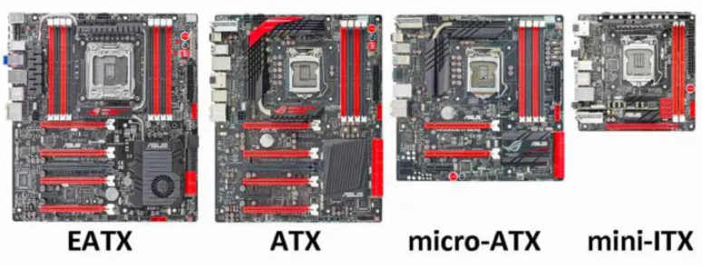{ width="70%" }
  <figcaption>Comparativa de tamaños: E-ATX, ATX, Micro-ATX y Mini-ITX</figcaption>
</figure>

!!! tip "¿Qué factor de forma elegir?"
    Para un equipo de desarrollo o servidor de aula, **ATX** es la opción más equilibrada: ofrece suficientes slots de expansión, buena disipación térmica y compatibilidad con la mayoría de cajas. Mini-ITX es interesante para equipos compactos pero limita mucho las posibilidades de expansión.

## El chipset: el director del tráfico

El **chipset** es el conjunto de circuitos integrados en la placa base que gestiona la comunicación entre la CPU y el resto de componentes. Es, junto con el socket, el elemento que más condiciona la compatibilidad y las capacidades del sistema.

Históricamente el chipset se dividía en dos chips:

- **Puente norte** (*Northbridge*): conectaba la CPU con la RAM y la tarjeta gráfica (PCIe). Era el más crítico porque manejaba el tráfico de mayor ancho de banda.
- **Puente sur** (*Southbridge*): conectaba los dispositivos más lentos: USB, SATA, audio, red...

<!-- IMG: diagrama histórico con puente norte y puente sur -->
<figure markdown="span" align="center">
  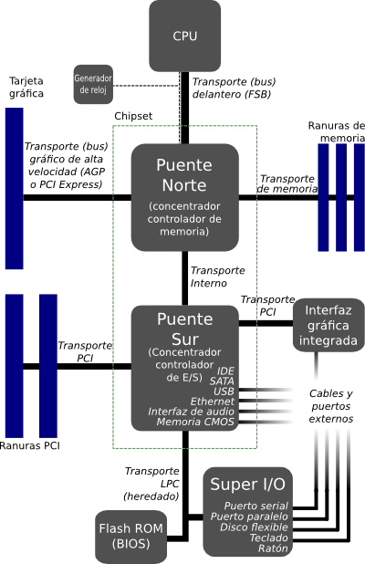{ width="85%" }
  <figcaption>Arquitectura clásica con Northbridge y Southbridge</figcaption>
</figure>

En los procesadores modernos el **puente norte ha desaparecido**: sus funciones (controlador de memoria RAM y el enlace PCIe principal hacia la GPU) se han integrado directamente en la CPU. El chipset actual es heredero del antiguo Southbridge y se encarga de gestionar el resto de conectividad: puertos USB adicionales, puertos SATA, slots M.2 secundarios, audio y red.

<!-- IMG: diagrama moderno CPU con controlador de memoria integrado + chipset -->
<figure markdown="span" align="center">
  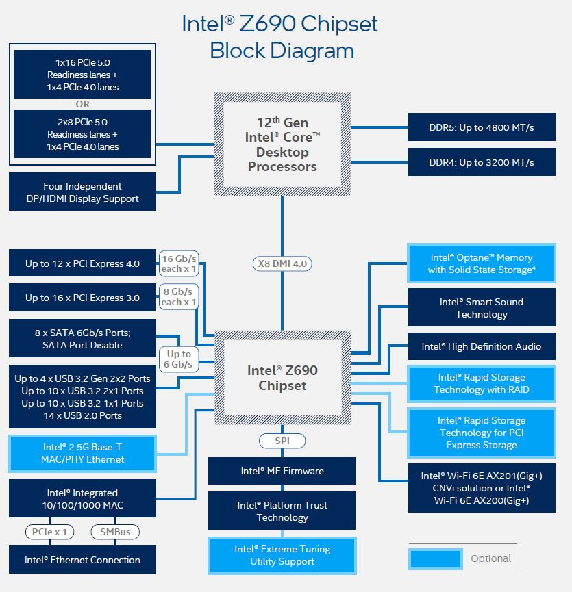{ width="70%" }
  <figcaption>Arquitectura moderna: el controlador de memoria y PCIe principal están integrados en la CPU</figcaption>
</figure>

La CPU y el chipset se comunican a través de un enlace de alta velocidad llamado **DMI** (*Direct Media Interface* en Intel) o **GPP** (*General Purpose Ports* en AMD).

## PCIe y el concepto de lanes

**PCIe** (*PCI Express*) es el bus de comunicación de alta velocidad que conecta la CPU (y el chipset) con las tarjetas de expansión: tarjetas gráficas, tarjetas de red, tarjetas de sonido, SSDs M.2... Entender cómo funciona PCIe es fundamental para comprender las limitaciones reales de un sistema.

### ¿Qué es una lane?

Una **lane PCIe** es un canal de comunicación bidireccional. Cada lane tiene un ancho de banda determinado según la versión de PCIe:

| Versión PCIe | Año | Ancho de banda por lane | Ancho de banda x16 |
|-------------|-----|------------------------|-------------------|
| PCIe 3.0 | 2010 | ~1 GB/s | ~16 GB/s |
| PCIe 4.0 | 2017 | ~2 GB/s | ~32 GB/s |
| PCIe 5.0 | 2019 | ~4 GB/s | ~64 GB/s |
| PCIe 6.0 | 2022 | ~8 GB/s | ~128 GB/s |

Los slots físicos de PCIe se denominan según el número de lanes que usan: **x1, x4, x8, x16**. Una tarjeta gráfica de alto rendimiento usa un slot x16; una tarjeta de red puede usar solo x1 o x4.

### Las lanes son un recurso limitado

Este es el concepto más importante de este apartado: **el número total de lanes PCIe es fijo** y está repartido entre la CPU y el chipset. No se puede superar ese límite, y si intentamos conectar más dispositivos de los que las lanes permiten, el sistema tiene que **repartir** las lanes disponibles entre ellos, reduciendo el ancho de banda de cada uno.

<!-- IMG: diagrama de reparto de lanes entre GPU, M.2 y otros dispositivos -->
<figure markdown="span" align="center">
  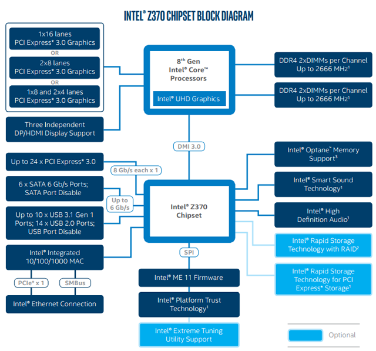{ width="80%" }
  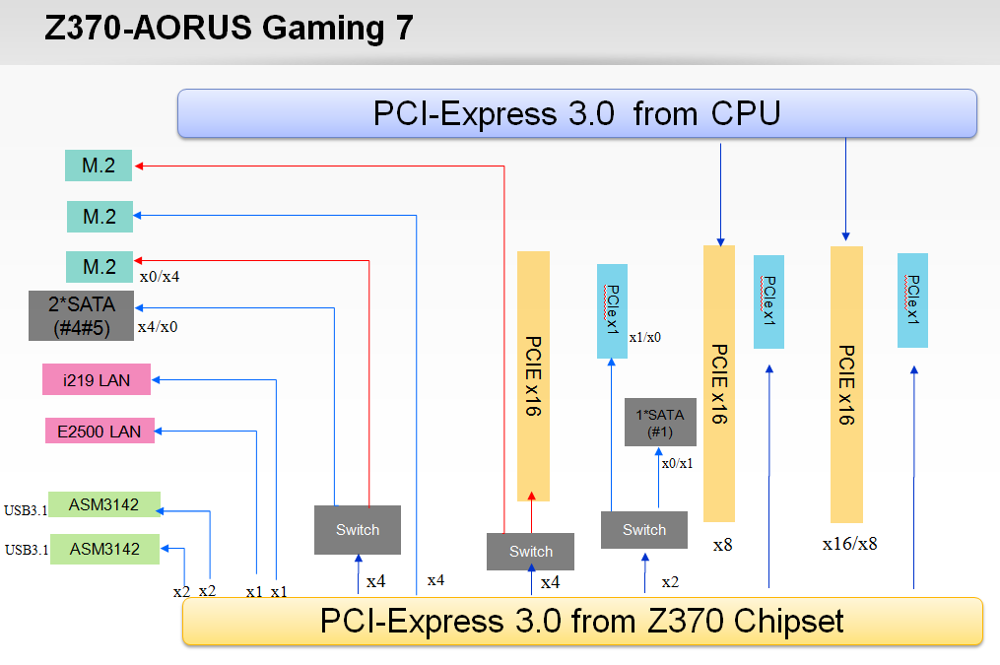{ width="80%" }
  <figcaption>Las lanes PCIe son un recurso limitado que se reparte entre los dispositivos conectados</figcaption>
</figure>

!!! example "Ejemplo real: el problema de las lanes"

    Imagina una plataforma con **16 lanes PCIe desde la CPU**:

    ```
    Situación A — Solo tarjeta gráfica:
    GPU  →  x16  (16 lanes, máximo rendimiento)

    Situación B — Tarjeta gráfica + SSD M.2 NVMe:
    GPU  →  x16  ... pero el M.2 necesita x4
    ¿De dónde salen esas x4?  Del mismo pool de 16 lanes.
    Resultado:
    GPU  →  x12  (baja de x16 a x12)
    M.2  →  x4

    Situación C — Dos tarjetas gráficas (SLI/CrossFire):
    GPU 1  →  x8
    GPU 2  →  x8
    (16 lanes repartidas entre las dos)
    ```

    En la Situación B el impacto en la GPU es pequeño (la diferencia entre x16 y x12 apenas se nota en la práctica). Pero en configuraciones más extremas con múltiples SSDs NVMe y GPU, la limitación de lanes sí puede ser un cuello de botella real.

### Lanes de CPU vs lanes de chipset

Es importante distinguir de dónde vienen las lanes:

- **Lanes de CPU**: conexión directa con el procesador, máxima velocidad y mínima latencia. Se usan para la GPU principal y los SSDs NVMe de mayor rendimiento.
- **Lanes de chipset**: pasan primero por el enlace DMI/GPP entre chipset y CPU, lo que introduce algo más de latencia. Se usan para dispositivos secundarios: más SSDs, tarjetas de red, USB adicional...

| Origen | Latencia | Uso típico |
|--------|----------|-----------|
| CPU directa | Mínima | GPU principal, SSD NVMe primario |
| Chipset | Algo mayor | SSDs adicionales, tarjetas PCIe secundarias |

<figure markdown="span" align="center">
  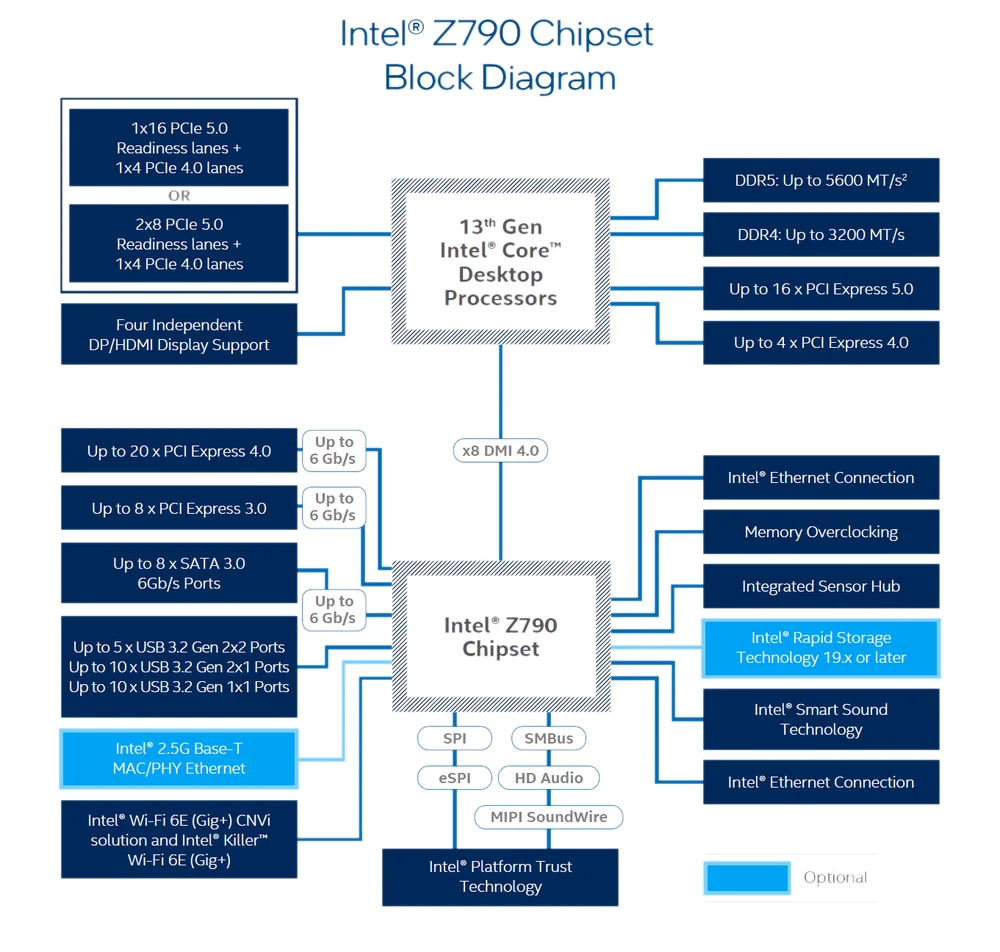{ width="80%" }
  <figcaption>Las lanes PCIe son un recurso limitado que se reparte entre los dispositivos conectados</figcaption>
</figure>


!!! tip "Cómo leer el manual de una placa base"
    El manual de cualquier placa base incluye un diagrama de bloques que muestra exactamente cuántas lanes van a la CPU y cuántas al chipset, y qué slots/puertos usa cada una. Cuando en el manual lees algo como *"El slot PCIe x16_1 comparte ancho de banda con el slot M.2_1: cuando M.2_1 está ocupado, el slot x16_1 opera a x8"*, significa exactamente eso: las lanes se reparten.

    En las prácticas de este tema analizaremos el manual de una placa base real para identificar todas estas relaciones.

## Slots de RAM

Los slots de RAM (ranuras DIMM) son los conectores donde se instalan los módulos de memoria. La placa base determina:

- **Tipo de RAM compatible**: DDR4 o DDR5 (no son intercambiables físicamente, tienen muescas en posiciones diferentes)
- **Número de slots**: típicamente 2 o 4 en placas de consumo
- **Velocidades soportadas**: la placa base tiene una velocidad máxima certificada (XMP/EXPO)
- **Capacidad máxima**: límite total de GB que puede gestionar

### Dual channel

Las plataformas modernas soportan **dual channel**: si instalas dos módulos de RAM iguales en los slots correctos (normalmente el 1º y 3º, o el 2º y 4º, según el manual), la CPU accede a ambos módulos simultáneamente, doblando el ancho de banda de memoria.

<!-- IMG: diagrama slots RAM con dual channel marcado -->
<figure markdown="span" align="center">
  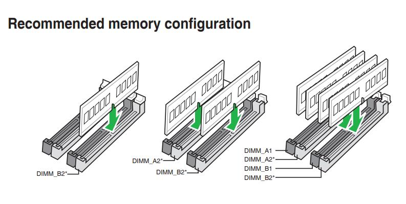{ width="80%" }
  <figcaption>Configuración de dual channel: los módulos se instalan en slots del mismo color</figcaption>
</figure>

Se deben consultar el manual de las placas base ya que ahí se recomiendan la colocación de la memoria adecuada para hacer un uso correcto del **dual channel**

!!! warning "DDR4 vs DDR5: no son compatibles"
    DDR4 y DDR5 tienen la muesca de la ranura en posiciones diferentes, por lo que físicamente es imposible instalar un tipo en el slot del otro. Además, la placa base solo soporta uno de los dos tipos — no existe ninguna placa que admita ambos simultáneamente (aunque algunas de 12ª gen Intel con LGA 1700 tienen versiones DDR4 y versiones DDR5 del mismo modelo).

## Conectores de almacenamiento internos

### SATA

**SATA** (*Serial ATA*) es el conector estándar para discos duros HDD y SSDs SATA. La versión actual es SATA III con un ancho de banda máximo de **600 MB/s**. Una placa base típica incluye entre 4 y 8 puertos SATA.

Es un conector sencillo con dos cables: uno de datos y uno de alimentación. Su principal limitación es precisamente ese techo de 600 MB/s, que aunque es más que suficiente para un HDD, limita el rendimiento de un SSD moderno.

<figure markdown="span" align="center">
  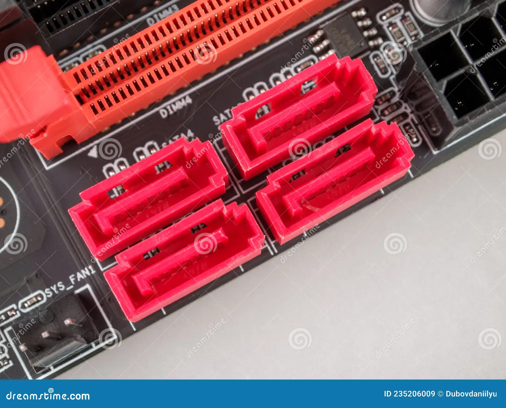{ width="40%" }
  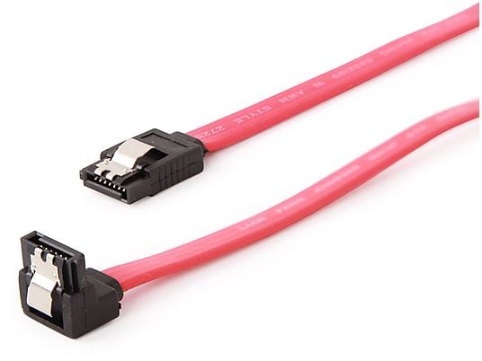{ width="40%" }
  <figcaption>Conectores SATA en placa base y cable SATA</figcaption>
</figure>


### M.2

El slot **M.2** es un conector compacto que puede alojar tanto SSDs SATA como SSDs NVMe, aunque lo más habitual hoy en día es usarlo para NVMe. Físicamente es una ranura estrecha donde se inserta la tarjeta y se fija con un tornillo.

Los SSDs M.2 NVMe usan el protocolo **NVMe** (*Non-Volatile Memory Express*) sobre PCIe, lo que les permite velocidades muy superiores a SATA:

| Interfaz | Protocolo | Velocidad máx. lectura secuencial |
|----------|----------|----------------------------------|
| SATA III | AHCI | ~550 MB/s |
| M.2 NVMe PCIe 3.0 x4 | NVMe | ~3.500 MB/s |
| M.2 NVMe PCIe 4.0 x4 | NVMe | ~7.000 MB/s |
| M.2 NVMe PCIe 5.0 x4 | NVMe | ~14.000 MB/s |

<figure markdown="span" align="center">
  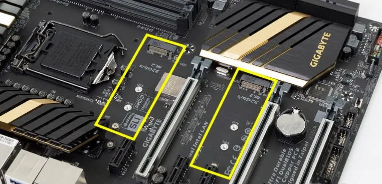{ width="60%" }
  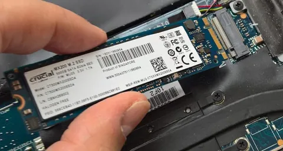{ width="50%" }
  <figcaption>Zócalos M.2 y disco M.2 en instalación.</figcaption>
</figure>

!!! info "Tamaños de módulos M.2"
    Los módulos M.2 tienen diferentes longitudes. El nombre del formato indica ancho y longitud en milímetros: **M.2 2280** significa 22 mm de ancho y 80 mm de largo, que es el más común. También existen 2242 y 22110. Antes de comprar un SSD M.2 hay que verificar qué longitudes soporta la placa base.

    <figure markdown="span" align="center">
      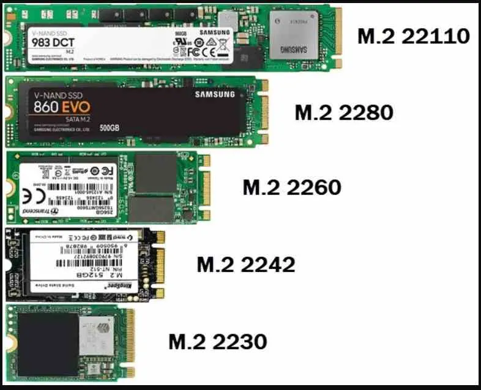{ width="60%" }
      <figcaption>Formatos M.2</figcaption>
    </figure>

## Conectores de alimentación

La placa base recibe la alimentación de la fuente a través de dos conectores principales:

- **Conector ATX 24 pines**: alimentación principal de la placa base
- **Conector CPU 8 pines** (o 4+4 pines): alimentación específica para el procesador. En placas de alto rendimiento puede ser de 8+8 pines (16 pines total)

Esta alimentación tiene diferentes voltajes, ya que los elementos que conectamos a la placa base pueden funcionar con voltajes diferentes.

<figure markdown="span" align="center">
  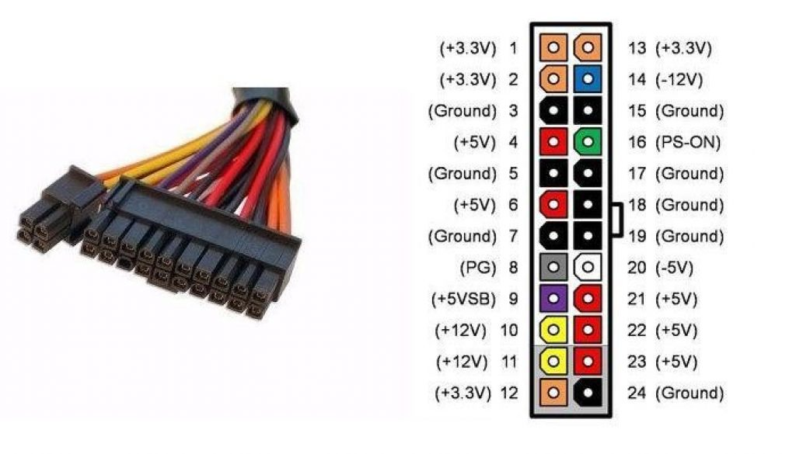{ width="80%" }
  <figcaption>Conector ATX 24, que se puede usar como ATX 20 con desglose de líneas de alimentación.</figcaption>
</figure>

Además, los slots PCIe tienen sus propios conectores de alimentación para tarjetas gráficas de alto consumo (conector PCIe de 6, 8 o 16 pines directamente desde la fuente).

## BIOS y UEFI

**BIOS** (*Basic Input/Output System*) es el firmware de la placa base: el software más básico del sistema, grabado en un chip de la placa, que se ejecuta nada más encender el ordenador antes de que cargue el sistema operativo.

Sus funciones son:
- Inicializar y verificar todos los componentes del sistema (POST)
- Configurar parámetros del hardware: frecuencias, voltajes, orden de arranque
- Proporcionar una interfaz básica para modificar esa configuración
- Cargar el sistema operativo desde el dispositivo seleccionado

<figure markdown="span" align="center">
  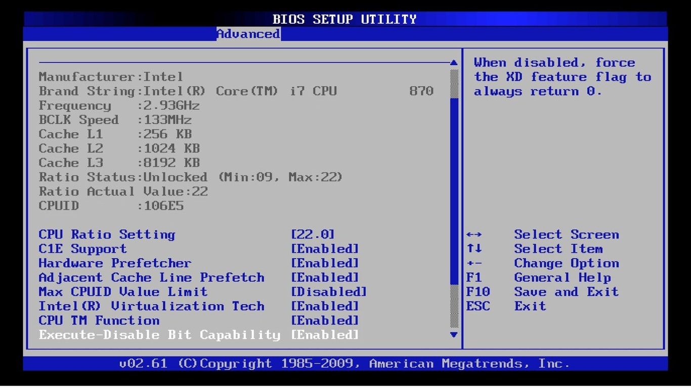{ width="75%" }
  <figcaption>Interfaz BIOS tradicional.</figcaption>
</figure>

La **UEFI** (*Unified Extensible Firmware Interface*) es la evolución moderna de la BIOS. Ofrece una interfaz gráfica, soporte para discos mayores de 2 TB (mediante tablas de particiones GPT), arranque seguro (*Secure Boot*) y tiempos de inicio más rápidos.

<!-- IMG: captura de pantalla de una UEFI moderna (ASUS, MSI o Gigabyte) -->
<figure markdown="span" align="center">
  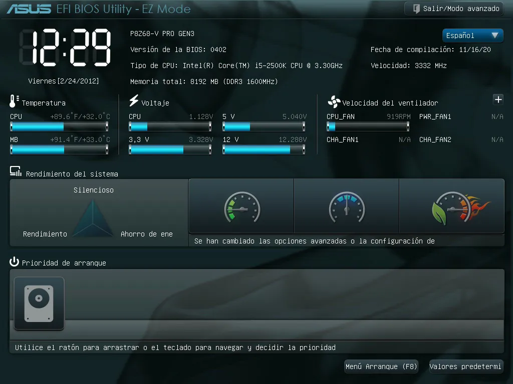{ width="75%" }
  <figcaption>Interfaz UEFI moderna con modo avanzado. Permite monitorizar y configurar frecuencias, voltajes y perfiles XMP/EXPO</figcaption>
</figure>

!!! tip "XMP y EXPO"
    Por defecto, la RAM funciona a su velocidad base (generalmente 2400 o 3200 MHz). Para activar la velocidad anunciada por el fabricante (por ejemplo 6000 MHz DDR5) hay que activar en la UEFI el perfil **XMP** (Intel) o **EXPO** (AMD). Si no lo activas, la RAM funciona más lenta de lo que pagaste.

---

## Chipsets Intel por generación

El chipset determina las capacidades de la placa base dentro de una misma generación de CPU. Dentro de un mismo socket, Intel suele ofrecer varios chipsets con distintas capacidades:

| Generación CPU | Socket | Chipsets disponibles | PCIe versión | DDR |
|---------------|--------|---------------------|-------------|-----|
| 6ª / 7ª gen | LGA 1151 | H110, B150, H170, Z170, Z270 | PCIe 3.0 | DDR4/DDR3L |
| 8ª / 9ª gen | LGA 1151 v2 | H310, B360, H370, Z370, Z390 | PCIe 3.0 | DDR4 |
| 10ª / 11ª gen | LGA 1200 | H410, B460, H470, Z490, Z590 | PCIe 3.0/4.0 | DDR4 |
| 12ª / 13ª / 14ª gen | LGA 1700 | H610, B660, H670, Z690, Z790 | PCIe 4.0/5.0 | DDR4/DDR5 |
| Core Ultra 200S | LGA 1851 | B860, Z890 | PCIe 5.0 | DDR5 |

### Diferencias entre gamas de chipset Intel

Dentro de cada generación, la gama del chipset determina las funcionalidades disponibles:

| Gama | Overclocking | Lanes PCIe extra | Puertos USB 3.x | Uso típico |
|------|-------------|-----------------|-----------------|-----------|
| **H** (H610, H670) | No | Pocos | Básico | Ofimática, uso general |
| **B** (B660, B760) | Parcial (RAM) | Medios | Intermedio | Gaming, desarrollo |
| **Z** (Z690, Z790) | Sí (CPU+RAM) | Máximos | Completo | Enthusiast, overclocking |

!!! info "El chipset Z es para overclocking"
    Solo los chipsets de la gama **Z** permiten hacer overclocking de la CPU (junto con procesadores desbloqueados, los que llevan la K al final: Core i9-13900**K**). Para la mayoría de usuarios un chipset **B** ofrece todas las funcionalidades necesarias a menor coste.

---

## Chipsets AMD por generación

AMD ha seguido una política diferente: mayor longevidad del socket, lo que significa que un mismo chipset puede ser compatible con varias generaciones de CPU.

| Generación CPU | Socket | Chipsets disponibles | PCIe versión | DDR |
|---------------|--------|---------------------|-------------|-----|
| Ryzen 1000/2000 | AM4 | A320, B350, X370 | PCIe 3.0 | DDR4 |
| Ryzen 3000 | AM4 | A320*, B450, X470, X570 | PCIe 3.0/4.0 | DDR4 |
| Ryzen 5000 | AM4 | B450*, B550, X570 | PCIe 3.0/4.0 | DDR4 |
| Ryzen 7000 | AM5 | A620, B650, B650E, X670, X670E | PCIe 4.0/5.0 | DDR5 |
| Ryzen 9000 | AM5 | A620, B650, B650E, X670, X670E, X870, X870E | PCIe 4.0/5.0 | DDR5 |

*Con actualización de BIOS

### Diferencias entre gamas de chipset AMD

| Gama | Overclocking | Lanes PCIe | Uso típico |
|------|-------------|-----------|-----------|
| **A** (A620) | No | Básico | Ofimática, bajo coste |
| **B** (B650) | RAM (EXPO) | Intermedio | Gaming, desarrollo |
| **X** (X670) | CPU + RAM | Máximo | Enthusiast |
| **E** (B650E, X670E) | CPU + RAM | PCIe 5.0 en slots principales | Workstation, NVMe Gen5 |

!!! info "La E significa PCIe 5.0"
    Los chipsets con sufijo **E** (Enhanced) garantizan que el slot PCIe principal y al menos un slot M.2 usen PCIe 5.0 directamente desde la CPU, pensado para SSDs NVMe Gen5 y GPUs de próxima generación.

---

## Leer el manual de una placa base

El manual de cualquier placa base es el documento más valioso para entender exactamente qué puede hacer ese modelo. Incluye siempre:

- **Diagrama de bloques**: muestra cómo se conectan CPU, chipset, slots y puertos
- **Tabla de especificaciones de slots**: indica cuántas lanes usa cada slot y si comparte con otro
- **Tabla de compatibilidad de CPU**: lista exacta de procesadores soportados
- **Tabla de velocidades de RAM soportadas**: frecuencias certificadas con XMP/EXPO

!!! example "Ejercicio: interpretar un manual de placa base"

    Analiza el siguiente fragmento típico de un manual de placa base (ASUS ROG Strix B650E-F):

    ```
    Slot        | Lanes  | Origen   | Comparte con
    ------------|--------|----------|------------------
    PCIe x16_1  | x16    | CPU      | M.2_1 (si ocupado → x8)
    PCIe x16_2  | x4     | Chipset  | —
    M.2_1       | x4     | CPU      | PCIe x16_1
    M.2_2       | x4     | Chipset  | —
    M.2_3       | x4     | Chipset  | —
    ```

    **Preguntas:**

    1. Si instalo una GPU en PCIe x16_1 y un SSD NVMe en M.2_1, ¿a cuántas lanes opera la GPU?
    2. ¿Qué ranura usarías para el SSD principal si quieres que la GPU opere siempre a x16?
    3. ¿Cuántos SSDs NVMe puedo instalar en total en esta placa?

    ??? "Solución"
        1. La GPU opera a **x8**, porque M.2_1 comparte lanes con PCIe x16_1 y consume x4.
        2. Usaría **M.2_2 o M.2_3** (conectadas al chipset), así la GPU mantiene x16 completo.
        3. Un total de **3 SSDs NVMe**: M.2_1, M.2_2 y M.2_3. Si priorizo rendimiento de GPU, uso M.2_2 y M.2_3 y dejo M.2_1 libre.
