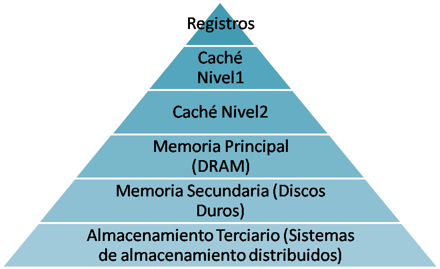
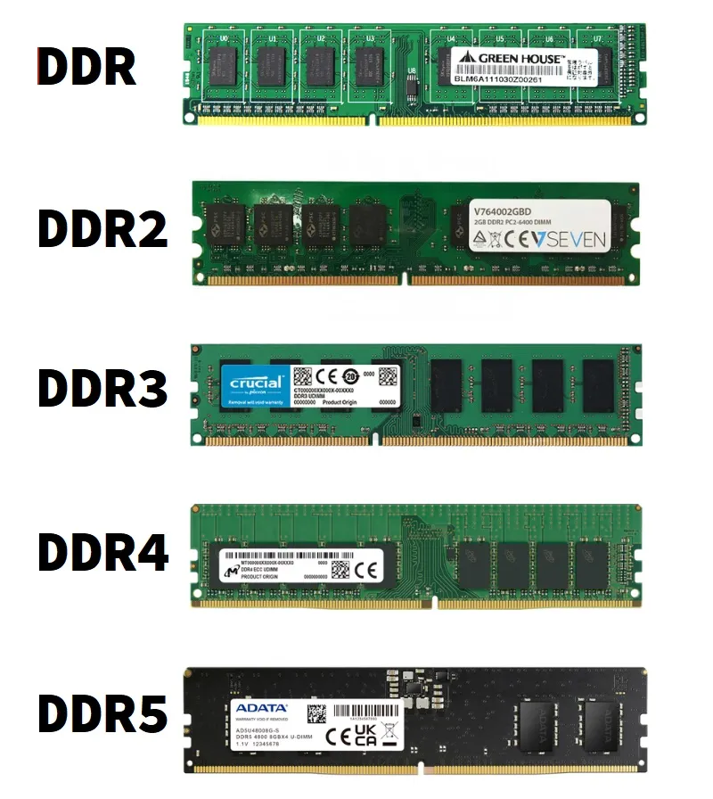
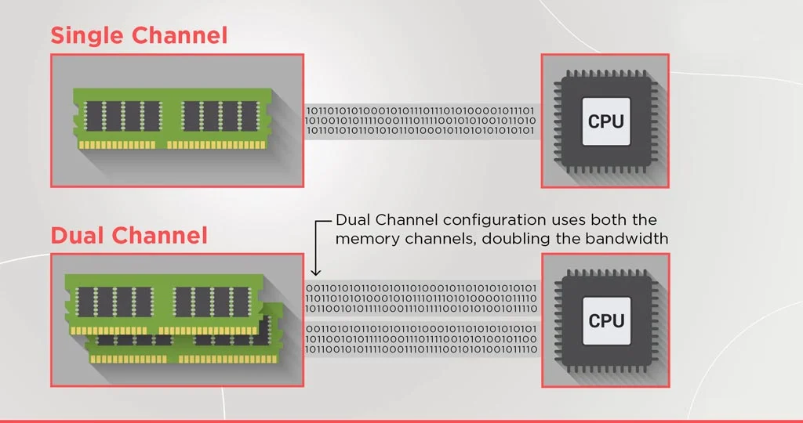
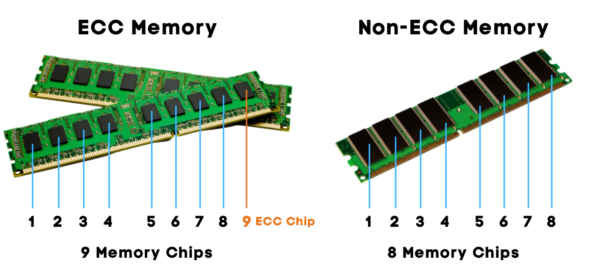

Cuando encendemos el ordenador y abrimos una aplicación, esa aplicación se carga desde el disco duro o SSD hasta la **memoria RAM**. A partir de ese momento, todo lo que el procesador necesita para ejecutarla — el código del programa, los datos que está manejando, los resultados intermedios — reside en la RAM. Sin memoria RAM no hay ejecución posible: es el espacio de trabajo activo del sistema.

La diferencia fundamental entre la RAM y el almacenamiento (disco duro o SSD) es que la RAM es **volátil**: cuando apagamos el ordenador, todo su contenido desaparece. El almacenamiento es **persistente**: los datos sobreviven al apagado. Esta diferencia no es un defecto sino una consecuencia directa de cómo funciona cada tecnología: la RAM usa condensadores o transistores que mantienen su estado solo mientras hay corriente, lo que permite velocidades de acceso muy superiores a cualquier tipo de almacenamiento.

<!-- IMG: diagrama jerarquía de memoria: registros → caché L1/L2/L3 → RAM → almacenamiento -->
<figure markdown="span" align="center">
  { width="70%" }
  <figcaption>Jerarquía de memoria en un sistema informático: velocidad vs capacidad vs coste</figcaption>
</figure>

La RAM ocupa un lugar intermedio en la jerarquía de memoria: es más lenta que la caché del procesador pero mucho más rápida que cualquier disco. Es también mucho más cara por gigabyte que el almacenamiento, lo que explica por qué los ordenadores tienen decenas o cientos de gigabytes de disco pero solo 8, 16 o 32 GB de RAM.

## ¿Qué ocurre cuando la RAM se llena?

Cuando el sistema operativo necesita más memoria de la que hay disponible en la RAM, recurre a una zona del disco llamada **memoria virtual** o **swap** (en Linux) / **archivo de paginación** (en Windows). El SO mueve temporalmente al disco los datos de la RAM que llevan más tiempo sin usarse, liberando espacio para lo que necesita ahora.

Este proceso se llama **paginación** y tiene un coste enorme en rendimiento: acceder al disco es miles de veces más lento que acceder a la RAM. Cuando un sistema está paginando continuamente se dice que está en **thrashing** y el rendimiento cae de forma dramática — el ordenador parece "bloqueado" aunque técnicamente sigue funcionando.

!!! example "Ejemplo práctico"
    Si tienes un ordenador con 8 GB de RAM y abres el IDE, el navegador con 20 pestañas, el servidor de base de datos y el servidor de aplicaciones simultáneamente, es muy probable que el sistema empiece a paginar. La solución no es cerrar aplicaciones constantemente: es tener más RAM. Para desarrollo con virtualización, **16 GB es el mínimo razonable y 32 GB es lo recomendable**.

## Estructura física de un módulo de RAM

Un módulo de RAM (*stick* o *DIMM*) es una pequeña placa de circuito impreso con varios chips de memoria soldados. En un ordenador de sobremesa se usan módulos **DIMM** (*Dual Inline Memory Module*); en portátiles se usan los más pequeños **SO-DIMM** (*Small Outline DIMM*).

<!-- IMG: fotografía de un módulo DIMM DDR5 con sus chips y la muesca identificativa -->
<figure markdown="span" align="center">
  { width="70%" }
  <figcaption>Módulos de RAM DIMM DDR. La muesca identifica el tipo y evita instalarlo al revés o en el slot incorrecto</figcaption>
</figure>

Cada generación de DDR tiene la muesca en una posición diferente, lo que hace físicamente imposible instalar un módulo DDR4 en un slot DDR5 o viceversa. Además de ser incompatibles físicamente, también lo son eléctricamente: operan a voltajes diferentes.

## Características principales de la RAM

### Capacidad

La capacidad se mide en gigabytes (GB) e indica cuánta información puede almacenar el módulo. Los módulos más comunes hoy en día son de 8, 16 y 32 GB. La cantidad total de RAM del sistema es la suma de todos los módulos instalados.

La placa base tiene un límite máximo de RAM que puede gestionar, definido por el chipset y el número de slots disponibles. Una placa con 4 slots y soporte para módulos de hasta 32 GB por slot puede albergar un máximo de 128 GB.

### Frecuencia

La frecuencia indica la velocidad a la que la RAM puede transferir datos, medida en MHz (megahercios). A mayor frecuencia, mayor ancho de banda disponible para la CPU. Sin embargo, la frecuencia real a la que opera la RAM depende de tres factores:

- La frecuencia del módulo de RAM
- La frecuencia máxima soportada por la placa base
- La frecuencia máxima soportada por el controlador de memoria de la CPU

El sistema siempre opera a la frecuencia más restrictiva de las tres.

!!! info "MT/s vs MHz"
    Técnicamente la velocidad de la RAM se mide en **MT/s** (megatransferencias por segundo) porque DDR (*Double Data Rate*) transfiere datos dos veces por ciclo. Una RAM de 3200 MHz DDR4 hace en realidad 3200 MT/s a 1600 MHz reales de reloj. Por convenio se suele indicar la cifra de MT/s como si fueran MHz, lo que puede generar confusión.

### Latencia CAS

La **latencia CAS** (*Column Address Strobe*) es el número de ciclos de reloj que tarda la RAM en responder a una solicitud de datos. Se expresa como una serie de números: por ejemplo **CL16-18-18-38**, donde el primero (CL16) es el más importante.

A menor latencia CAS, más rápida es la respuesta de la RAM. Pero la latencia real en nanosegundos depende también de la frecuencia: una RAM DDR4 a 3200 MHz CL16 tiene prácticamente la misma latencia real en nanosegundos que una DDR4 a 2400 MHz CL12, aunque los números parezcan muy diferentes.

### Voltaje

Cada generación de DDR opera a un voltaje estándar diferente. Usar el voltaje incorrecto puede dañar los módulos o la placa base:

| Tipo | Voltaje estándar |
|------|-----------------|
| DDR3 | 1,5 V (1,35 V en versión L) |
| DDR4 | 1,2 V |
| DDR5 | 1,1 V |
| LPDDR5 | 1,05 V |

La tendencia es clara: cada generación reduce el voltaje para mejorar la eficiencia energética.

## Dual channel, quad channel

Una de las optimizaciones más importantes y fáciles de implementar en cualquier sistema es el **dual channel**. Cuando se instalan dos módulos de RAM iguales en los slots correctos de la placa base, el controlador de memoria de la CPU accede a ambos módulos simultáneamente, doblando el ancho de banda efectivo de memoria.

La mejora de rendimiento es especialmente notable en:

- **Gráficos integrados**: las GPU integradas en la CPU comparten el ancho de banda de la RAM con el procesador, por lo que el dual channel puede suponer una mejora del 30-50% en rendimiento gráfico.
- **Aplicaciones con mucho acceso a memoria**: compiladores, máquinas virtuales, bases de datos en memoria.
- **Procesadores AMD Ryzen**: la arquitectura Zen es especialmente sensible al ancho de banda de memoria; pasar de single a dual channel puede mejorar el rendimiento general un 10-15%.

<!-- IMG: diagrama comparativo single channel vs dual channel -->
<figure markdown="span" align="center">
  { width="70%" }
  <figcaption>Single channel vs Dual channel: el ancho de banda se dobla con dos módulos en los slots correctos</figcaption>
</figure>

!!! warning "¿En qué slots instalar los módulos?"
    No vale instalar los dos módulos en cualquier slot. Los slots de dual channel están marcados en la placa base con colores o identificados en el manual. Habitualmente en una placa con 4 slots (A1, A2, B1, B2), los slots de dual channel son **A2 y B2** (el segundo de cada canal). Si instalas los módulos en A1 y A2 (misma ranura del mismo canal), funcionarán en single channel aunque sean idénticos.

Las plataformas de servidor y workstation de alto nivel implementan **quad channel** (cuatro canales simultáneos) e incluso **octo channel**, multiplicando aún más el ancho de banda disponible.

## Tipos de RAM

### DDR4

**DDR4** fue el estándar dominante desde 2014 hasta aproximadamente 2022. Todavía es muy común en equipos existentes y en placas LGA 1700 de 12ª y 13ª generación Intel y en toda la plataforma AM4 de AMD.

Opera a 1,2 V y las frecuencias más habituales van de 2133 MHz (frecuencia base JEDEC) hasta 4800 MHz con perfiles XMP extremos.

### DDR5

**DDR5** es el estándar actual, introducido con Intel de 12ª generación (LGA 1700) y AMD Ryzen 7000 (AM5). Ofrece mejoras significativas respecto a DDR4:

- **Mayor ancho de banda**: las frecuencias base comienzan en 4800 MHz (frente a 2133 de DDR4)
- **Mayor capacidad por módulo**: hasta 64 GB por DIMM en versiones de consumo
- **Menor voltaje**: 1,1 V frente a 1,2 V de DDR4
- **Corrección de errores integrada**: DDR5 incorpora ECC on-die (corrección básica de errores en el propio módulo)
- **Doble canal interno**: cada módulo DDR5 tiene dos subcanales internos de 32 bits en lugar de un canal de 64 bits

!!! info "¿DDR4 o DDR5 en 2025?"
    Si estás montando un equipo nuevo con AM5 o LGA 1851, la elección es DDR5 sin alternativa (estos sockets solo aceptan DDR5). Si tienes una placa LGA 1700 que acepta ambas, DDR5 ofrece mayor rendimiento teórico pero DDR4 de alta frecuencia sigue siendo muy competitiva y más barata. Para la mayoría de usos la diferencia práctica es pequeña.

### LPDDR

**LPDDR** (*Low Power DDR*) es la variante de bajo consumo diseñada para portátiles, smartphones y tablets. La "LP" indica que opera a voltajes inferiores a la versión estándar:

- **LPDDR4X**: muy común en portátiles de gama media hasta 2022. 1,8 V en señalización, 0,6 V en núcleo.
- **LPDDR5**: estándar actual en móviles y portátiles ultradelgados. Hasta 6400 MT/s.
- **LPDDR5X**: versión extendida, hasta 8533 MT/s. Presente en Snapdragon 8 Gen 3 y chips Apple M recientes.

La principal diferencia con DIMM estándar es que los módulos LPDDR están **soldados directamente a la placa base** (formato BGA), lo que significa que **no son reemplazables ni ampliables**. Es una decisión de diseño que prioriza el tamaño y el consumo sobre la flexibilidad.

### RAM ECC

**ECC** (*Error-Correcting Code*) es una tecnología que añade bits adicionales a cada bloque de datos para detectar y corregir errores de memoria al vuelo. Los errores de memoria (causados por radiación cósmica, fluctuaciones eléctricas u otros factores) son raros pero ocurren, y en un servidor que lleva meses encendido procesando datos críticos, un error no detectado puede corromper datos silenciosamente.

La RAM ECC es prácticamente obligatoria en servidores y workstations donde la integridad de los datos es crítica. Requiere soporte tanto en la CPU como en la placa base — los procesadores de consumo normales (Intel Core, AMD Ryzen de consumo) no soportan ECC o lo hacen de forma limitada. Las plataformas de servidor (Intel Xeon, AMD EPYC) siempre incluyen soporte ECC completo.

<!-- IMG: comparativa módulo RAM estándar vs ECC con los chips adicionales visibles -->
<figure markdown="span" align="center">
  { width="85%" }
  <figcaption>Módulo RAM ECC (abajo) con los chips adicionales de corrección de errores visibles</figcaption>
</figure>

## Evolución de las generaciones DDR

La evolución de la memoria RAM ha seguido un patrón consistente: cada nueva generación dobla aproximadamente el ancho de banda, reduce el voltaje y aumenta la capacidad máxima por módulo.

| Generación | Año intro. | Voltaje | Frec. base | Frec. máx. típica | Ancho de banda pico | Conector |
|------------|-----------|---------|-----------|------------------|--------------------| ---------|
| DDR | 2000 | 2,5 V | 200 MHz | 400 MHz | 3,2 GB/s | 184 pines |
| DDR2 | 2003 | 1,8 V | 400 MHz | 800 MHz | 6,4 GB/s | 240 pines |
| DDR3 | 2007 | 1,5 V | 800 MHz | 2133 MHz | 17 GB/s | 240 pines |
| DDR4 | 2014 | 1,2 V | 2133 MHz | 4800 MHz | 38 GB/s | 288 pines |
| DDR5 | 2020 | 1,1 V | 4800 MHz | 8400 MHz+ | 67 GB/s | 288 pines* |

*DDR5 usa 288 pines igual que DDR4 pero la muesca está en posición diferente, por lo que son físicamente incompatibles.

!!! info "¿Por qué importa conocer esta evolución?"
    Igual que con las CPUs, cada generación de RAM está asociada a plataformas concretas. No puedes mezclar generaciones: si tu placa base es AM5 (Ryzen 7000/9000), solo acepta DDR5. Si es AM4 (Ryzen 1000-5000), solo acepta DDR4. Conocer la generación de tu plataforma determina qué RAM puedes comprar.

## XMP y EXPO: perfiles de overclocking de RAM

Por defecto, cualquier módulo de RAM arranca a su frecuencia base JEDEC (4800 MHz en DDR5, 2133 MHz en DDR4), independientemente de la velocidad que ponga en la caja. Para activar la velocidad anunciada por el fabricante hay que activar un perfil especial en la UEFI de la placa base:

- **XMP** (*Extreme Memory Profile*): estándar de Intel, compatible con la mayoría de placas.
- **EXPO** (*Extended Profiles for Overclocking*): estándar equivalente de AMD, optimizado para plataforma AM5.

Estos perfiles almacenan en el propio módulo de RAM los parámetros exactos (frecuencia, timings, voltaje) para que opere a su velocidad máxima certificada. Activarlos es tan sencillo como entrar en la UEFI, buscar la opción XMP/EXPO y habilitarla — normalmente hay varias opciones de perfil y se elige la más alta que el sistema soporte de forma estable.

!!! warning "¿Es seguro activar XMP/EXPO?"
    Técnicamente es overclocking, pero es un overclocking certificado por el fabricante de la RAM y validado para ese módulo específico. En la inmensa mayoría de casos es completamente estable. Si el sistema da problemas de estabilidad, siempre puedes volver a la frecuencia base desde la UEFI.

## Cuánta RAM necesito

La cantidad de RAM necesaria depende completamente del uso:

| Uso | RAM mínima | RAM recomendable |
|-----|-----------|-----------------|
| Ofimática básica, navegación | 4 GB | 8 GB |
| Uso general, gaming ligero | 8 GB | 16 GB |
| Gaming, desarrollo sin virtualización | 16 GB | 32 GB |
| Desarrollo con virtualización (este curso) | 16 GB | 32 GB |
| Edición de vídeo, 3D, IA local | 32 GB | 64 GB+ |
| Servidor de bases de datos | 32 GB | 128 GB+ |
| Servidor de virtualización | 64 GB | 256 GB+ |

!!! tip "Regla práctica para este curso"
    Para ejecutar cómodamente Windows Server y un cliente Windows en VirtualBox simultáneamente necesitas **al menos 16 GB** en el equipo host. Con 8 GB la experiencia será muy lenta. Con 32 GB podrás tener varias VMs corriendo a la vez sin problemas.

---

## Ejercicio integrador: elige la RAM para tu plataforma

Dado el siguiente equipo:

- **CPU**: AMD Ryzen 7 9700X (socket AM5, controlador de memoria DDR5 hasta 5600 MHz)
- **Placa base**: ASUS Prime X670-P (4 slots DDR5, dual channel, XMP/EXPO, máx. 192 GB)

**Preguntas:**

1. ¿Qué tipo de RAM necesitas? ¿DDR4 o DDR5?
2. Si compras 2 módulos de 16 GB DDR5-6000 CL30, ¿en qué slots los instalas para activar dual channel?
3. ¿A qué frecuencia operará la RAM si no activas el perfil EXPO en la UEFI?
4. ¿Cuánta RAM total tendrás? ¿Podrías ampliar en el futuro sin cambiar los módulos actuales?

??? "Solución"
    1. **DDR5** obligatoriamente. AM5 no acepta DDR4.
    2. En los slots **A2 y B2** (o los marcados del mismo color en el manual). Nunca A1+A2 ni B1+B2.
    3. A **4800 MHz** (frecuencia base JEDEC de DDR5), independientemente de que los módulos sean DDR5-6000.
    4. Tendrás **32 GB** (2 × 16 GB). Podrías ampliar instalando 2 módulos más iguales en los slots A1 y B1, llegando a **64 GB** en quad channel efectivo (dos pares en dual channel).
