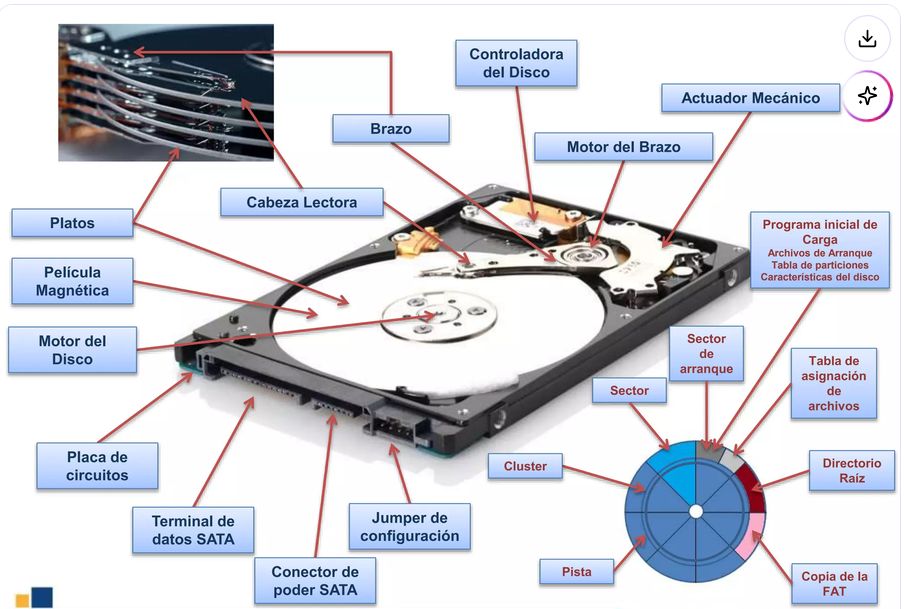
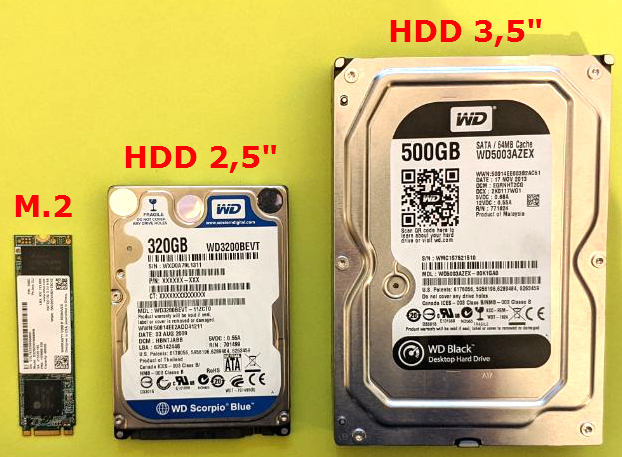
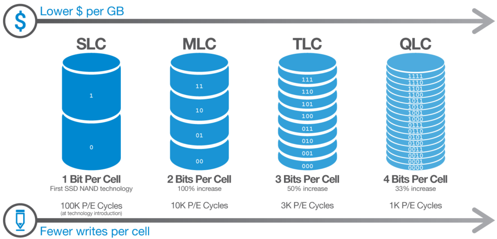
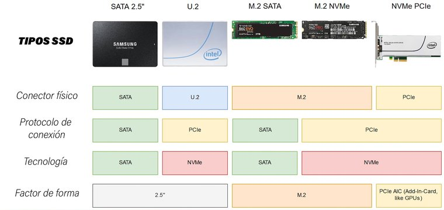
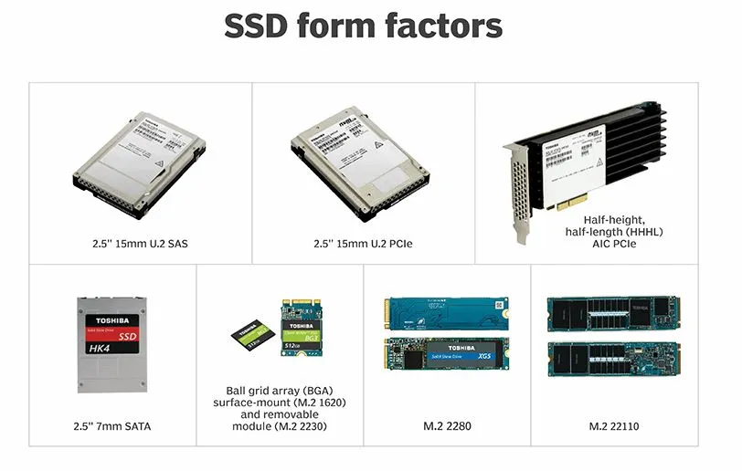
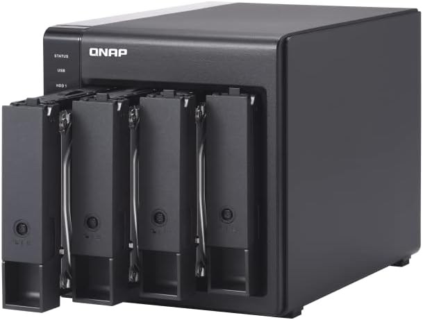
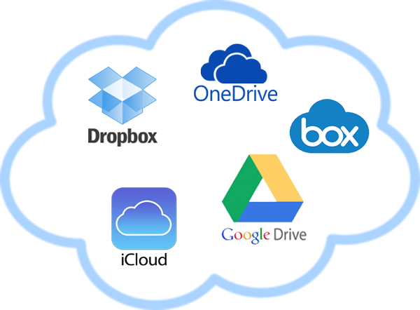

El **almacenamiento** es la parte del sistema informático encargada de guardar la información de forma **persistente**: a diferencia de la RAM, los datos no desaparecen cuando apagamos el equipo. Es donde vive el sistema operativo, las aplicaciones, los documentos, las bases de datos y cualquier otro dato que necesitemos conservar.

Comprender el almacenamiento es fundamental para cualquier desarrollador porque las decisiones que tomamos sobre cómo y dónde guardamos los datos afectan directamente al rendimiento, la fiabilidad y el coste de nuestras aplicaciones. No es lo mismo guardar un fichero en un SSD NVMe local que en un HDD mecánico o en la nube, y elegir mal puede marcar la diferencia entre una aplicación rápida y una inutilizable.

## El disco duro mecánico (HDD)

El **HDD** (*Hard Disk Drive*) es la tecnología de almacenamiento más antigua de las que todavía se usan hoy en día. Funciona mediante un principio **electromagnético**: uno o varios **platos** de material magnético giran a alta velocidad (habitualmente 5400 o 7200 RPM), y un **cabezal** de lectura/escritura se desplaza sobre su superficie para leer o escribir datos.

<!-- IMG: diagrama interior de un HDD con platos, cabezal y motor identificados -->
<figure markdown="span" align="center">
  { width="65%" }
  <figcaption>Interior de un disco duro mecánico.</figcaption>
</figure>

Este funcionamiento mecánico es precisamente su mayor limitación. Para leer un dato, el cabezal tiene que desplazarse físicamente hasta la posición correcta del plato (tiempo de **búsqueda** o *seek time*) y esperar a que el plato gire hasta que el dato quede bajo el cabezal (latencia rotacional). Este proceso tarda varios milisegundos, lo que es una eternidad para un procesador moderno que puede realizar miles de millones de operaciones por segundo.

### Características del HDD

- **Capacidad**: desde 500 GB hasta 20 TB o más en modelos de consumo. Es la tecnología más barata por gigabyte.
- **Velocidad de lectura/escritura secuencial**: entre 80 y 200 MB/s dependiendo del modelo.
- **Velocidad de acceso aleatorio**: muy limitada por la mecánica. Entre 0,5 y 2 MB/s en operaciones aleatorias pequeñas.
- **Tiempo de acceso medio**: 5-15 ms (milisegundos).
- **Resistencia a golpes**: baja. Al tener partes móviles, un golpe mientras está en funcionamiento puede dañar el cabezal y rayar los platos, perdiendo datos.
- **Ruido y vibración**: genera ruido mecánico perceptible durante la operación.
- **Vida útil**: medida en horas de funcionamiento (MTBF), típicamente entre 500.000 y 1.000.000 horas para modelos de consumo.

### ¿Para qué sigue siendo útil el HDD?

A pesar de sus limitaciones de velocidad, el HDD sigue siendo relevante actualmente por su **coste por gigabyte**, que es entre 5 y 10 veces más bajo que un SSD equivalente. Esto lo hace ideal para:

- **Almacenamiento masivo de datos**: copias de seguridad, archivos multimedia, almacenamiento NAS.
- **Servidores de ficheros**: donde la capacidad importa más que la velocidad de acceso.
- **Archivado a largo plazo**: guardar datos que se acceden raramente pero necesitan conservarse.

Para el sistema operativo y las aplicaciones, un HDD moderno es completamente inadecuado comparado con un SSD.

## Los SSD: el almacenamiento de estado sólido

Un **SSD** (*Solid State Drive*) no tiene partes móviles. Almacena los datos en chips de **memoria flash NAND**, el mismo tipo de tecnología que usan los pendrives y las tarjetas SD. Al no tener componentes mecánicos, el acceso a los datos es casi instantáneo y el rendimiento en operaciones aleatorias es incomparablemente superior al HDD.

La diferencia de rendimiento entre un HDD y un SSD en el uso cotidiano es la más perceptible de todas las actualizaciones que se pueden hacer a un ordenador. El tiempo de arranque del sistema pasa de minutos a segundos, las aplicaciones abren de forma casi instantánea y la experiencia general del equipo es completamente diferente.

<!-- IMG: comparativa fotografía HDD 3.5" vs SSD 2.5" vs M.2 mostrando diferencia de tamaño -->
<figure markdown="span" align="center">
  { width="75%" }
  <figcaption>Comparativa de tamaños: HDD 3,5", SSD 2,5" y SSD M.2 2280</figcaption>
</figure>

Amplia información en [Tipos de discos SSD y conexiones](https://www.losmejoresdiscosssd.es/tipos-de-discos-ssd-y-conexiones/)

## Tecnología NAND: SLC, MLC, TLC y QLC

No todos los SSDs son iguales. La diferencia más importante entre modelos está en el tipo de **celda NAND** que usan, que determina cuántos bits almacena cada celda y cómo afecta esto al rendimiento, la durabilidad y el coste.

Una celda de memoria NAND es un transistor que puede almacenar carga eléctrica. La cantidad de niveles de carga que puede distinguir determina cuántos bits almacena:

### SLC (Single Level Cell)

Cada celda almacena **1 bit** (solo dos estados: cargada o no cargada). Es la tecnología más rápida, más duradera y más cara. Se usa principalmente en SSDs industriales y de servidor donde la fiabilidad es crítica. Raramente se encuentra en productos de consumo por su elevado precio.

- **Velocidad**: máxima
- **Durabilidad**: 50.000 – 100.000 ciclos P/E (escritura/borrado por celda)
- **Coste**: muy alto
- **Uso**: industrial, servidor, caché en SSDs de consumo

### MLC (Multi Level Cell)

Cada celda almacena **2 bits** (cuatro niveles de carga). Fue el estándar durante muchos años en SSDs de consumo de gama alta. Ofrece un buen equilibrio entre rendimiento, durabilidad y coste. Actualmente casi desaparecido del mercado de consumo, sustituido por TLC.

- **Velocidad**: muy alta
- **Durabilidad**: 3.000 – 10.000 ciclos P/E
- **Coste**: alto
- **Uso**: SSDs profesionales, algunos NVMe de gama alta

### TLC (Triple Level Cell)

Cada celda almacena **3 bits** (ocho niveles de carga). Es el estándar actual en la gran mayoría de SSDs de consumo, tanto SATA como NVMe. Ofrece buena capacidad a precio razonable con un rendimiento más que suficiente para uso general y desarrollo.

- **Velocidad**: alta (con caché SLC)
- **Durabilidad**: 1.000 – 3.000 ciclos P/E
- **Coste**: moderado
- **Uso**: SSDs de consumo estándar (Samsung 870 EVO, WD Blue, Crucial MX500...)

### QLC (Quad Level Cell)

Cada celda almacena **4 bits** (dieciséis niveles de carga). Es la tecnología más densa y barata pero también la más lenta y menos duradera. Se usa en SSDs de gran capacidad orientados a lectura. El rendimiento de escritura cae significativamente cuando se llena la caché SLC.

- **Velocidad**: moderada (cae mucho al llenar la caché)
- **Durabilidad**: 100 – 1.000 ciclos P/E
- **Coste**: bajo
- **Uso**: SSDs de alta capacidad para almacenamiento, no para sistema operativo

<!-- IMG: diagrama comparativo SLC/MLC/TLC/QLC mostrando bits por celda y niveles de voltaje -->
<figure markdown="span" align="center">
  { width="80%" }
  <figcaption>Comparativa de tipos de celda NAND: bits almacenados, durabilidad y rendimiento</figcaption>
</figure>

Amplia información: [Tipos de memorias en los discos SSD: 3D MLC, TLC, QLC…](https://www.losmejoresdiscosssd.es/ssd-vs-hdd-informacion-tecnica-sobre-los-ssds/)

### La caché SLC: el truco que usan los TLC y QLC

Los SSDs TLC y QLC modernos usan un truco inteligente para mejorar su rendimiento de escritura: reservan una parte de la NAND para usarla temporalmente como si fuera SLC (escribiendo solo 1 bit por celda). Esta zona actúa como **caché SLC** y permite velocidades de escritura muy altas mientras no se llena.

Cuando la caché SLC se llena, el SSD tiene que mover los datos de SLC a TLC/QLC (proceso de *flushing*) mientras sigue aceptando nuevas escrituras, lo que hace caer el rendimiento a la velocidad nativa de escritura TLC/QLC, que es mucho menor. En SSDs QLC baratos esto es muy perceptible al escribir ficheros grandes.

!!! tip "¿Qué SSD comprar para este curso?"
    Para el sistema operativo y las máquinas virtuales que usaremos, un **SSD NVMe TLC** de marcas reconocidas (Samsung 980/990, WD Black SN850, Crucial P3 Plus) es la opción ideal. Evita los QLC para el disco del sistema. Para almacenamiento secundario (copias de seguridad, datos) un SSD SATA TLC o incluso QLC es perfectamente válido.

## Tipos de SSD: factor de forma, conector y protocolo

Una confusión muy habitual es pensar que "SSD" y "NVMe" son sinónimos o que "M.2" significa automáticamente NVMe. La realidad es más compleja: hay que distinguir tres aspectos independientes — el **factor de forma** (tamaño físico), el **conector** (cómo se conecta) y el **protocolo** (cómo se comunica con el sistema).

<!-- IMG: imagen del alumno con la tabla de tipos de SSD que ha subido -->
<figure markdown="span" align="center">
  { width="95%" }
  <figcaption>Tipos de SSD según factor de forma, conector, protocolo y tecnología</figcaption>
</figure>

Es **imprescindible** tener en cuenta estas diferencias, donde vemos que protocolos y tecnologías no no deben confundirse con el factor de forma o el conector. Realmente lo importante es la tecnología que siempre va asociada a un protocolo de comunicaciones. Básicamente tenemos protocolos heredados de sistemas de díscos duros mecánicos AHCI y SATA donde tenemos una única cola de comandos a realizar en el disco duro de 32 órdenes y los protocolos adoptados para sistemas de almacenamiento electrónicos que se basan en el uso de 65.536 (2^16) colas de 65.536 comandos cada una. Más abajo, ampliaremos información.

Además, tenemos el factor de forma de los discos SSD, que aunque es lo más visible, hemos visto que no es lo más importante.

<figure markdown="span" align="center">
  { width="95%" }
  <figcaption>Factor de forma SSD</figcaption>
</figure>

### Factor de forma 2,5" (SATA)

El SSD más clásico tiene el mismo tamaño que un disco duro de portátil (2,5 pulgadas) y se conecta mediante el conector **SATA**. Es la opción más sencilla para actualizar un ordenador antiguo que tenía un HDD, ya que usa el mismo conector.

- **Conector físico**: SATA
- **Protocolo**: SATA (AHCI)
- **Velocidad máxima**: ~550 MB/s (limitada por el protocolo SATA)
- **Uso típico**: actualización de portátiles y desktops antiguos

### Factor de forma M.2

El slot **M.2** es un conector compacto que admite dos tipos de dispositivos completamente diferentes según el protocolo que usen:

**M.2 SATA**: usa el slot M.2 físicamente pero el protocolo SATA por dentro. Su rendimiento está limitado exactamente igual que un SSD 2,5" SATA (~550 MB/s). Actualmente en desuso, prácticamente sustituido por M.2 NVMe.

**M.2 NVMe**: usa el slot M.2 y el protocolo NVMe sobre PCIe. Es el estándar actual para el disco del sistema operativo en cualquier equipo moderno. El rendimiento es muy superior al SATA.

!!! warning "M.2 no significa NVMe"
    Un slot M.2 puede alojar tanto un SSD SATA como un SSD NVMe. Físicamente el conector es idéntico (misma ranura, misma muesca tipo M o tipo B+M), pero el rendimiento es radicalmente diferente. Antes de comprar un SSD M.2 hay que verificar si la placa base soporta NVMe en ese slot (la mayoría de placas modernas sí, pero no todas).

### Factor de forma U.2

**U.2** es un conector de mayor tamaño utilizado principalmente en entornos de servidor y workstation. Permite discos NVMe en formato 2,5" con mayor capacidad térmica que M.2. No es habitual en equipos de consumo.

### Factor de forma PCIe AIC (Add-In Card)

Los SSDs **AIC** son tarjetas de expansión que se instalan directamente en un slot PCIe de la placa base, igual que una tarjeta gráfica. Se usan en servidores y workstations de alto rendimiento donde se necesita el máximo ancho de banda o múltiples unidades NVMe en un solo slot.

## Protocolo NVMe vs protocolo SATA

La diferencia de rendimiento entre SATA y NVMe no viene solo de la velocidad del conector físico sino del **protocolo** que usan para comunicarse con el sistema:

**SATA/AHCI** fue diseñado en 2004 para discos duros mecánicos. Aunque funciona perfectamente con SSDs, tiene limitaciones estructurales: soporta una sola cola de comandos con hasta 32 comandos en paralelo. Esto no era un problema para un HDD, pero limita el rendimiento de un SSD que puede procesar miles de operaciones simultáneas.

**NVMe** (*Non-Volatile Memory Express*) fue diseñado específicamente para SSDs y presentado en 2011. Soporta hasta 65.535 colas con hasta 65.535 comandos cada una, lo que permite explotar completamente la velocidad del almacenamiento flash moderno. Además reduce la latencia de software al usar una ruta más directa hacia la CPU.

| Característica | SATA/AHCI | NVMe |
|---------------|-----------|------|
| Año de diseño | 2004 | 2011 |
| Pensado para | HDD mecánico | SSD flash |
| Colas de comandos | 1 cola × 32 cmds | 65.535 colas × 65.535 cmds |
| Velocidad máxima | ~600 MB/s | hasta ~14.000 MB/s (PCIe 5.0) |
| Latencia | ~70-100 µs | ~20-35 µs |
| Interfaz | SATA | PCIe |

## Velocidades comparadas por generación NVMe

La tecnología NVMe PCIe no es estática, si no que a lo largo de los años ha ido evolucionando y ya nos encontramos por la 5ª versión. Cada versión suele duplicar las capacidades de la anterior.

| Interfaz | Velocidad lectura secuencial | Velocidad escritura secuencial | Ejemplos |
|----------|----------------------------|-------------------------------|---------|
| SATA III (SSD) | ~550 MB/s | ~520 MB/s | Samsung 870 EVO, Crucial MX500 |
| NVMe PCIe 3.0 x4 | ~3.500 MB/s | ~3.000 MB/s | WD Blue SN570, Samsung 980 |
| NVMe PCIe 4.0 x4 | ~7.000 MB/s | ~6.500 MB/s | Samsung 980 Pro, WD Black SN850X |
| NVMe PCIe 5.0 x4 | ~14.000 MB/s | ~12.000 MB/s | Crucial T705, Samsung 990 Pro (Gen5) |

!!! info "¿Nota el usuario la diferencia entre PCIe 4.0 y PCIe 5.0?"
    En el uso cotidiano la diferencia entre un NVMe Gen4 y Gen5 es prácticamente imperceptible. El cuello de botella en la mayoría de aplicaciones no está en la velocidad del disco sino en la CPU, la RAM o el diseño del software. Los NVMe Gen5 son especialmente útiles en servidores con cargas de trabajo muy intensivas en I/O: bases de datos, virtualización masiva o edición de vídeo 8K.

## Almacenamiento en red y en la nube

Hasta ahora hemos hablado de almacenamiento **local**: dispositivos conectados físicamente al equipo. Pero en el entorno profesional actual, el almacenamiento **en red** y **en la nube** es igual de importante.

### NAS (Network Attached Storage)

Un **NAS** es un dispositivo de almacenamiento conectado a la red local que permite a múltiples usuarios y equipos acceder a los mismos ficheros simultáneamente. Funciona como un servidor de ficheros dedicado, siempre encendido y accesible desde cualquier dispositivo de la red.

<!-- IMG: fotografía de un NAS doméstico/PYME de 2 o 4 bahías -->
<figure markdown="span" align="center">
  { width="55%" }
  <figcaption>NAS de 4 bahías para entorno doméstico o PYME. Permite almacenamiento centralizado con redundancia RAID</figcaption>
</figure>

Los NAS suelen usar configuraciones **RAID** para proteger los datos frente a fallos de disco:

- **RAID 0**: divide los datos entre discos para mayor velocidad, sin redundancia. Un fallo destruye todo.
- **RAID 1**: copia exacta en dos discos (espejo). Si falla uno, el otro tiene todos los datos.
- **RAID 5**: distribuye datos y paridad entre 3 o más discos. Tolera el fallo de 1 disco.
- **RAID 6**: como RAID 5 pero tolera el fallo de 2 discos simultáneos.

Veremos RAID en detalle en la UD de gestión de almacenamiento.

### Almacenamiento en la nube

El **almacenamiento en la nube** (*cloud storage*) consiste en guardar los datos en servidores remotos accesibles a través de internet, gestionados por un proveedor externo. El usuario no necesita preocuparse por el hardware subyacente: paga por la capacidad y el servicio, y el proveedor gestiona la infraestructura.

<figure markdown="span" align="center">
  { width="55%" }
  <figcaption>Almacenamiento en la nube</figcaption>
</figure>

Existen dos grandes categorías según el usuario final:

**Para usuarios individuales y equipos pequeños:**

| Servicio | Capacidad gratuita | Integración | Características destacadas |
|---------|-------------------|-------------|--------------------------|
| Google Drive | 15 GB | Google Workspace | Colaboración en tiempo real |
| OneDrive | 5 GB (1 TB con Microsoft 365) | Windows, Office | Integración nativa en Windows |
| Dropbox | 2 GB | Multiplataforma | Sincronización muy fiable |
| iCloud | 5 GB | Apple | Integración perfecta en macOS/iOS |

**Para empresas y desarrolladores (IaaS/PaaS):**

| Proveedor | Servicio de almacenamiento | Características |
|-----------|--------------------------|-----------------|
| Amazon Web Services | S3, EBS, EFS, Glacier | El más usado en producción, enorme ecosistema |
| Microsoft Azure | Blob Storage, Azure Files | Integración con Active Directory y entorno Microsoft |
| Google Cloud | Cloud Storage, Persistent Disk | Excelente para Big Data e IA |

### Ventajas e inconvenientes del almacenamiento en la nube

**Ventajas:**

- **Acceso desde cualquier lugar**: los datos están disponibles desde cualquier dispositivo con conexión a internet.
- **Escalabilidad instantánea**: se puede aumentar la capacidad en segundos, sin comprar hardware.
- **Redundancia incluida**: los proveedores replican los datos en múltiples centros de datos, con niveles de disponibilidad del 99,999%.
- **Sin mantenimiento**: el proveedor gestiona el hardware, las actualizaciones y la seguridad física.
- **Colaboración**: múltiples usuarios pueden acceder y trabajar sobre los mismos ficheros simultáneamente.

**Inconvenientes:**

- **Dependencia de la conexión**: sin internet, no hay acceso a los datos (salvo caché local).
- **Coste recurrente**: el pago mensual puede superar a largo plazo el coste de hardware propio.
- **Privacidad y soberanía de datos**: los datos residen en servidores de terceros, lo que puede ser un problema legal en ciertos sectores (sanidad, banca, administración pública).
- **Latencia**: el acceso a datos en la nube nunca será tan rápido como un SSD local, especialmente para operaciones aleatorias de bases de datos.
- **Vendor lock-in**: migrar datos de un proveedor a otro puede ser costoso y complejo.

!!! example "¿Cuándo usar cada tipo de almacenamiento?"

    En un proyecto de desarrollo real, lo habitual es combinar varios tipos:

    - **SSD NVMe local**: sistema operativo, IDE, código fuente en desarrollo activo
    - **NAS en red local**: compartir recursos entre el equipo, backups automáticos
    - **Nube (S3, Azure Blob...)**: almacenamiento de assets de producción, backups offsite, distribución de contenido (CDN)
    - **HDD externo**: archivado de proyectos terminados, copias de seguridad frías

---

## Comparativa final de tecnologías de almacenamiento

| Tecnología | Velocidad lectura | Velocidad escritura | Precio/GB | Durabilidad | Uso ideal |
|------------|-----------------|--------------------|-----------|--------------| ---------|
| HDD 7200 RPM | ~150 MB/s | ~150 MB/s | ~0,02 €/GB | Alta (mecánica) | Almacenamiento masivo, backup |
| SSD SATA TLC | ~550 MB/s | ~520 MB/s | ~0,06 €/GB | Alta | Sistema OS en equipos con SATA |
| SSD NVMe PCIe 4.0 TLC | ~7.000 MB/s | ~6.500 MB/s | ~0,08 €/GB | Alta | Sistema OS, VMs, desarrollo |
| SSD NVMe PCIe 5.0 TLC | ~14.000 MB/s | ~12.000 MB/s | ~0,15 €/GB | Alta | Workstation, servidor intensivo |
| Nube (S3 estándar) | Variable (red) | Variable (red) | ~0,023 €/GB/mes | Muy alta (replicada) | Producción, distribución, backup |