Hasta ahora hemos visto los componentes internos de un ordenador: la CPU, la placa base, la RAM y el almacenamiento. Pero un ordenador sin forma de interactuar con el usuario ni de mostrar resultados sería completamente inútil. Los **periféricos** son todos aquellos dispositivos que se conectan al ordenador para permitir la entrada de información, la salida de resultados o ambas cosas a la vez.

El término "periférico" viene de "periferia": son componentes que rodean al núcleo del sistema (CPU + RAM + placa base) y amplían sus capacidades. Sin periféricos, el ordenador más potente del mundo no podría comunicarse con el mundo exterior.

## Clasificación de los periféricos

Los periféricos se clasifican según la dirección del flujo de información entre el dispositivo y el ordenador:

<!-- IMG: diagrama clasificación periféricos entrada/salida/E-S con ejemplos de cada tipo -->
<figure markdown="span" align="center">
  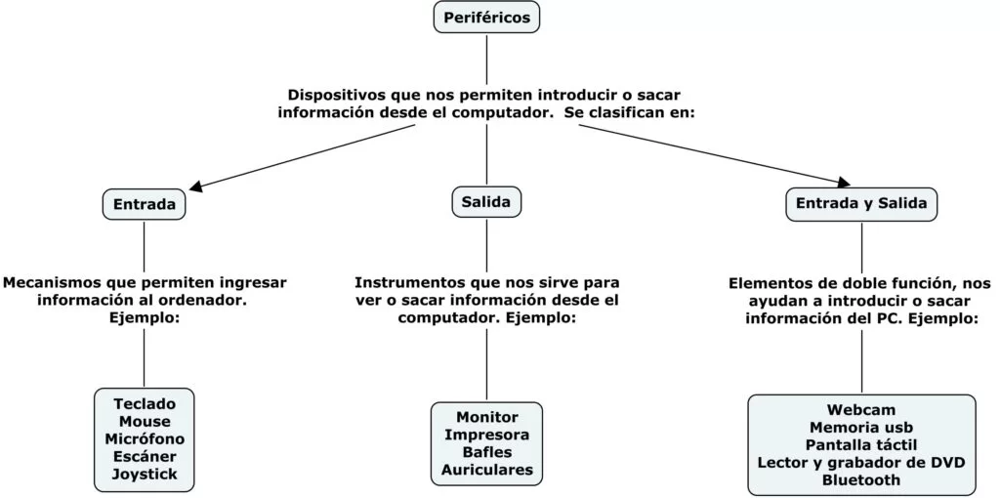{ width="95%" }
  <figcaption>Clasificación de periféricos según la dirección del flujo de información</figcaption>
</figure>

- **Periféricos de entrada**: envían información al ordenador. El flujo va del dispositivo hacia el sistema.
- **Periféricos de salida**: reciben información del ordenador y la presentan al usuario. El flujo va del sistema hacia el dispositivo.
- **Periféricos de entrada/salida (E/S)**: intercambian información en ambas direcciones.

## Periféricos de entrada

### Teclado

El **teclado** es el periférico de entrada más universal. Permite introducir texto, números y comandos mediante la pulsación de teclas. Los teclados actuales se conectan principalmente por **USB** o de forma inalámbrica por **Bluetooth** o **receptor USB 2.4 GHz**.

<!-- IMG: fotografía teclado mecánico y membrana comparativa -->
<figure markdown="span" align="center">
  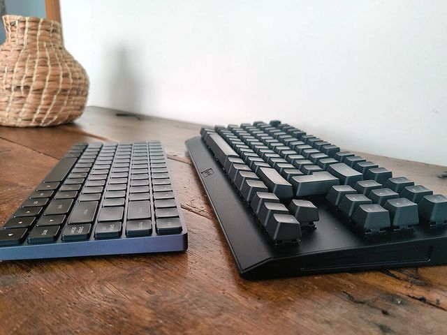{ width="70%" }
  <figcaption>Tipos de teclado: membrana (izquierda) y mecánico (derecha)</figcaption>
</figure>

Los teclados se clasifican principalmente por su **mecanismo de pulsación**:

- **Membrana**: el más común y económico. Las teclas presionan una membrana de goma que cierra el circuito. Silencioso pero con menor tacto.
- **Mecánico**: cada tecla tiene un interruptor mecánico independiente (switch). Mayor durabilidad, mejor tacto y respuesta. Muy popular en gaming y desarrollo.
- **Tijera** (*scissor*): variante usada en portátiles. Mecanismo compacto entre membrana y mecánico.

Los diseños de teclado más habituales son:

| Diseño | Teclas | Características |
|--------|--------|----------------|
| Completo (Full size) | ~104 | Incluye teclado numérico |
| TKL (Tenkeyless) | ~87 | Sin teclado numérico, más compacto |
| 75% | ~84 | Compacto con flechas y algunas teclas de función |
| 60% | ~61 | Sin flechas ni función, muy compacto |

### Ratón

El **ratón** traduce el movimiento físico en movimiento del cursor en pantalla. Los ratones actuales usan sensores **ópticos** o **láser** para detectar el movimiento sobre la superficie.

<!-- IMG: fotografía ratón óptico de escritorio y ratón ergonómico -->
<figure markdown="span" align="center">
  { width="65%" }
  <figcaption>Tipos de ratón: estándar óptico y ergonómico vertical</figcaption>
</figure>

Las características más importantes de un ratón son:

- **DPI** (*Dots Per Inch*): sensibilidad del sensor. A mayor DPI, el cursor se mueve más con menos movimiento físico. Un ratón típico va de 400 a 16.000 DPI.
- **Polling rate**: frecuencia con la que el ratón envía su posición al ordenador (Hz). A mayor polling rate, más fluido y preciso el movimiento.
- **Conexión**: USB con cable, USB inalámbrico (receptor 2.4 GHz) o Bluetooth.

### Escáner

El **escáner** convierte documentos físicos o fotografías en imágenes digitales. Usa una fuente de luz y sensores CCD o CIS para capturar la imagen línea a línea.

<!-- IMG: fotografía escáner de sobremesa plano -->
<figure markdown="span" align="center">
  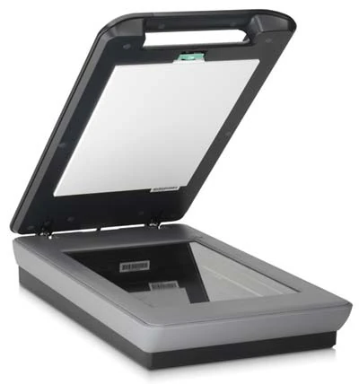{ width="55%" }
  <figcaption>Escáner de sobremesa plano para digitalización de documentos y fotografías</figcaption>
</figure>

### Micrófono y webcam

El **micrófono** convierte las ondas sonoras en señal eléctrica digital. La **webcam** captura imágenes y vídeo para videoconferencias, streaming o reconocimiento facial. Ambos se han convertido en periféricos esenciales para el trabajo remoto y la educación en línea.

<!-- IMG: fotografía micrófono de condensador USB y webcam de escritorio -->
<figure markdown="span" align="center">
  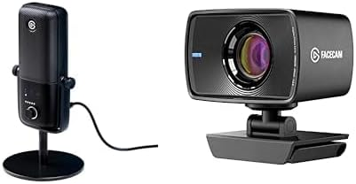{ width="65%" }
  <figcaption>Micrófono y webcam Full HD</figcaption>
</figure>

### Otros periféricos de entrada

- **Lápiz digitalizador y tableta gráfica**: para diseño, ilustración y anotaciones digitales.
- **Lector de código de barras / QR**: muy común en entornos comerciales e industriales.
- **Lector de tarjetas**: para DNI electrónico, tarjetas bancarias, tarjetas de acceso.
- **Joystick y gamepad**: para videojuegos y simuladores.

## Periféricos de salida

### El monitor

El monitor es el periférico de salida más importante. Recibe la señal de vídeo de la tarjeta gráfica y la muestra en pantalla. Sus características determinan en gran medida la experiencia de uso del ordenador.

Lo tratamos en detalle en su propia sección más adelante en este tema por la cantidad de parámetros relevantes.

### Impresora

La **impresora** convierte documentos digitales en copias físicas en papel u otros soportes. Existen varios tipos según la tecnología de impresión:

<!-- IMG: fotografía impresora láser de oficina y impresora de inyección de tinta doméstica -->
<figure markdown="span" align="center">
  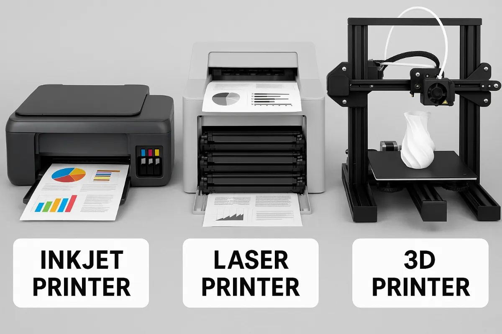{ width="70%" }
  <figcaption>Tipos de Impresora</figcaption>
</figure>

| Tipo | Tecnología | Velocidad | Coste/página | Uso típico |
|------|-----------|-----------|-------------|-----------|
| **Inyección de tinta** | Microgotas de tinta sobre papel | Media | Alto | Doméstico, fotografía |
| **Láser** | Tóner fundido con calor | Alta | Bajo | Oficina, volumen alto |
| **Térmica** | Calor sobre papel especial | Alta | Muy bajo | Tickets, etiquetas |
| **3D** | Deposición de material por capas | Baja | Variable | Prototipado, fabricación |

<figure markdown="span" align="center">
  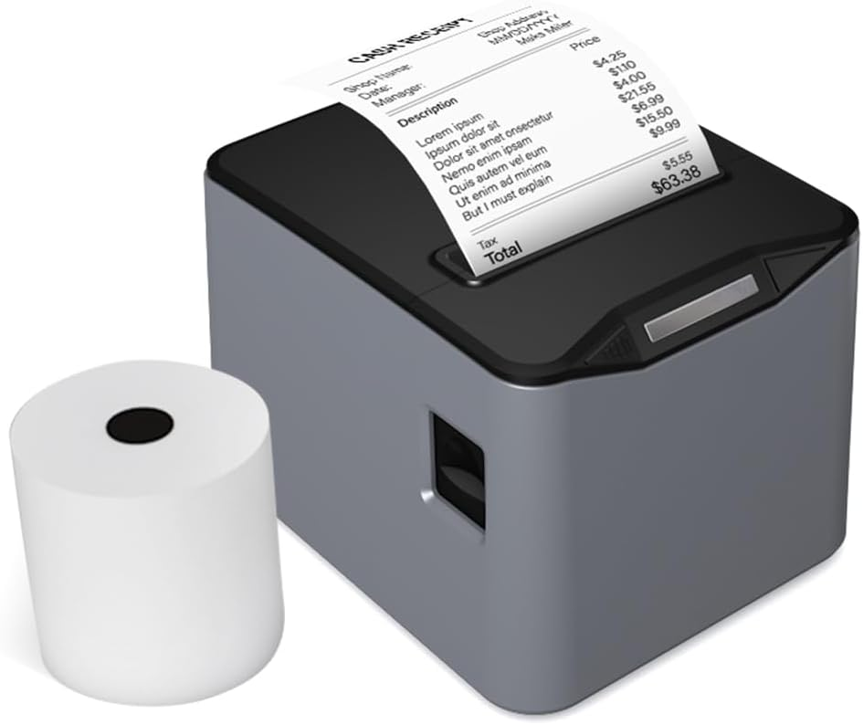{ width="50%" }
  <figcaption>Impresora térmica de etiquetas</figcaption>
</figure>

### Altavoces y auriculares

Convierten la señal de audio digital en ondas sonoras. Se conectan mediante jack 3,5mm, USB o de forma inalámbrica por Bluetooth.

<!-- IMG: fotografía altavoces de escritorio 2.1 y auriculares con micrófono -->
<figure markdown="span" align="center">
  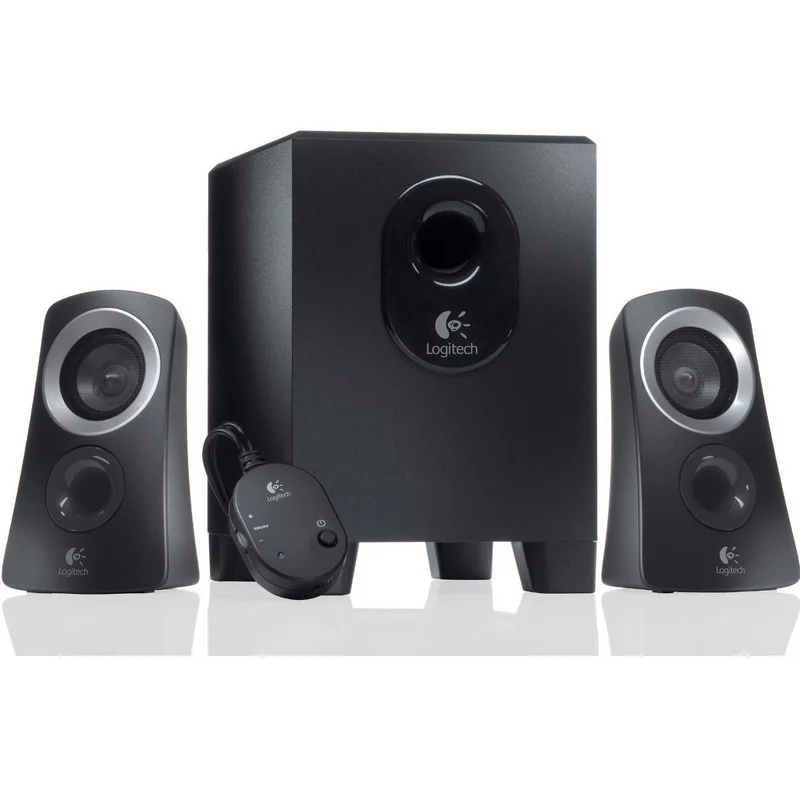{ width="40%" }
  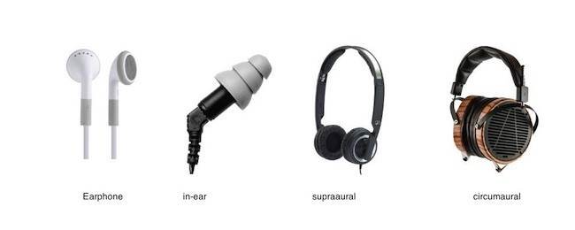{ width="80%" }
  <figcaption>Altavoces de escritorio 2.1 y tipos de auriculares</figcaption>
</figure>

### Proyector

Proyecta la imagen del ordenador sobre una superficie externa. Muy usado en entornos educativos y presentaciones. Los modelos actuales usan tecnología **DLP** o **LCD** y se conectan por HDMI o DisplayPort.

<!-- IMG: fotografía proyector de corta distancia en aula -->
<figure markdown="span" align="center">
  { width="60%" }
  <figcaption>Proyector de corta distancia en entorno educativo</figcaption>
</figure>

## Periféricos de entrada/salida

### Disco duro y SSD externos

Los discos externos funcionan exactamente igual que los internos pero en una carcasa con conexión USB o Thunderbolt. Son el periférico de E/S más común: se leen y escriben datos en ambas direcciones.

<!-- IMG: fotografía disco duro externo USB y SSD externo compacto -->
<figure markdown="span" align="center">
  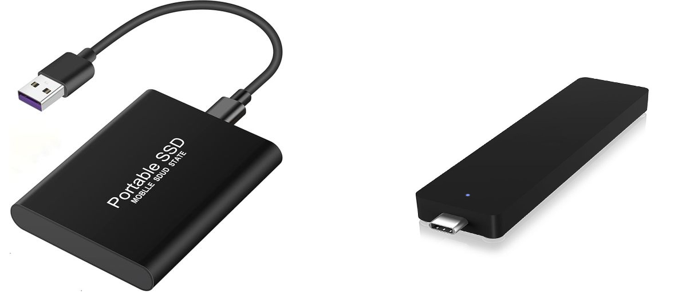{ width="65%" }
  <figcaption>Disco duro externo USB 3.0 (izquierda) y SSD externo compacto (derecha)</figcaption>
</figure>

### Impresora multifunción

Combina impresora, escáner y a veces fax en un solo dispositivo. Es el periférico de E/S más habitual en oficinas: imprime (salida) y escanea (entrada).

### Pantalla táctil

Funciona simultáneamente como periférico de salida (muestra imagen) y de entrada (detecta el toque del dedo o lápiz). Prácticamente todos los smartphones y tablets usan pantallas táctiles.

### Memoria USB (pendrive)

Almacenamiento flash en formato compacto con conector USB. Permite transportar datos entre equipos fácilmente. Es un dispositivo de E/S porque tanto se lee como se escribe en él.

<!-- IMG: fotografía pendrive USB-A y USB-C comparativa tamaños -->
<figure markdown="span" align="center">
  { width="55%" }
  <figcaption>Pendrive USB-A clásico (izquierda) y pendrive USB-C compacto (derecha)</figcaption>
</figure>

---

## Conectores externos

Un **conector** es la interfaz física que permite conectar un periférico al ordenador. Entender los conectores es fundamental porque determina qué dispositivos son compatibles con nuestro equipo y qué rendimiento podemos esperar de esa conexión. No todos los conectores con el mismo aspecto son iguales — el mismo conector físico puede ocultar protocolos completamente diferentes con velocidades muy distintas.

## USB: el conector universal

**USB** (*Universal Serial Bus*) es el estándar de conexión más usado del mundo. Prácticamente cualquier periférico moderno — teclados, ratones, discos, cámaras, teléfonos — usa USB en alguna de sus variantes. Pero la familia USB es enorme y confusa, con múltiples versiones y tipos de conector que conviene conocer bien.

### Versiones USB: la velocidad

La versión USB determina la velocidad máxima de transferencia:

| Versión | Nombre comercial | Velocidad máxima | Año | Notas |
|---------|-----------------|-----------------|-----|-------|
| USB 1.1 | USB Full Speed | 12 Mbps | 1998 | Obsoleto |
| USB 2.0 | USB Hi-Speed | 480 Mbps | 2000 | Aún muy común en periféricos básicos |
| USB 3.0 | USB 3.2 Gen 1 | 5 Gbps | 2008 | Identificado con color azul |
| USB 3.1 | USB 3.2 Gen 2 | 10 Gbps | 2013 | Doble velocidad respecto a 3.0 |
| USB 3.2 | USB 3.2 Gen 2×2 | 20 Gbps | 2017 | Solo en conector Type-C |
| USB4 Gen 2×2 | USB4 20 | 20 Gbps | 2019 | Basado en protocolo Thunderbolt |
| USB4 Gen 3×2 | USB4 40 | 40 Gbps | 2019 | Equivalente a Thunderbolt 3 |

!!! warning "La confusión de los nombres USB"
    La nomenclatura USB es de las más confusas de la informática. Lo que en 2008 se llamó "USB 3.0" se renombró después a "USB 3.1 Gen 1" y luego a "USB 3.2 Gen 1". Un mismo puerto puede tener tres nombres distintos según quién lo etiquete. Lo más fiable es fijarse en la **velocidad en Gbps** que indica el fabricante, no en el número de versión.

### Tipos de conector USB: la forma física

La versión (velocidad) y el tipo de conector (forma física) son independientes. Un mismo tipo de conector puede implementar varias versiones USB:

<!-- IMG: fotografía comparativa todos los tipos de conector USB: Type-A, Type-B, Mini-B, Micro-B, Type-C -->
<figure markdown="span" align="center">
  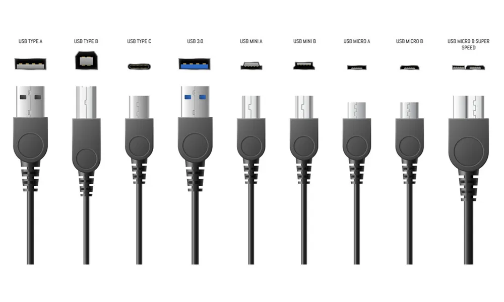{ width="85%" }
  <figcaption>Tipos de conector USB: Type-A, Type-B, Mini-B, Micro-B y Type-C</figcaption>
</figure>

| Conector | Descripción | Uso típico |
|----------|-------------|-----------|
| **Type-A** | Rectangular, el más clásico | Ordenadores (host), pendrives, cargadores |
| **Type-B** | Cuadrado, más grande | Impresoras, hubs, equipos de sobremesa |
| **Mini-B** | Pequeño, 5 pines | Cámaras y dispositivos antiguos (obsoleto) |
| **Micro-B** | Muy pequeño, trapezoidal | Móviles y tablets antiguos, discos externos |
| **Type-C** | Ovalado, reversible | Estándar actual en móviles, portátiles, periféricos |

### USB Type-C: el presente y el futuro

**USB Type-C** merece mención especial. Es el único conector **reversible** (se puede insertar en cualquier orientación), compacto y capaz de transportar simultáneamente datos, vídeo y corriente eléctrica por el mismo cable.

<!-- IMG: primer plano conector USB-C mostrando su simetría -->
<figure markdown="span" align="center">
  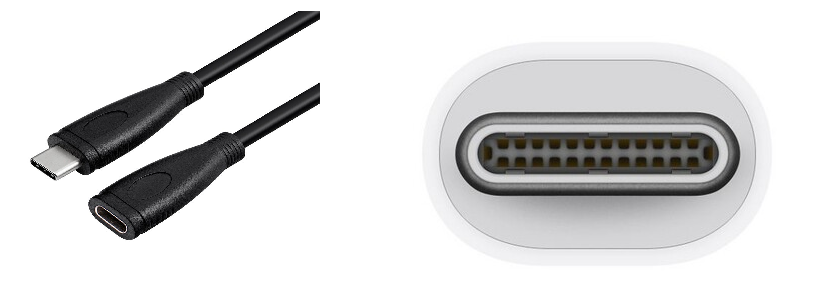{ width="55%" }
  <figcaption>Conector USB Type-C: reversible, compacto y multipropósito</figcaption>
</figure>

Un puerto USB-C puede implementar:
- USB 3.2 Gen 2 (10 Gbps)
- USB4 (40 Gbps)
- Thunderbolt 3 o 4 (40 Gbps)
- DisplayPort Alternate Mode (vídeo)
- Power Delivery (carga de hasta 240 W)

!!! warning "No todos los USB-C son iguales"
    Que un dispositivo tenga conector USB-C no significa que soporte todas estas funciones. Un móvil económico puede tener USB-C pero solo a velocidad USB 2.0. Siempre hay que consultar las especificaciones del dispositivo para saber qué versión implementa ese conector específico.

---

## Conectores de vídeo

Los conectores de vídeo transmiten la señal de imagen (y generalmente audio) desde la tarjeta gráfica hasta el monitor. Conocerlos es importante porque determinan la resolución máxima, la frecuencia de refresco y las capacidades de la conexión.

<!-- IMG: fotografía comparativa conectores de vídeo: VGA, DVI, HDMI, DisplayPort, Mini-DP, USB-C -->
<figure markdown="span" align="center">
  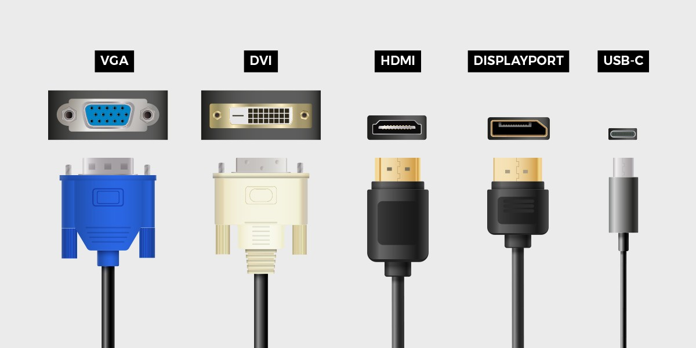{ width="85%" }
  <figcaption>Conectores de vídeo más comunes: VGA, DVI, HDMI, DisplayPort y USB-C/Thunderbolt</figcaption>
</figure>

### VGA (D-Sub)

**VGA** (*Video Graphics Array*) es el conector de vídeo más antiguo que todavía puede encontrarse en equipos. Transmite señal **analógica**, lo que significa que la calidad de imagen puede degradarse con cables de baja calidad o longitudes grandes. Máximo práctico de 1920×1080 a 60 Hz.

Hoy en día está completamente obsoleto y solo se encuentra en proyectores y monitores muy antiguos. Si un equipo moderno necesita conectar a VGA, se usa un adaptador.

<!-- IMG: fotografía conector VGA de 15 pines azul -->
<figure markdown="span" align="center">
  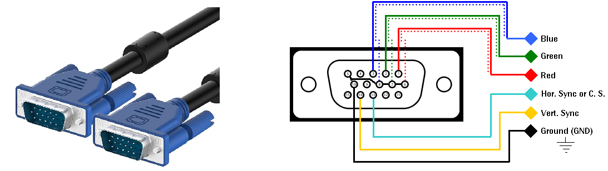{ width="45%" }
  <figcaption>Conector VGA (D-Sub 15 pines). Señal analógica, actualmente obsoleto</figcaption>
</figure>

### DVI

**DVI** (*Digital Visual Interface*) fue la evolución digital del VGA. Puede transmitir señal digital (DVI-D), analógica (DVI-A) o ambas (DVI-I). Soporta hasta 2560×1600 en su versión Dual Link.

Está también en proceso de desaparición, sustituido por HDMI y DisplayPort. Todavía se encuentra en monitores de gama media de hace unos años.

<!-- IMG: fotografía conector DVI-D dual link -->
<figure markdown="span" align="center">
  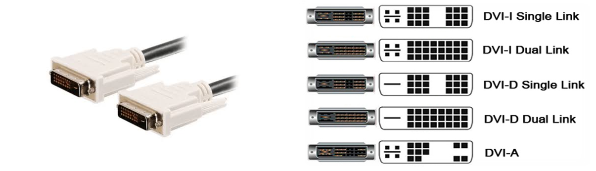{ width="45%" }
  <figcaption>Conector DVI-D Dual Link. Digital, soporta hasta 2560×1600</figcaption>
</figure>

### HDMI

**HDMI** (*High Definition Multimedia Interface*) es el estándar dominante en electrónica de consumo. Transmite vídeo y audio **digital** por un solo cable. Se encuentra en televisores, monitores, proyectores, consolas, reproductores y prácticamente cualquier dispositivo multimedia.

<!-- IMG: fotografía conector HDMI Type-A estándar y Type-D micro -->
<figure markdown="span" align="center">
  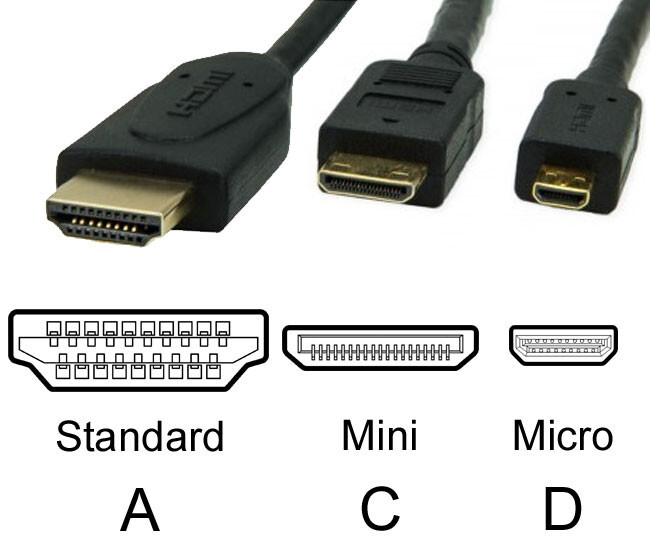{ width="55%" }
  <figcaption>Conector HDMI Type-A (estándar) y Type-D (micro HDMI para tablets y cámaras)</figcaption>
</figure>

| Versión HDMI | Ancho de banda | Resolución máxima | Frecuencia máxima |
|-------------|---------------|-------------------|------------------|
| HDMI 1.4 | 10,2 Gbps | 4K | 30 Hz |
| HDMI 2.0 | 18 Gbps | 4K | 60 Hz / 1080p 240 Hz |
| HDMI 2.1 | 48 Gbps | 10K | 4K 144 Hz / 8K 60 Hz |

### DisplayPort

**DisplayPort** es el estándar profesional diseñado específicamente para conectar ordenadores a monitores. Desarrollado por VESA, es el preferido en el mundo PC para gaming y diseño por su mayor ancho de banda y funciones avanzadas.

<!-- IMG: fotografía conector DisplayPort estándar y Mini DisplayPort -->
<figure markdown="span" align="center">
  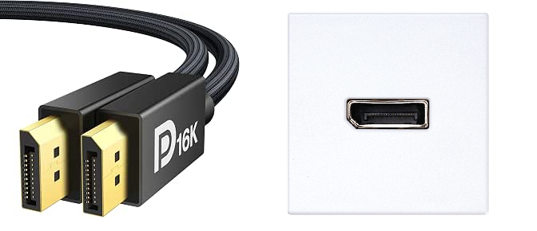{ width="55%" }
  <figcaption>Conector DisplayPort estándar (izquierda) y Mini DisplayPort (derecha)</figcaption>
</figure>

| Versión DP | Ancho de banda | Resolución máxima | Frecuencia máxima |
|-----------|---------------|-------------------|------------------|
| DP 1.2 | 17,28 Gbps | 4K | 60 Hz / 1440p 165 Hz |
| DP 1.4 | 25,92 Gbps | 8K | 4K 120 Hz / 1440p 240 Hz |
| DP 2.0 | 77,37 Gbps | 16K | 4K 240 Hz / 8K 85 Hz |

**Ventaja exclusiva de DisplayPort**: permite conectar **múltiples monitores en cadena** (*daisy chaining*) con un solo cable desde la tarjeta gráfica, usando la tecnología **MST** (*Multi-Stream Transport*).

### Thunderbolt

**Thunderbolt** es un protocolo desarrollado por Intel en colaboración con Apple que usa el conector físico USB-C. Combina datos (PCIe + USB), vídeo (DisplayPort) y alimentación en un solo cable con velocidades muy superiores al USB estándar.

<!-- IMG: fotografía puerto Thunderbolt con rayo identificativo en el conector -->
<figure markdown="span" align="center">
  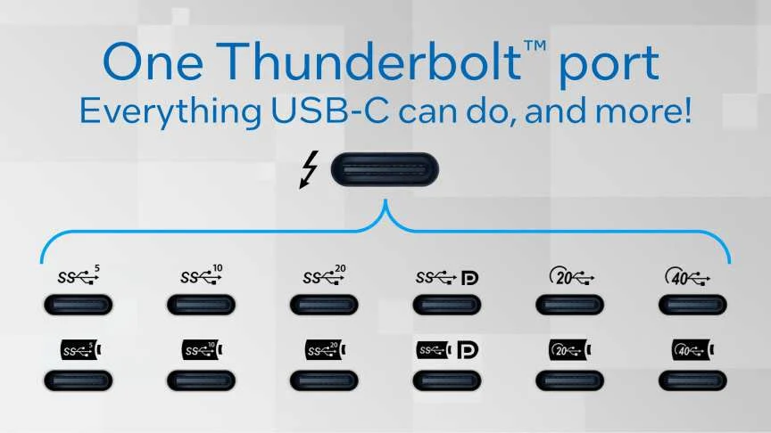{ width="50%" }
  <figcaption>Puerto Thunderbolt identificado con el icono del rayo. Mismo conector que USB-C pero mucho más capaz</figcaption>
</figure>

| Versión | Velocidad datos | Vídeo | Alimentación | Equivalente USB |
|---------|----------------|-------|-------------|----------------|
| Thunderbolt 3 | 40 Gbps | 2× DisplayPort 1.2 | 100 W | USB4 Gen 3×2 |
| Thunderbolt 4 | 40 Gbps | 2× DisplayPort 1.4 | 100 W | USB4 Gen 3×2 |
| Thunderbolt 5 | 120 Gbps | DisplayPort 2.1 | 240 W | USB4 Gen 4 |

Thunderbolt permite conectar **docks** (estaciones de acoplamiento) que expanden un solo puerto Thunderbolt en múltiples USB, HDMI, Ethernet, tarjetas SD y más.

---

## Conectores de red

### RJ-45 (Ethernet)

El conector **RJ-45** es el estándar para redes cableadas Ethernet. Similar en apariencia al conector de teléfono (RJ-11) pero más ancho (8 pines frente a 4).

<!-- IMG: fotografía conector RJ-45 macho y hembra en placa base -->
<figure markdown="span" align="center">
  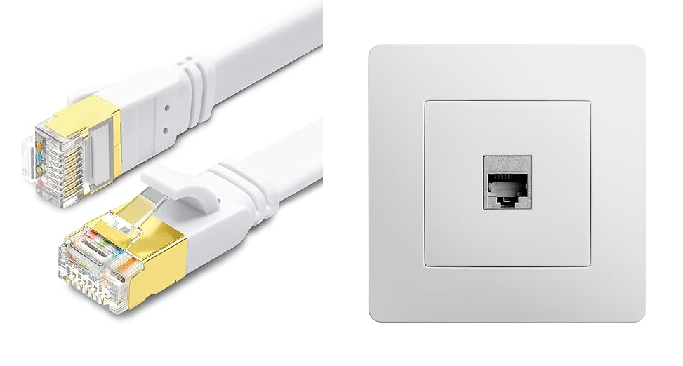{ width="55%" }
  <figcaption>Conector RJ-45: estándar para redes cableadas Ethernet. 8 pines, hasta 10 Gbps en Cat6A</figcaption>
</figure>

La velocidad soportada depende del estándar Ethernet y la categoría del cable:

| Estándar | Velocidad | Categoría cable mínima |
|----------|-----------|----------------------|
| Fast Ethernet | 100 Mbps | Cat5 |
| Gigabit Ethernet | 1 Gbps | Cat5e |
| 2.5G Ethernet | 2,5 Gbps | Cat5e |
| 10G Ethernet | 10 Gbps | Cat6A |

### SFP / SFP+ (fibra óptica)

En entornos de servidor y redes de alta velocidad se usan módulos **SFP** (*Small Form-factor Pluggable*) que permiten conectar cables de fibra óptica. No es habitual en equipos de consumo pero sí en switches de red y servidores.

---

## Conectores de audio

### Jack 3,5mm (TRS/TRRS)

El jack de 3,5mm es el conector de audio analógico más universal. Está presente en auriculares, altavoces, micrófonos y prácticamente cualquier dispositivo de audio de consumo.

<!-- IMG: fotografía conectores jack 3.5mm TRS (estéreo) y TRRS (con micrófono) con sus anillos identificados -->
<figure markdown="span" align="center">
  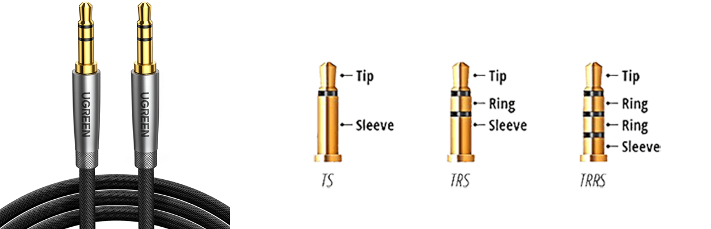{ width="55%" }
  <figcaption>Jack 3,5mm TRS (3 contactos, solo audio) y TRRS (4 contactos, audio + micrófono)</figcaption>
</figure>

- **TRS** (Tip-Ring-Sleeve, 3 contactos): audio estéreo sin micrófono. El clásico de auriculares para PC.
- **TRRS** (4 contactos): audio estéreo + micrófono. El estándar en smartphones y auriculares con micrófono integrado.

### S/PDIF y TOSLINK (óptico digital)

**TOSLINK** es el conector de audio digital óptico. Transmite audio digital mediante pulsos de luz, eliminando completamente el ruido eléctrico. Se usa para conectar sistemas de Home Cinema, amplificadores y DACs de alta fidelidad.

<!-- IMG: fotografía conector TOSLINK óptico con cubierta y sin ella mostrando la luz roja -->
<figure markdown="span" align="center">
  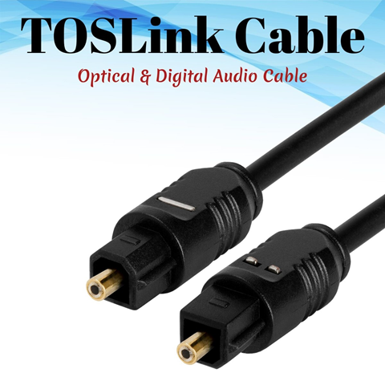{ width="50%" }
  <figcaption>Conector TOSLINK óptico. La luz roja indica que está activo y transmitiendo señal digital</figcaption>
</figure>

---

## El monitor en detalle

El monitor merece un apartado propio porque es el periférico con el que el usuario interactúa visualmente durante toda la jornada de trabajo. Sus características afectan directamente a la productividad, la comodidad visual y la calidad del trabajo de diseño.

### Resolución

La **resolución** indica el número de píxeles que puede mostrar el monitor, expresada como ancho × alto:

| Nombre | Resolución | Relación de aspecto | Uso típico |
|--------|-----------|--------------------| ---------|
| Full HD (FHD) | 1920 × 1080 | 16:9 | Estándar de consumo |
| Quad HD (QHD) | 2560 × 1440 | 16:9 | Gaming, diseño, productividad |
| 4K Ultra HD | 3840 × 2160 | 16:9 | Diseño profesional, edición vídeo |
| Ultra Wide FHD | 2560 × 1080 | 21:9 | Productividad, multitarea |
| Ultra Wide QHD | 3440 × 1440 | 21:9 | Gaming y productividad premium |
| 5K | 5120 × 2880 | 16:9 | Edición fotográfica y vídeo |

### Tipos de panel

El **tipo de panel** determina la calidad de imagen, los ángulos de visión, el tiempo de respuesta y el coste. Existen cuatro tecnologías principales:

<!-- IMG: comparativa ángulos de visión IPS vs TN vs VA -->
<figure markdown="span" align="center">
  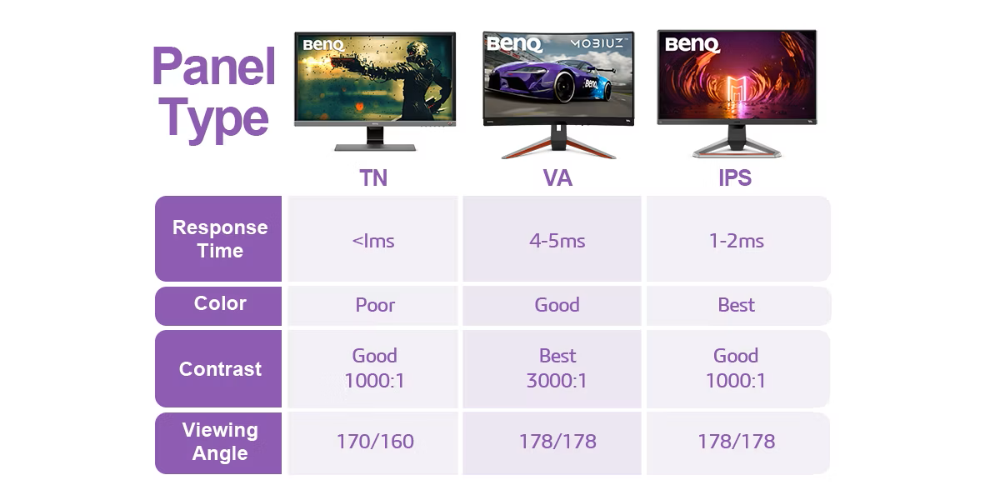{ width="80%" }
  <figcaption>Comparativa de tipos de panel: TN, IPS, VA y OLED en términos de rendimiento</figcaption>
</figure>

**TN (Twisted Nematic)**

La tecnología más antigua y económica. Su punto fuerte es el **tiempo de respuesta** extremadamente bajo (1 ms), lo que lo hace popular en gaming competitivo. Sus debilidades son los ángulos de visión muy limitados y la reproducción de color mediocre.

- ✅ Tiempo de respuesta muy bajo
- ✅ Precio bajo
- ❌ Ángulos de visión pobres
- ❌ Reproducción de color mediocre
- **Uso ideal**: gaming competitivo donde la velocidad es prioritaria

**IPS (In-Plane Switching)**

El estándar para trabajo profesional. Ofrece **colores precisos y consistentes** y excelentes ángulos de visión (178°), lo que significa que la imagen se ve igual desde cualquier ángulo. Su único inconveniente histórico era el tiempo de respuesta, pero los IPS modernos ya alcanzan 1 ms.

- ✅ Colores precisos y consistentes
- ✅ Excelentes ángulos de visión
- ✅ Buena para trabajo y gaming
- ❌ Precio algo más alto que TN
- **Uso ideal**: diseño, fotografía, desarrollo, uso general

**VA (Vertical Alignment)**

Punto intermedio entre TN e IPS. Su característica destacada es el **contraste nativo** muy alto (hasta 5000:1 frente a 1000:1 del IPS), lo que produce negros muy profundos. Ideal para contenido multimedia. Sus debilidades son el *smearing* (efecto fantasma en movimientos rápidos) y los ángulos de visión algo peores que IPS.

- ✅ Contraste muy alto, negros profundos
- ✅ Buenos colores
- ❌ Smearing en movimientos rápidos
- ❌ Ángulos algo inferiores a IPS
- **Uso ideal**: cine, contenido multimedia, trabajo general

**OLED**

La tecnología más moderna y de mayor calidad. Cada píxel emite su propia luz, lo que permite **negros perfectos** (el píxel simplemente se apaga), contraste infinito y colores vibrantes. Los OLED modernos para monitor tienen tiempos de respuesta de 0,03 ms y frecuencias de refresco de hasta 240 Hz.

- ✅ Negros perfectos, contraste infinito
- ✅ Colores y HDR excepcionales
- ✅ Tiempo de respuesta ultrarrápido
- ❌ Precio elevado
- ❌ Riesgo de *burn-in* (retención de imagen) con imágenes estáticas
- **Uso ideal**: diseño de alto nivel, gaming premium, edición de vídeo

### Frecuencia de refresco

La **frecuencia de refresco** (Hz) indica cuántas veces por segundo se actualiza la imagen en pantalla. A mayor frecuencia, el movimiento se ve más fluido:

| Frecuencia | Percepción | Uso típico |
|-----------|-----------|-----------|
| 60 Hz | Estándar, fluido para trabajo | Ofimática, desarrollo, uso general |
| 75 Hz | Ligeramente más suave | Uso general mejorado |
| 144 Hz | Muy fluido | Gaming, usuarios exigentes |
| 165-240 Hz | Extremadamente fluido | Gaming competitivo |
| 360 Hz | Máxima fluidez posible | Gaming profesional/esports |

Para trabajar con código, documentos o navegador, **60 Hz es completamente suficiente**. La diferencia entre 60 y 144 Hz es claramente perceptible en juegos y en el movimiento del cursor, pero no mejora la productividad en tareas de desarrollo.

### Tiempo de respuesta

El **tiempo de respuesta** (ms) es el tiempo que tarda un píxel en cambiar de un color a otro. A menor tiempo, menos *ghosting* (efecto fantasma) en imágenes en movimiento rápido. Solo es relevante para gaming; para trabajo es completamente irrelevante.

### Tamaño y ergonomía

El tamaño del monitor se mide en pulgadas en diagonal. Para trabajo de desarrollo, los tamaños más habituales son:

- **24"**: compacto, ideal para espacios reducidos o como segundo monitor.
- **27"**: el más popular para desarrollo y diseño a 1440p. Buen equilibrio tamaño/resolución.
- **32"**: gran espacio de trabajo, ideal a 4K.
- **34"-49" ultrawide**: máxima superficie de trabajo sin necesidad de doble monitor.

!!! tip "Recomendación para desarrollo"
    Para desarrollo de software, un monitor **IPS de 27" a 1440p (QHD) con 60-144 Hz** es la opción más equilibrada. La resolución QHD en 27" ofrece suficiente espacio para tener el IDE, la terminal y el navegador abiertos simultáneamente sin que el texto sea demasiado pequeño. Un segundo monitor de 24" Full HD como pantalla secundaria para documentación o navegador es una combinación muy productiva.

---

## Resumen de conectores

<!-- IMG: tabla visual resumen de todos los conectores con fotografía de cada uno -->
<figure markdown="span" align="center">
  { width="95%" }
  <figcaption>Resumen visual de los conectores externos más importantes en un equipo moderno</figcaption>
</figure>

| Conector | Tipo | Velocidad / Capacidad | Uso principal |
|----------|------|----------------------|--------------|
| USB-A 2.0 | Datos | 480 Mbps | Periféricos lentos: teclado, ratón |
| USB-A 3.2 Gen1 | Datos | 5 Gbps | Pendrives, discos externos |
| USB-C 3.2 Gen2 | Datos + carga | 10 Gbps + 100 W | Discos externos rápidos, carga |
| Thunderbolt 4 | Datos + vídeo + carga | 40 Gbps + 100 W | Docks, monitores, discos rápidos |
| HDMI 2.1 | Vídeo + audio | 48 Gbps | Televisores, monitores, consolas |
| DisplayPort 1.4 | Vídeo | 25,92 Gbps | Monitores PC, gaming |
| RJ-45 | Red | hasta 10 Gbps | Red local cableada |
| Jack 3,5mm | Audio analógico | — | Auriculares, altavoces, micrófono |
| TOSLINK | Audio digital | — | Sistemas de audio de alta fidelidad |