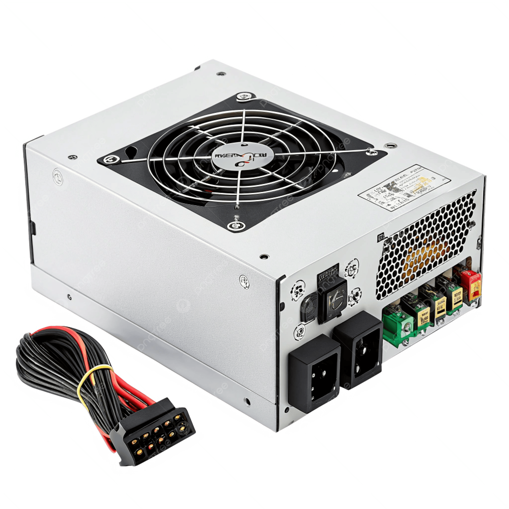
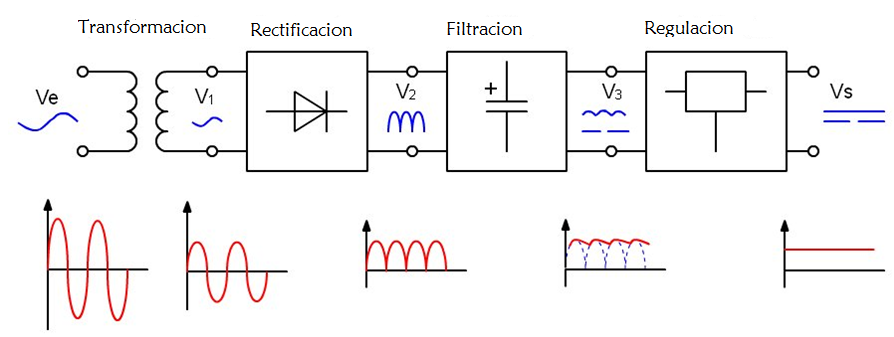
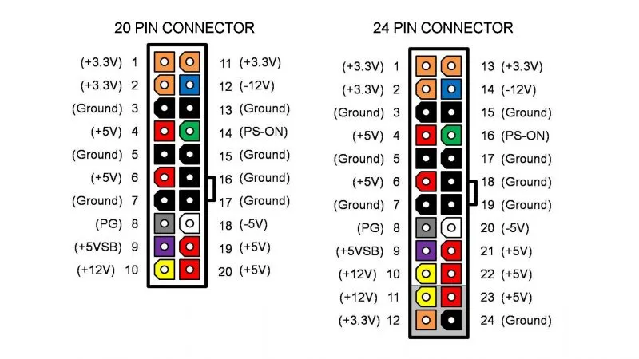
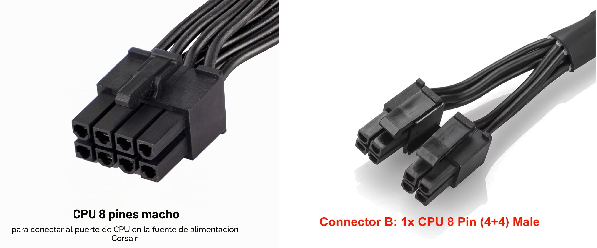
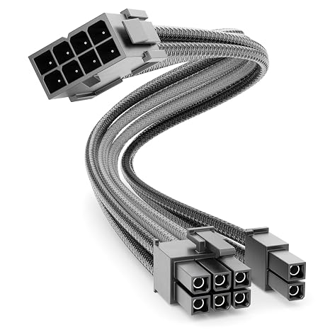
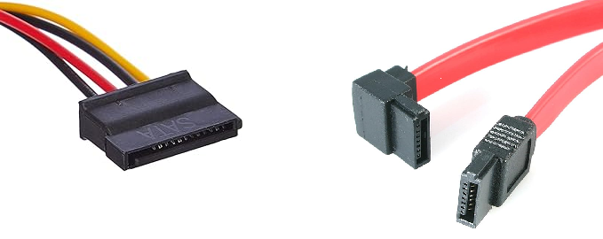
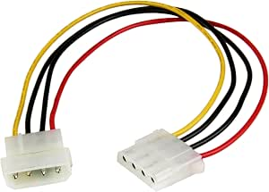
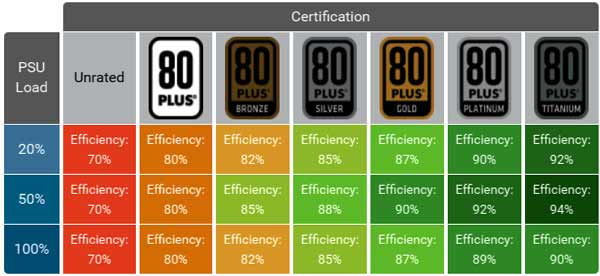
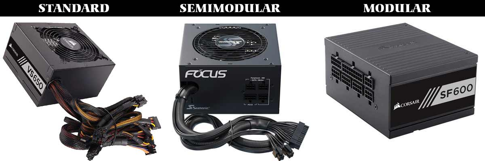

La **fuente de alimentación** (*PSU, Power Supply Unit*) es el componente encargado de suministrar energía eléctrica a todos los demás componentes del ordenador. Sin ella, ningún componente funciona. A pesar de ser uno de los componentes menos "*glamurosos*" del sistema, es uno de los más críticos: una fuente de mala calidad puede dañar permanentemente componentes caros como la CPU, la GPU o la placa base, y una fuente subdimensionada puede causar inestabilidades y apagados inesperados.

La corriente eléctrica que llega a nuestros hogares y oficinas es **corriente alterna (AC)** a 220-240 V en Europa. Sin embargo, los componentes internos del ordenador funcionan con **corriente continua (DC)** a voltajes mucho más bajos: 12 V, 5 V y 3,3 V principalmente. La función principal de la fuente de alimentación es realizar esta conversión de forma eficiente y estable.

<!-- IMG: fotografía de una fuente de alimentación ATX modular vista desde fuera e interior -->
<figure markdown="span" align="center">
  { width="70%" }
  <figcaption>Fuente de alimentación ATX modular. Convierte la corriente alterna de la red en corriente continua para los componentes</figcaption>
</figure>

## ¿Cómo funciona una fuente de alimentación?

El proceso de conversión que realiza la fuente tiene varias etapas:

1. **Rectificación**: convierte la corriente alterna (AC) en corriente continua (DC) mediante un puente de diodos.
2. **Filtrado**: elimina las fluctuaciones de la corriente rectificada para obtener una señal más limpia.
3. **Conmutación**: un circuito de conmutación de alta frecuencia reduce el voltaje al nivel necesario.
4. **Regulación**: circuitos de control mantienen los voltajes de salida estables independientemente de la carga.
5. **Protecciones**: circuitos adicionales protegen contra sobretensión (OVP), sobrecorriente (OCP), cortocircuito (SCP) y sobrecalentamiento (OTP).

La calidad de todos estos circuitos es lo que diferencia una fuente económica de una premium, y lo que determina si los componentes conectados recibirán una alimentación limpia y estable o una señal con ruido que puede degradarlos con el tiempo.

<!-- IMG: diagrama de bloques del proceso de conversión AC→DC con las etapas identificadas -->
<figure markdown="span" align="center">
  { width="75%" }
  <figcaption>Diagrama del proceso de conversión AC→DC en una fuente de alimentación</figcaption>
</figure>

## Voltajes de salida

Una fuente de alimentación estándar proporciona tres voltajes principales de corriente continua:

| Voltaje | Color del cable | Uso principal |
|---------|----------------|--------------|
| **+12 V** | Amarillo | CPU, GPU, motores de discos HDD, ventiladores |
| **+5 V** | Rojo | Placas USB, almacenamiento, electrónica de placa base |
| **+3,3 V** | Naranja | RAM, chipset, circuitos lógicos de baja potencia |
| **-12 V** | Azul | Algunos circuitos de audio y comunicaciones (residual) |
| **+5 V standby** | Morado | Alimentación en standby (el equipo "recuerda" la hora cuando está apagado) |

El raíl de **+12 V** es con diferencia el más importante en los sistemas modernos: la CPU y la GPU son los componentes que más consumen y ambos funcionan principalmente a 12 V. Por eso cuando se comparan fuentes de alimentación, la capacidad del raíl de 12 V es uno de los datos más relevantes.

## Conectores de la fuente de alimentación

Cada conector tiene una forma física específica que hace imposible conectarlo en el lugar incorrecto:

### Conector ATX 24 pines

Es el conector principal que alimenta la placa base. Proporciona todos los voltajes (+12V, +5V, +3,3V) necesarios para el funcionamiento general de la placa. Es el conector más grande de la fuente.

<!-- IMG: fotografía conector ATX 24 pines con los pines numerados -->
<figure markdown="span" align="center">
  { width="55%" }
  <figcaption>Conector ATX 24 pines: alimentación principal de la placa base</figcaption>
</figure>

Algunas fuentes antiguas tienen un conector de 20 pines que puede ampliarse a 24 con un módulo adicional. Las placas base modernas requieren los 24 pines completos.

### Conector CPU (EPS 8 pines / 4+4 pines)

Alimenta exclusivamente el procesador. Proporciona corriente de +12 V directamente al VRM (regulador de voltaje) de la placa base, que luego la convierte al voltaje exacto que necesita la CPU.

<!-- IMG: fotografía conector EPS 8 pines y 4+4 pines para CPU -->
<figure markdown="span" align="center">
  { width="55%" }
  <figcaption>Conector EPS de alimentación de CPU: 8 pines estándar o 4+4 pines desmontable</figcaption>
</figure>

Las placas base de gama alta para overclocking pueden tener dos conectores de 8 pines (16 pines en total) para poder suministrar más corriente a CPUs de alto consumo como el Core i9 o el Ryzen 9.

### Conector PCIe (6+2 pines)

Alimenta las tarjetas gráficas dedicadas, que son los componentes de mayor consumo en un sistema gaming o de trabajo con GPU. Las tarjetas de gama media usan un conector de 6 u 8 pines; las de gama alta pueden necesitar dos o tres conectores de 8 pines.

<!-- IMG: fotografía conector PCIe 6+2 pines para GPU -->
<figure markdown="span" align="center">
  { width="55%" }
  <figcaption>Conector PCIe 6+2 pines para alimentación de tarjeta gráfica</figcaption>
</figure>

Las GPUs de última generación (NVIDIA RTX 4000/5000) usan el nuevo conector **12VHPWR** de 16 pines que puede suministrar hasta 600 W a través de un único conector.

### Conector SATA

Alimenta los discos duros SATA, SSDs SATA y unidades ópticas. Es un conector plano en forma de L con 15 pines.

<!-- IMG: fotografía conector SATA de alimentación comparado con conector SATA de datos -->
<figure markdown="span" align="center">
  { width="55%" }
  <figcaption>Conector SATA de alimentación (15 pines, izquierda) y de datos (7 pines, derecha)</figcaption>
</figure>

### Conector Molex (4 pines)

Un conector más antiguo de 4 pines que alimentaba discos duros IDE y unidades ópticas. Aunque casi obsoleto para almacenamiento, todavía se usa para alimentar algunos ventiladores de gran formato, tiras LED y adaptadores.

<!-- IMG: fotografía conector Molex 4 pines -->
<figure markdown="span" align="center">
  { width="45%" }
  <figcaption>Conector Molex de 4 pines: antiguo estándar para discos IDE, aún usado en algunos periféricos</figcaption>
</figure>

## Potencia: ¿cuántos vatios necesito?

La **potencia** de una fuente se mide en vatios (W) e indica la cantidad máxima de energía que puede suministrar simultáneamente a todos los componentes. Elegir una fuente con potencia insuficiente es un error grave: el sistema se volverá inestable, se apagará bajo carga o en el peor caso dañará componentes.

Sin embargo, comprar una fuente excesivamente sobredimensionada tampoco es la mejor estrategia: las fuentes rinden mejor en eficiencia cuando trabajan entre el 40% y el 80% de su carga máxima.

### Consumo típico de los componentes

| Componente | Consumo típico | Consumo máximo |
|------------|---------------|----------------|
| CPU gama media (Ryzen 5, Core i5) | 65-95 W | 125 W |
| CPU gama alta (Ryzen 9, Core i9) | 125-170 W | 253 W |
| GPU gama media (RTX 4060, RX 7600) | 115-165 W | 165 W |
| GPU gama alta (RTX 4080, RX 7900 XTX) | 285-355 W | 355 W |
| RAM (por módulo DDR5) | 3-5 W | 8 W |
| SSD NVMe | 3-8 W | 10 W |
| HDD 7200 RPM | 6-10 W | 15 W |
| Placa base | 25-50 W | 80 W |
| Ventiladores (cada uno) | 1-5 W | 6 W |

### Cómo calcular la potencia necesaria

La forma más fiable de calcular la potencia necesaria es usar una **calculadora de PSU online** como la de [OuterVision](https://outervision.com/power-supply-calculator) o la de [be quiet!](https://www.bequiet.com/en/psucalculator). Estas calculadoras tienen las bases de datos de consumo de todos los componentes actuales y calculan la potencia recomendada con un margen de seguridad.

Como regla general para equipos de consumo:

| Tipo de sistema | Potencia recomendada |
|----------------|---------------------|
| Ofimática / desarrollo sin GPU dedicada | 350-450 W |
| Gaming gama media (RTX 4060 + Ryzen 5) | 550-650 W |
| Gaming gama alta (RTX 4080 + Core i9) | 750-850 W |
| Workstation con GPU profesional | 850-1000 W |
| Servidor de virtualización | 500-800 W (sin GPU) |

!!! tip "Margen de seguridad"
    Añade siempre un **20-30% de margen** sobre el consumo calculado. Esto asegura que la fuente trabaje en su rango de mayor eficiencia y deja margen para futuras ampliaciones.

## Eficiencia: la certificación 80 Plus

La **eficiencia** de una fuente indica qué porcentaje de la electricidad que consume de la red se convierte en electricidad útil para los componentes. El resto se disipa en forma de calor.

Una fuente con eficiencia del 80% que consume 100 W de la red entrega 80 W a los componentes y disipa 20 W en calor. Una fuente con eficiencia del 90% entrega 90 W y disipa solo 10 W.

La **certificación 80 Plus** es el estándar de referencia de la industria para garantizar la eficiencia de una fuente. Establece niveles mínimos de eficiencia a diferentes cargas (20%, 50% y 100% de la carga máxima):

<!-- IMG: tabla visual certificaciones 80 Plus con colores y porcentajes -->
<figure markdown="span" align="center">
  { width="80%" }
  <figcaption>Niveles de certificación 80 Plus: de menor a mayor eficiencia</figcaption>
</figure>

| Certificación | Eficiencia al 20% | Eficiencia al 50% | Eficiencia al 100% |
|--------------|------------------|------------------|-------------------|
| **80 Plus** | 80% | 80% | 80% |
| **80 Plus Bronze** | 82% | 85% | 82% |
| **80 Plus Silver** | 85% | 88% | 85% |
| **80 Plus Gold** | 87% | 90% | 87% |
| **80 Plus Platinum** | 90% | 92% | 89% |
| **80 Plus Titanium** | 90% | 94% | 91% |

!!! info "¿Merece la pena pagar más por una certificación mayor?"
    Desde un punto de vista económico, el ahorro en electricidad de una fuente Gold frente a una Bronze es real pero pequeño en sistemas domésticos. La diferencia más importante es que las fuentes de mayor certificación suelen usar componentes de mejor calidad, lo que se traduce en mayor fiabilidad, menor ruido y mayor vida útil. Para un servidor que va a estar encendido 24/7, una fuente Platinum o Titanium se amortiza; para un equipo doméstico, Gold es el punto de equilibrio razonable.

## Tipos de fuente: modular, semi-modular y no modular

Según cómo se gestionan los cables, las fuentes se clasifican en tres tipos:

<!-- IMG: fotografía comparativa fuente no modular, semi-modular y modular -->
<figure markdown="span" align="center">
  { width="80%" }
  <figcaption>De izquierda a derecha: fuente no modular, semi-modular y totalmente modular</figcaption>
</figure>

**No modular**: todos los cables están soldados permanentemente a la fuente. Es la opción más económica pero obliga a gestionar todos los cables aunque no se usen, lo que dificulta el cableado limpio dentro de la caja.

**Semi-modular**: los cables esenciales (ATX 24 pines y CPU) están fijos; el resto son desmontables. Buen equilibrio entre precio y flexibilidad.

**Totalmente modular**: todos los cables son desmontables. Solo se conectan los que se necesitan, lo que facilita enormemente el cableado limpio. Es la opción preferida para builds cuidados estéticamente.

## Factor de forma

Al igual que las placas base, las fuentes tienen factores de forma estándar:

| Factor de forma | Dimensiones | Uso |
|----------------|------------|-----|
| **ATX** | 150 × 86 × 140 mm (profundidad variable) | Desktop estándar |
| **SFX** | 100 × 63,5 × 125 mm | Cajas compactas Mini-ITX |
| **SFX-L** | 100 × 63,5 × 130 mm | Cajas compactas con más potencia |
| **TFX** | 85 × 64 × 175 mm | PCs de perfil bajo |

## Protecciones de la fuente

Una fuente de calidad incorpora múltiples sistemas de protección que evitan daños a los componentes en situaciones anómalas:

| Protección | Siglas | Función |
|-----------|--------|---------|
| Sobretensión | OVP | Corta la alimentación si el voltaje supera el límite seguro |
| Subtensión | UVP | Protege si el voltaje cae demasiado |
| Sobrecorriente | OCP | Limita la corriente máxima por raíl |
| Sobrepotencia | OPP | Corta si la potencia total supera el límite |
| Cortocircuito | SCP | Protección inmediata ante cortocircuitos |
| Sobrecalentamiento | OTP | Apaga la fuente si alcanza temperatura crítica |

!!! warning "Fuentes sin protecciones"
    Las fuentes de muy bajo coste sin certificación 80 Plus frecuentemente carecen de estas protecciones o las implementan de forma deficiente. Un cortocircuito en un disco puede propagar el daño a la placa base o la CPU si la fuente no tiene SCP. Nunca vale la pena ahorrar en la fuente de alimentación.

## Ruido y ventilación

La fuente de alimentación genera calor que debe disiparse. Los sistemas de refrigeración más comunes son:

- **Ventilador activo estándar**: siempre en marcha, incluso en carga baja. Más ruidoso.
- **Ventilador semi-pasivo**: el ventilador permanece parado hasta que la fuente supera cierta temperatura (modo fanless). Mucho más silencioso en uso normal.
- **Pasiva completa (fanless)**: sin ventilador. Solo posible en fuentes de baja potencia o muy alta eficiencia. Silencio total.

La mayoría de fuentes de gama media-alta actuales implementan el modo semi-pasivo, lo que hace que el equipo sea completamente silencioso en reposo y bajo carga ligera.

---

Mas información en : [Hard Zone: ¿Qué es una fuente de alimentación y por qué es tan importante?](https://hardzone.es/reportajes/que-es/fuente-alimentacion-caracteristicas/)


## Ejercicio: calcula la fuente para tu equipo

Dado el siguiente sistema que vamos a usar en el proyecto del curso:

- CPU: AMD Ryzen 7 9700X (TDP 65 W, máximo 88 W)
- Placa base: ASUS Prime B650-Plus
- RAM: 2 × 16 GB DDR5-6000
- SSD: 1 × NVMe PCIe 4.0 1 TB
- Sin tarjeta gráfica dedicada (GPU integrada en CPU)
- 3 ventiladores de caja

**Preguntas:**

1. Calcula el consumo aproximado del sistema en carga máxima.
2. ¿Qué potencia mínima recomendarías para la fuente con un margen del 25%?
3. ¿Qué certificación 80 Plus elegirías y por qué?
4. ¿Modular, semi-modular o no modular?

??? "Solución"
    **1. Consumo aproximado:**
    ```
    CPU:          88 W (máximo)
    Placa base:   40 W
    RAM (2×):     10 W
    SSD NVMe:      8 W
    Ventiladores:  9 W (3 × 3 W)
    ─────────────────────
    Total:       155 W
    ```

    **2. Potencia mínima con margen del 25%:**
    ```
    155 W × 1,25 = 194 W → redondear a 250-300 W
    ```
    Una fuente de **350 W** sería más que suficiente y dejaría margen para añadir una GPU en el futuro.

    **3. Certificación:** Para un equipo de desarrollo que puede estar muchas horas encendido, **80 Plus Gold** es el equilibrio ideal entre precio y eficiencia.

    **4. Tipo:** **Semi-modular o modular**, para mantener el interior de la caja limpio y facilitar el cableado. En un servidor o equipo de laboratorio el orden interno facilita el mantenimiento.