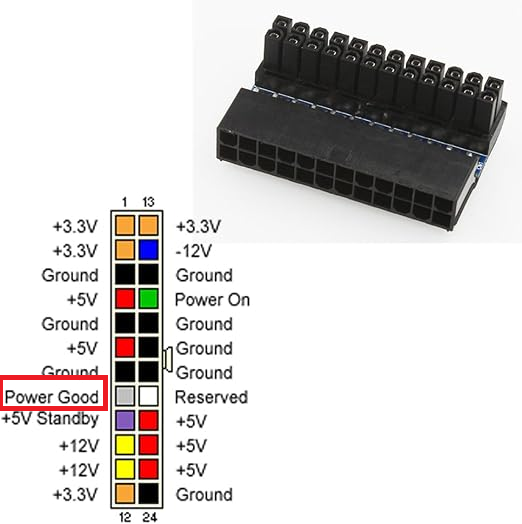
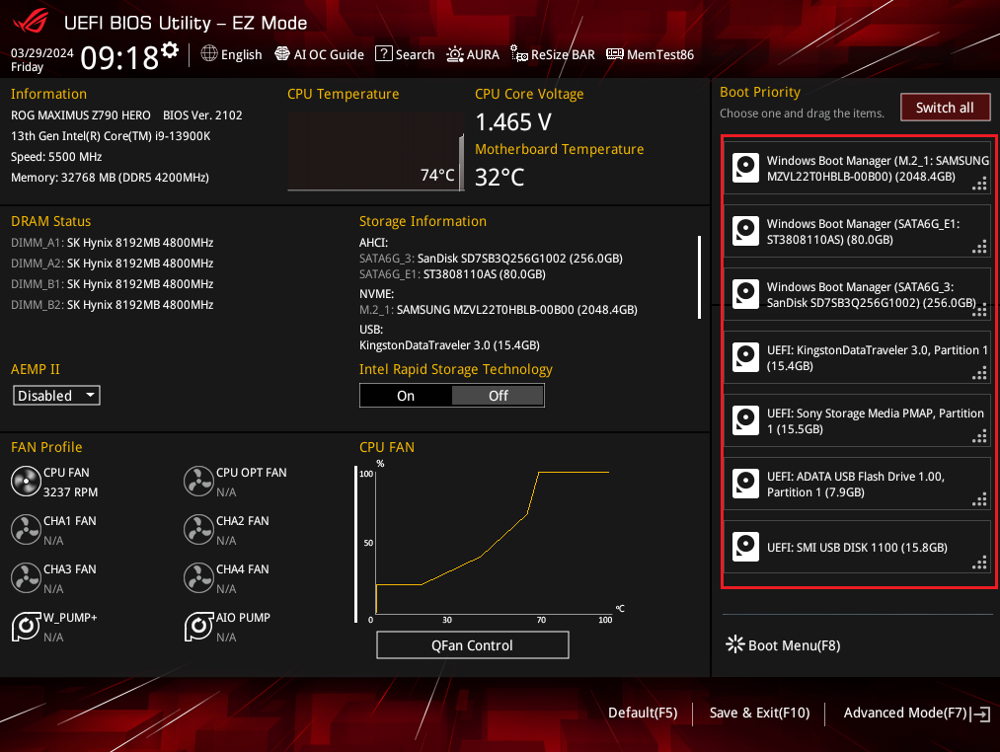
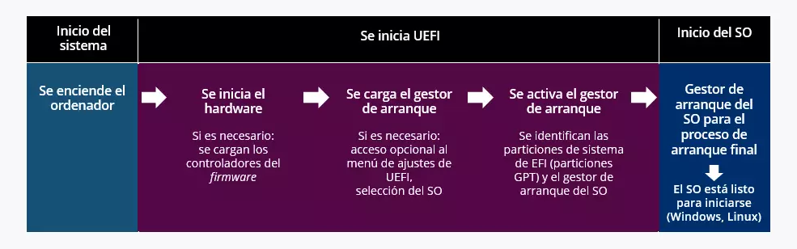
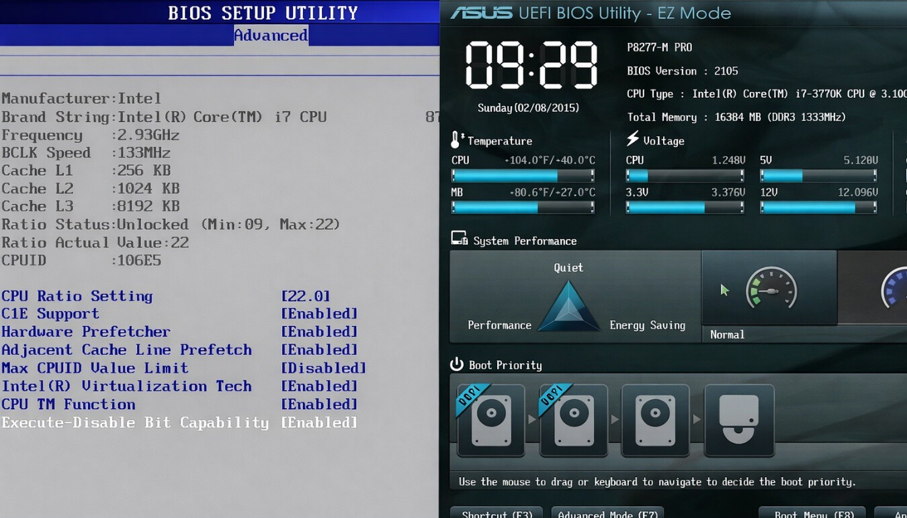
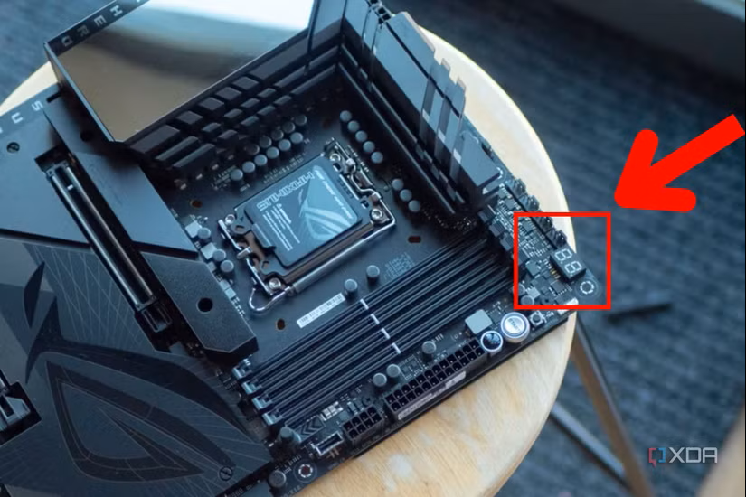
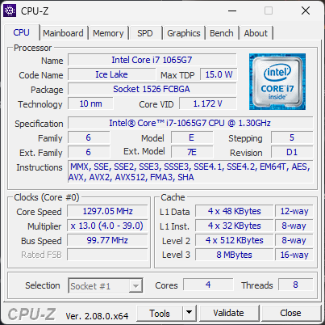
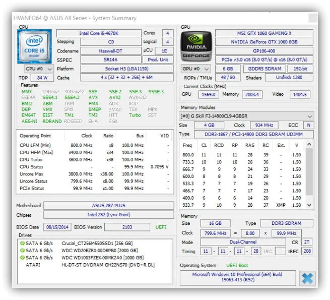
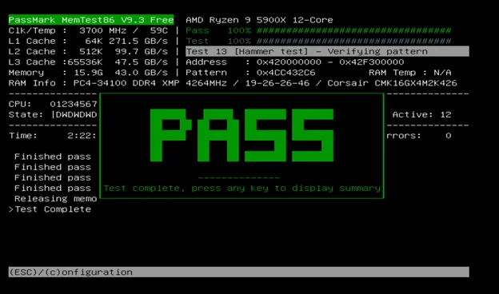
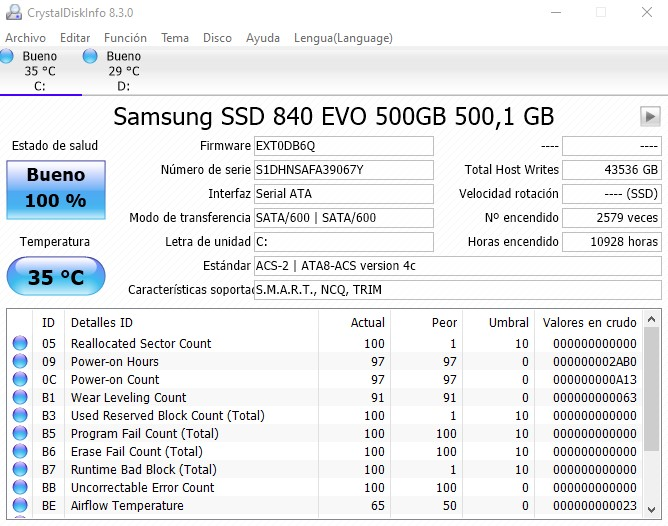
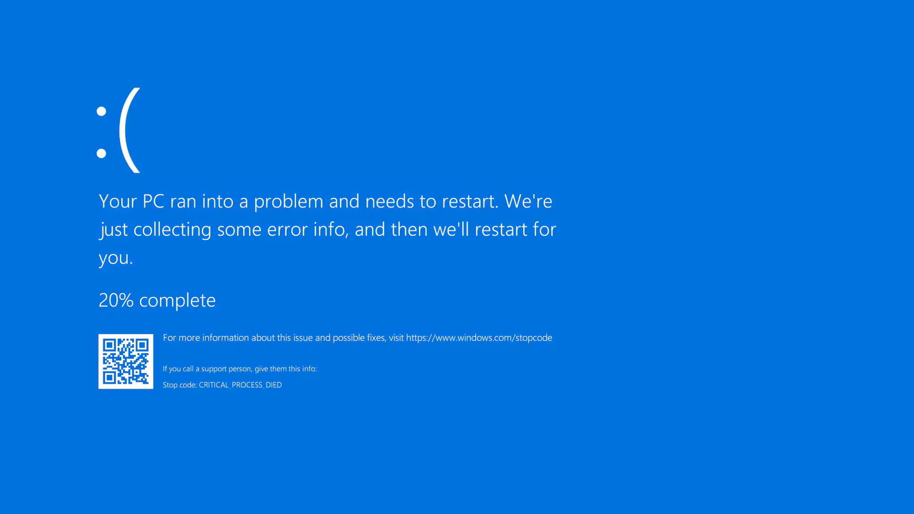

Cuando pulsamos el botón de encendido de un ordenador, se desencadena una secuencia de eventos muy precisa que va desde la activación de la fuente de alimentación hasta la carga del sistema operativo. Este proceso, que en un equipo moderno dura apenas unos segundos, implica la coordinación de todos los componentes que hemos estudiado en los temas anteriores. Entender cómo funciona este proceso es fundamental para poder diagnosticar y resolver los problemas más habituales que nos encontraremos cuando un equipo no arranca correctamente.

## El proceso de arranque paso a paso

### 1. Señal de encendido (Power On)

Al pulsar el botón de encendido, el panel frontal de la caja envía una señal eléctrica a la placa base. La placa base, que ya recibe corriente en standby (+5V standby) aunque el equipo esté "apagado", activa la fuente de alimentación enviándole la señal **PS_ON**.

La fuente de alimentación tarda entre 100 y 500 ms en estabilizar todos sus voltajes. Una vez estabilizados, envía a la placa base la señal **Power Good** (o PWR_OK), indicando que la alimentación es correcta y que se puede iniciar el proceso de arranque.

<!-- IMG: diagrama de la secuencia de señales Power On → PS_ON → Power Good -->
<figure markdown="span" align="center">
  { width="70%" }
  <figcaption>Secuencia de señales en el proceso de encendido: del botón a la señal Power Good</figcaption>
</figure>

### 2. Reset de la CPU y carga del firmware

Al recibir la señal Power Good, la placa base libera el reset de la CPU. El procesador comienza a ejecutar instrucciones desde una dirección de memoria fija y conocida de antemano: la dirección donde reside el firmware de la placa base (**BIOS o UEFI**).

### 3. POST (Power-On Self Test)

El **POST** (*Power-On Self Test*) es la primera rutina que ejecuta el firmware. Su función es verificar que todos los componentes esenciales del sistema están presentes y funcionan correctamente antes de intentar cargar el sistema operativo.

El POST comprueba por orden:

1. **CPU**: verifica que el procesador funciona correctamente
2. **RAM**: comprueba que la memoria es accesible y no tiene errores básicos
3. **Chipset y placa base**: verifica los circuitos principales
4. **Tarjeta gráfica**: inicializa el adaptador de vídeo para poder mostrar información en pantalla
5. **Dispositivos de almacenamiento**: detecta discos duros, SSDs y unidades ópticas
6. **Dispositivos de entrada**: teclado y ratón
7. **Otros periféricos**: tarjetas de expansión, USB...


```plaintext
┌───────────────┐
│ Encendido PC │   
└───────┬───────┘
        │         A[Encendido del ordenador] --> B[Inicio del POST]
        ▼
┌───────────────┐
│     POST     │
└───────┬───────┘
        │          B --> C[1. Comprobar CPU<br/>Verifica que el procesador funciona correctamente]
        ▼
┌───────────────┐
│ C. CPU       │
└───────┬───────┘
        │          C --> D[2. Comprobar RAM<br/>Verifica acceso y errores básicos de memoria] 
        ▼           
┌───────────────┐
│ D. RAM       │
└───────┬───────┘
        │          D --> E[3. Comprobar Chipset y Placa Base<br/>Verifica los circuitos principales]
        ▼
┌───────────────┐
│ E. Chipset y │
│   placa base │
└───────┬───────┘
        │          E --> F[4. Inicializar Tarjeta Gráfica<br/>Activa el adaptador de vídeo]    
        ▼
┌───────────────┐
│ F. Tarjeta   │
│    gráfica   │
└───────┬───────┘
        │           F --> G[5. Detectar Dispositivos de Almacenamiento<br/>HDD, SSD y unidades ópticas]
        ▼
┌───────────────┐
│ G. Almacenam │
└───────┬───────┘
        │          G --> H[6. Detectar Dispositivos de Entrada<br/>Teclado y ratón]
        ▼
┌───────────────┐
│ H. Teclado y │
│    ratón     │
└───────┬───────┘
        │          H --> I[7. Detectar Otros Periféricos<br/>USB y tarjetas de expansión]
        ▼
┌───────────────┐
│ I. Otros     │
│ periféricos  │
└───────┬───────┘
        │          I --> J{¿Errores detectados?}
        ▼
   ¿Todo OK?
    /     \
   Sí      No
   │        │
   ▼        ▼
Arranque   Error
del SO     POST
```
<!-- IMG: diagrama de flujo del proceso POST con los componentes verificados en orden -->
<figure markdown="span" align="center">
  <!-- { width="65%" } -->
  <figcaption>Diagrama del proceso POST: verificación secuencial de componentes antes del arranque</figcaption>
</figure>


Si el POST se completa sin errores, el sistema emite un **pitido corto** (en placas con altavoz interno) y continúa el arranque. Si detecta algún problema, lo indica mediante **códigos de pitidos** o **códigos POST** que se muestran en un display de 2 dígitos en algunas placas base de gama alta.

### 4. BIOS/UEFI: inicialización del hardware

Una vez superado el POST, el firmware realiza una inicialización más completa del hardware: configura los voltajes y frecuencias de la CPU y la RAM (incluyendo los perfiles XMP/EXPO si están activados), establece la configuración de los puertos y prepara el entorno para que pueda ejecutarse un sistema operativo.

### 5. Búsqueda del gestor de arranque

El firmware busca el dispositivo de arranque según el **orden de arranque** (*boot order*) configurado en la UEFI. Este orden determina en qué secuencia se comprueban los dispositivos: primero el SSD interno, luego el USB, luego la red, etc.

Cuando encuentra un dispositivo con un sector de arranque válido, carga el **gestor de arranque** (*bootloader*) en memoria y le transfiere el control.

<!-- IMG: captura de pantalla de la configuración de boot order en una UEFI moderna -->
<figure markdown="span" align="center">
  { width="70%" }
  <figcaption>Configuración del orden de arranque en una UEFI moderna. El primer dispositivo con SO válido es el que arranca</figcaption>
</figure>

### 6. Gestor de arranque

El **gestor de arranque** es un pequeño programa que reside en el disco y que se encarga de cargar el núcleo del sistema operativo. Los más habituales son:

- **Windows Boot Manager**: gestor de arranque de Windows, almacenado en la partición EFI.
- **GRUB** (*Grand Unified Bootloader*): el gestor de arranque más usado en Linux. Permite elegir entre varios sistemas operativos instalados (*dual boot*).

### 7. Carga del sistema operativo

El gestor de arranque carga el **kernel** (núcleo) del sistema operativo en memoria RAM. El kernel inicializa el resto del sistema operativo, carga los drivers de los dispositivos y finalmente presenta al usuario la pantalla de inicio de sesión o el escritorio.

<!-- IMG: diagrama lineal completo del proceso de arranque de principio a fin -->
<figure markdown="span" align="center">
  { width="90%" }
  <figcaption>Proceso de arranque completo: desde el botón de encendido hasta el escritorio del sistema operativo</figcaption>
</figure>

## BIOS vs UEFI

**BIOS** (*Basic Input/Output System*) es el firmware tradicional, presente en ordenadores desde los años 80. Está programado en una memoria ROM o Flash de la placa base y es lo primero que se ejecuta al encender el equipo.

**UEFI** (*Unified Extensible Firmware Interface*) es su sucesor moderno, adoptado de forma generalizada a partir de 2012. Aunque coloquialmente seguimos llamándolo "BIOS", técnicamente todos los equipos modernos usan UEFI.

| Característica | BIOS (Legacy) | UEFI |
|---------------|--------------|------|
| Interfaz | Solo texto, teclado | Gráfica, ratón + teclado |
| Soporte de disco | MBR, máx. 2 TB | GPT, soporte para discos de cualquier tamaño |
| Tiempo de arranque | Más lento | Más rápido (Fast Boot) |
| Seguridad | Sin Secure Boot | Secure Boot (protege contra malware en arranque) |
| Arquitectura | 16 bits | 32/64 bits |
| Red | No | Soporte para arranque por red mejorado |
| Actualizaciones | Complicadas | Desde la propia interfaz o sistema operativo |

<!-- IMG: captura de pantalla de una BIOS de texto clásica vs una UEFI moderna con interfaz gráfica -->
<figure markdown="span" align="center">
  { width="85%" }
  <figcaption>BIOS clásica de texto (izquierda) vs interfaz UEFI moderna con gráficos y soporte para ratón (derecha)</figcaption>
</figure>

### Secure Boot

**Secure Boot** es una función de UEFI que verifica que el gestor de arranque y el kernel del sistema operativo tienen una firma digital válida antes de ejecutarlos. Esto impide que malware o software no autorizado se ejecute durante el arranque, antes de que el sistema operativo pueda protegerse.

Windows 11 requiere Secure Boot habilitado para instalarse. La mayoría de distribuciones Linux modernas (Ubuntu, Fedora, Debian) son compatibles con Secure Boot.

### MBR vs GPT

El **esquema de particionado** del disco determina cómo se organiza la información sobre las particiones:

- **MBR** (*Master Boot Record*): esquema clásico, compatible con BIOS. Limitado a discos de máximo 2 TB y 4 particiones primarias.
- **GPT** (*GUID Partition Table*): esquema moderno, requerido por UEFI. Soporta discos de cualquier tamaño y hasta 128 particiones.

Los equipos modernos con UEFI siempre usan GPT. Para instalar Windows en modo UEFI el disco debe estar formateado con GPT.

## Señales de error: códigos de pitidos y códigos POST

Cuando el POST detecta un error antes de que el sistema de vídeo esté operativo, no puede mostrar un mensaje en pantalla. En su lugar, utiliza el **altavoz interno** de la placa base para emitir una secuencia de pitidos que codifica el tipo de error.

!!! info "Altavoz interno (Speaker)"
    El altavoz interno es un pequeño componente que se conecta a los pines SPEAKER de la placa base. Muchas cajas modernas no lo incluyen, y sin él no se escucharán los códigos de pitidos. Es recomendable tener uno conectado para facilitar el diagnóstico.

Los códigos de pitidos varían según el fabricante del firmware (AMI BIOS, Award BIOS, Phoenix BIOS), pero los más comunes son:

**AMI BIOS (el más habitual en placas modernas):**

| Pitidos | Significado |
|---------|-------------|
| 1 pitido corto | POST completado correctamente |
| 2 pitidos cortos | Error de paridad de memoria RAM |
| 3 pitidos cortos | Error en los primeros 64 KB de RAM |
| 4 pitidos cortos | Fallo en el temporizador del sistema |
| 5 pitidos cortos | Error de CPU |
| 6 pitidos cortos | Error en el controlador de teclado |
| 7 pitidos cortos | Error de excepción de CPU |
| 8 pitidos cortos | Error de escritura en memoria de vídeo |
| 1 pitido largo + 2 cortos | Error en tarjeta gráfica |
| 1 pitido largo + 3 cortos | Error de vídeo |
| Pitidos continuos | Fallo de alimentación o RAM no detectada |

Las placas base de gama alta incorporan un **display de 2 dígitos hexadecimales** (Q-Code en ASUS, Debug LED en MSI) que muestra el código POST en curso. Esto permite identificar exactamente en qué paso del arranque falla el sistema incluso cuando no hay vídeo ni altavoz.

<!-- IMG: fotografía del display de 2 dígitos Q-Code en una placa ASUS ROG -->
<figure markdown="span" align="center">
  { width="55%" }
  <figcaption>Display de diagnóstico Q-Code en una placa ASUS ROG. Muestra el código POST actual en hexadecimal</figcaption>
</figure>

## Herramientas de diagnóstico

Una vez que el sistema arranca correctamente, existen múltiples herramientas para monitorizar el estado de los componentes y detectar problemas:

### Herramientas de información y monitorización

**CPU-Z**
Muestra información detallada sobre la CPU (modelo, frecuencia real, voltaje, caché), la RAM (tipo, frecuencia, timings, dual channel activo) y la placa base (modelo, chipset, versión de BIOS). Es la herramienta de referencia para verificar que los componentes están funcionando a sus especificaciones correctas.

<!-- IMG: captura de pantalla de CPU-Z mostrando información de CPU y memoria -->
<figure markdown="span" align="center">
  { width="70%" }
  <figcaption>CPU-Z: información detallada de CPU, placa base, RAM y gráfica en tiempo real</figcaption>
</figure>

**HWiNFO64**
La herramienta de monitorización más completa. Muestra temperatura, voltaje, velocidad de ventiladores y carga de todos los componentes en tiempo real. Ideal para detectar problemas de sobrecalentamiento o inestabilidad de voltajes.

<!-- IMG: captura de pantalla de HWiNFO64 con sensores de temperatura y voltaje -->
<figure markdown="span" align="center">
  { width="70%" }
  <figcaption>HWiNFO64: monitorización en tiempo real de temperaturas, voltajes y velocidad de ventiladores</figcaption>
</figure>

**HWMonitor**
Similar a HWiNFO pero con interfaz más sencilla. Muestra temperaturas, voltajes y velocidades de ventilador. Útil para una visión rápida del estado térmico del sistema.

### Diagnóstico de RAM

**Memtest86**
Herramienta de diagnóstico de memoria RAM que se ejecuta **fuera del sistema operativo**, arrancando desde un USB. Realiza pruebas exhaustivas de escritura y lectura en toda la RAM para detectar celdas defectuosas. Es la herramienta estándar cuando se sospecha de RAM defectuosa. Una prueba completa puede durar varias horas.

<!-- IMG: captura de pantalla de Memtest86 ejecutándose con barras de progreso de las pruebas -->
<figure markdown="span" align="center">
  { width="70%" }
  <figcaption>Memtest86 en ejecución. Prueba toda la RAM fuera del sistema operativo para detectar errores de memoria</figcaption>
</figure>

### Diagnóstico de almacenamiento

**CrystalDiskInfo**
Muestra el estado **S.M.A.R.T.** (*Self-Monitoring, Analysis and Reporting Technology*) de los discos duros y SSDs. S.M.A.R.T. es un sistema de autodiagnóstico integrado en los propios discos que registra parámetros como sectores reasignados, errores de lectura, horas de funcionamiento y temperatura. CrystalDiskInfo interpreta estos datos y asigna un estado de salud al disco (Bueno, Precaución o Malo).

<!-- IMG: captura de pantalla de CrystalDiskInfo mostrando estado S.M.A.R.T. de un SSD -->
<figure markdown="span" align="center">
  { width="70%" }
  <figcaption>CrystalDiskInfo: estado S.M.A.R.T. del disco. Un estado "Precaución" indica que el disco debe reemplazarse pronto</figcaption>
</figure>

**CrystalDiskMark**
Mide el rendimiento real del disco (velocidad de lectura y escritura secuencial y aleatoria). Útil para verificar que un SSD NVMe está funcionando a sus velocidades especificadas o para comparar el rendimiento antes y después de cambios en el sistema.

### Pruebas de estabilidad (stress test)

**Prime95**
Somete a la CPU a una carga máxima sostenida para verificar su estabilidad y comprobar que el sistema de refrigeración es adecuado. Se usa para detectar inestabilidades tras un overclocking o para verificar que la pasta térmica está bien aplicada.

**Furmark**
Equivalente a Prime95 pero para la GPU. Somete a la tarjeta gráfica a carga máxima para verificar su estabilidad y temperatura.

**AIDA64**
Suite completa de diagnóstico y stress test que puede someter simultáneamente a CPU, RAM, GPU y disco a carga máxima. Muy útil para verificar la estabilidad general del sistema.

## Averías más comunes y su diagnóstico

La metodología de diagnóstico debe ser siempre **sistemática**: ir descartando causas de la más simple a la más compleja, y cambiar solo un componente a la vez para poder identificar cuál es el problema.

### El equipo no enciende (no hay respuesta al pulsar el botón)

```
¿Hay luz en la placa base (LED de standby)?
    │
    ├── NO → Problema de alimentación
    │         1. Verificar cable de corriente
    │         2. Verificar interruptor posterior de la fuente
    │         3. Probar en otro enchufe
    │         4. Fuente defectuosa
    │
    └── SÍ → Problema en el circuito de encendido
              1. Verificar conexión del cable POWER SW de la caja
              2. Hacer cortocircuito manual en pines POWER SW
              3. Botón de la caja defectuoso
              4. Placa base defectuosa
```

### El equipo enciende pero no hay imagen en el monitor

Este es uno de los problemas más frecuentes. Las causas más habituales por orden de probabilidad:

1. **Cable de vídeo desconectado o defectuoso**: verificar que el cable HDMI/DisplayPort está bien conectado tanto al monitor como a la tarjeta gráfica (no a la salida de vídeo integrada de la placa base si hay GPU dedicada).
2. **Monitor apagado o en la entrada incorrecta**: verificar que el monitor está encendido y seleccionada la entrada correcta.
3. **RAM mal instalada**: extraer y reinstalar los módulos de RAM, verificar que están en los slots correctos para dual channel.
4. **RAM incompatible o defectuosa**: probar con un solo módulo, probar en slots diferentes.
5. **GPU mal asentada**: extraer y reinstalar la tarjeta gráfica en el slot PCIe.
6. **Códigos de pitidos**: escuchar los pitidos del POST para identificar el componente con error.

### Pantallas azules (BSOD) en Windows

La **pantalla azul de la muerte** (*Blue Screen of Death*, BSOD) indica un error crítico del sistema que Windows no puede recuperar. Cada BSOD incluye un **código de error** que identifica la causa:

| Código BSOD | Causa más probable |
|-------------|-------------------|
| `MEMORY_MANAGEMENT` | RAM defectuosa o incompatible |
| `IRQL_NOT_LESS_OR_EQUAL` | Driver defectuoso o RAM |
| `KERNEL_SECURITY_CHECK_FAILURE` | Corrupción de archivos del sistema |
| `CRITICAL_PROCESS_DIED` | Proceso del sistema terminado inesperadamente |
| `WHEA_UNCORRECTABLE_ERROR` | Error de hardware: CPU, RAM o placa base |
| `NTFS_FILE_SYSTEM` | Error en el disco (S.M.A.R.T. crítico) |

<!-- IMG: captura de pantalla de una BSOD de Windows 11 con código de error visible -->
<figure markdown="span" align="center">
  { width="65%" }
  <figcaption>Pantalla azul de Windows 11 con código de error. El código identifica la causa del fallo</figcaption>
</figure>

### Sobrecalentamiento

El sobrecalentamiento es una de las causas más frecuentes de inestabilidad: el sistema se reinicia inesperadamente, va lento, o la CPU reduce automáticamente su frecuencia (*thermal throttling*) para no quemarse.

**Síntomas:**
- El equipo se reinicia sin aviso bajo carga
- Rendimiento muy inferior al esperado (thermal throttling)
- Temperaturas de CPU por encima de 90-100°C bajo carga
- Ruido excesivo de los ventiladores

**Causas y soluciones:**

| Causa | Solución |
|-------|---------|
| Pasta térmica seca o mal aplicada | Limpiar y reaplicar pasta térmica |
| Disipador mal montado | Verificar presión y montaje del disipador |
| Ventilación de la caja insuficiente | Añadir ventiladores, mejorar el cable management |
| Filtros de polvo obstruidos | Limpiar filtros y el interior de la caja |
| Disipador insuficiente para la CPU | Cambiar a un disipador de mayor capacidad |
| Pasta térmica de mala calidad | Sustituir por pasta de calidad (Arctic MX-4, Thermal Grizzly) |

!!! tip "Temperaturas de referencia"
    Como referencia general, las temperaturas aceptables bajo carga plena son:

    - **CPU**: hasta 85-90°C es normal en CPUs modernas de alto rendimiento. Por encima de 95°C hay que actuar.
    - **GPU**: hasta 80-85°C es normal. Por encima de 90°C hay que revisar la ventilación.
    - **SSD NVMe**: hasta 70°C en carga. Por encima de 80°C puede reducir velocidad.
    - **HDD**: por debajo de 50°C. Por encima de 55°C su vida útil se reduce significativamente.

### Disco no detectado

Si el sistema no encuentra el disco de arranque o no detecta un disco en la UEFI:

1. **Verificar la conexión**: cable SATA o módulo M.2 bien asentado.
2. **Verificar la alimentación**: cable de alimentación SATA conectado (en HDD/SSD SATA).
3. **Comprobar en la UEFI**: entrar en la UEFI y verificar si aparece el disco en la lista de dispositivos detectados.
4. **Probar en otro puerto SATA**: cambiar el cable o el puerto SATA.
5. **S.M.A.R.T.**: si el disco se detecta pero falla, comprobar el estado S.M.A.R.T. con CrystalDiskInfo.

## Metodología de diagnóstico: el proceso sistemático

Ante cualquier avería, la tentación es cambiar componentes aleatoriamente hasta que funcione. Esto es ineficiente y puede generar más problemas. El proceso correcto es:

1. **Reproducir el problema**: verificar que el problema es reproducible y documentar cuándo ocurre.
2. **Recopilar información**: códigos de error, pitidos POST, mensajes en pantalla, logs del sistema.
3. **Aislar el componente**: desconectar todo lo no esencial y probar con la configuración mínima (placa + CPU + 1 módulo RAM + fuente).
4. **Cambiar un componente a la vez**: nunca cambiar dos cosas simultáneamente o no sabrás cuál era el problema.
5. **Probar componentes conocidos buenos**: si tienes acceso a componentes que funcionan, úsalos para aislar el defectuoso.
6. **Documentar**: anotar qué se ha probado y los resultados para no repetir pasos.

!!! example "Caso práctico: el equipo no arranca y emite 3 pitidos cortos"

    **Síntoma**: al encender el equipo no hay imagen y emite 3 pitidos cortos repetidamente.

    **Diagnóstico según tabla AMI BIOS**: 3 pitidos = error en los primeros 64 KB de RAM.

    **Proceso:**
    1. Apagar y desconectar de la corriente.
    2. Extraer ambos módulos de RAM.
    3. Limpiar los contactos con una goma de borrar suavemente.
    4. Reinstalar solo el módulo 1 en el slot A2.
    5. Encender: ¿arranca? → el módulo 2 era el defectuoso.
    6. Si sigue fallando: mover el módulo 1 al slot B2.
    7. Si sigue fallando: probar con un módulo conocido bueno.
    8. Si con módulo bueno funciona: RAM defectuosa. Si sigue fallando: slot o placa base defectuosa.