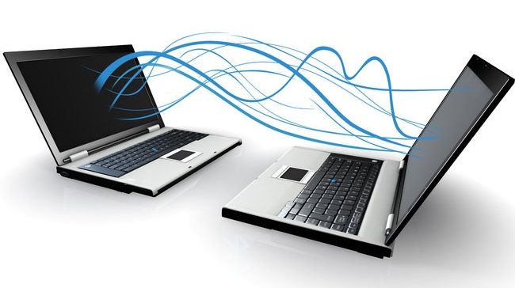
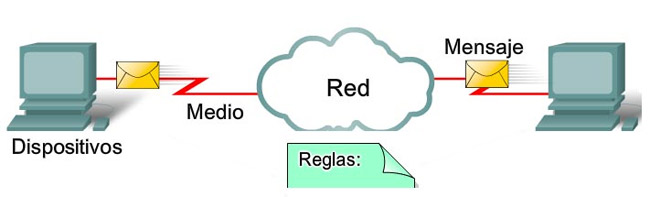

Imagina que tienes dos ordenadores en una misma habitación y quieres pasar un fichero de uno al otro. La opción más primitiva sería copiar el fichero en un pendrive, llevarlo físicamente al otro ordenador e importarlo. Esto funcionaba en los años 80 y tenía incluso un nombre: **sneakernet** (la red de las zapatillas). Era lento, incómodo y totalmente inviable cuando los equipos eran muchos o estaban lejos.

Una **red informática** es la solución a ese problema: un conjunto de dispositivos interconectados que pueden **comunicarse entre sí e intercambiar datos** sin necesidad de intermediarios físicos. En cuanto conectas dos ordenadores y pueden "hablar" entre ellos, ya tienes una red.

<!-- IMG: diagrama simple de dos ordenadores conectados por cable, evolucionando a una red con varios equipos y un switch -->
<figure markdown="span" align="center">
  { width="75%" }
  <figcaption>De la conexión entre dos equipos a una red completa: la misma idea escalada</figcaption>
</figure>

## ¿Para qué sirve una red?

Las redes permiten tres grandes cosas que han transformado completamente la forma en que trabajamos y vivimos:

### Compartir recursos

Sin una red, cada ordenador necesita su propia impresora, su propio disco de almacenamiento, su propia conexión a internet. Con una red, **un mismo recurso puede ser usado por varios equipos simultáneamente**.

En una empresa con 50 empleados, en lugar de tener 50 impresoras, puede haber 3 o 4 impresoras de red que todos comparten. En lugar de que cada empleado guarde sus ficheros en su propio disco, existe un servidor de ficheros central al que todos acceden. El ahorro en hardware y en gestión es enorme.

### Comunicarse

El correo electrónico, la mensajería instantánea, las videollamadas, los sistemas de ticketing, las plataformas colaborativas... todo esto es comunicación a través de redes. En el entorno de trabajo actual, la comunicación digital ha sustituido en gran medida a las reuniones físicas y al papel.

### Acceder a servicios remotos

Una red no tiene por qué limitarse a los equipos de una misma oficina. Internet es simplemente la red de redes más grande del mundo: conecta miles de millones de dispositivos y permite acceder a servicios que están físicamente en cualquier lugar del planeta. Cuando accedes a una aplicación web, a una base de datos en la nube o despliegas código en un servidor remoto, estás usando una red.

!!! example "Las redes en el trabajo de un desarrollador DAM"
    Como desarrolladores de aplicaciones, las redes son parte de vuestro trabajo diario aunque no os dediquéis específicamente a administración de sistemas:

    - Vuestras aplicaciones se comunican con bases de datos a través de la red
    - Los servicios que desarrolléis se desplegarán en servidores accesibles por red
    - Usaréis repositorios de código (GitHub, GitLab) accesibles por internet
    - Depuraréis problemas de conectividad entre servicios
    - Configuraréis puertos, firewalls y accesos en los entornos de desarrollo

    Entender cómo funciona una red no es "cosa de administradores de sistemas": es conocimiento fundamental para cualquier desarrollador.

## Componentes básicos de una red

Para que una red funcione necesita, como mínimo, tres elementos:

- **Dispositivos**: los equipos que quieren comunicarse. Pueden ser ordenadores, servidores, móviles, impresoras, cámaras, sensores IoT...
- **Medio de transmisión**: el canal por el que viajan los datos. Puede ser un cable físico o las ondas de radio (Wi-Fi).
- **Protocolo**: el "idioma común" que usan los dispositivos para entenderse. Sin un protocolo común, dos dispositivos conectados no pueden comunicarse, igual que dos personas que no comparten idioma no pueden mantener una conversación.

<!-- IMG: diagrama con los tres elementos: dispositivos, medio de transmisión y protocolo como triángulo -->
<figure markdown="span" align="center">
  { width="65%" }
  <figcaption>Tres elementos imprescindibles en cualquier red: dispositivos, medio de transmisión y protocolo</figcaption>
</figure>

---

## Actividad en clase

### 🖥️ Actividad conjunta: las redes que ya usamos

**Duración:** 10 minutos  
**Dinámica:** debate guiado por el profesor

Antes de estudiar cómo funcionan las redes, reflexionamos sobre cuántas redes usamos sin darnos cuenta.

El profesor pregunta al grupo:

1. ¿Cuántas redes diferentes has usado hoy antes de llegar al instituto?
2. ¿Qué recursos compartes en red en tu casa?
3. ¿Qué pasaría en tu trabajo habitual si se cayera la red durante 1 hora? ¿Y durante 1 día?
4. ¿Puedes pensar en algún dispositivo "inteligente" de tu casa que use la red para funcionar?

El objetivo es que los alumnos identifiquen que las redes no son algo abstracto sino que forman parte de su vida cotidiana.

---

### 📄 Actividad para entregar: inventario de redes personales

**Formato:** Documento Word/PDF  
**Entrega:** Próxima clase  

Elabora un documento con las siguientes secciones:

**1. Redes en mi hogar**

Identifica y describe las redes que tienes en tu casa:
- ¿Tienes red Wi-Fi? ¿De qué operador? ¿Sabes el modelo del router?
- ¿Hay algún dispositivo conectado por cable? ¿Cuál?
- ¿Qué dispositivos están conectados a tu red doméstica? Haz una lista lo más completa posible (ordenadores, móviles, tablets, smart TV, consolas, altavoces inteligentes, bombillas, cámaras...)

**2. Redes que uso fuera de casa**

- ¿Usas la red del instituto? ¿Es Wi-Fi o por cable?
- ¿Usas datos móviles? ¿De qué tipo (4G, 5G)?
- ¿Te conectas a redes Wi-Fi públicas (cafeterías, transporte, centros comerciales)?

**3. Recursos que comparto o uso en red**

- ¿Usas algún servicio de almacenamiento en la nube (Google Drive, OneDrive, iCloud...)?
- ¿Usas servicios de streaming (Netflix, Spotify, YouTube...)?
- ¿Accedes a algún recurso compartido en casa (impresora de red, NAS, Chromecast...)?

**4. Reflexión**

En un párrafo, responde: ¿qué servicios de tu vida diaria dejarían de funcionar si no existieran las redes informáticas?

!!! info "Criterios de evaluación"
    Se valorará la **completitud** del inventario (que hayas identificado todos los dispositivos y servicios de red que realmente usas), la **precisión** de la información (marca, modelo cuando sea posible) y la **reflexión final** (que sea razonada y personal, no genérica).