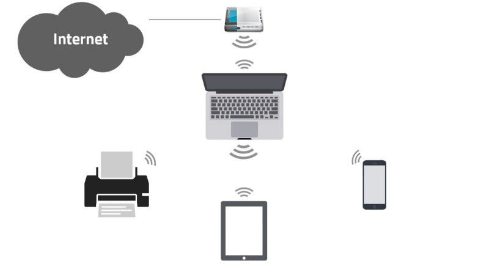
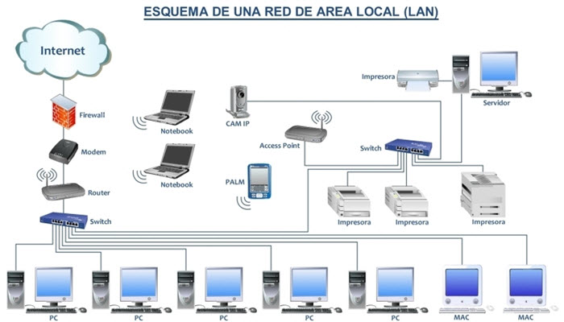
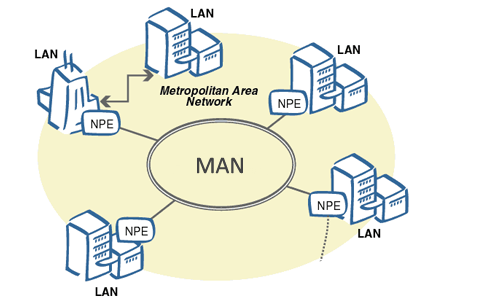
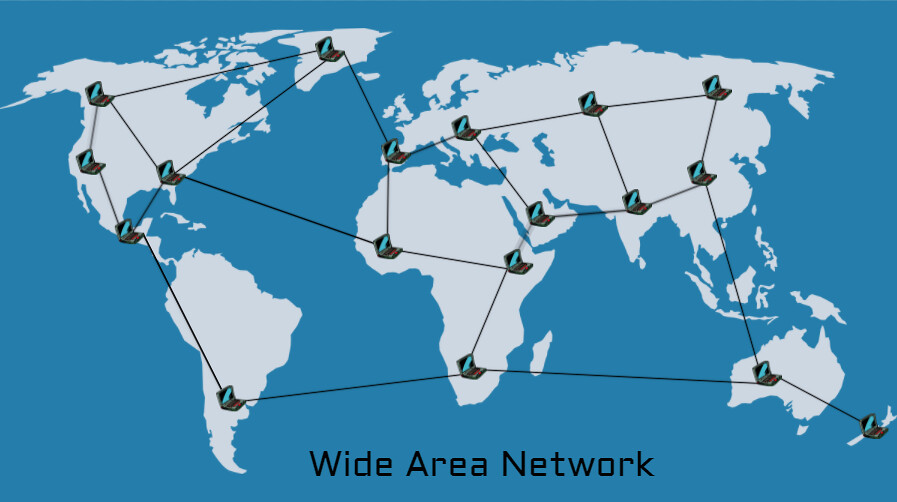
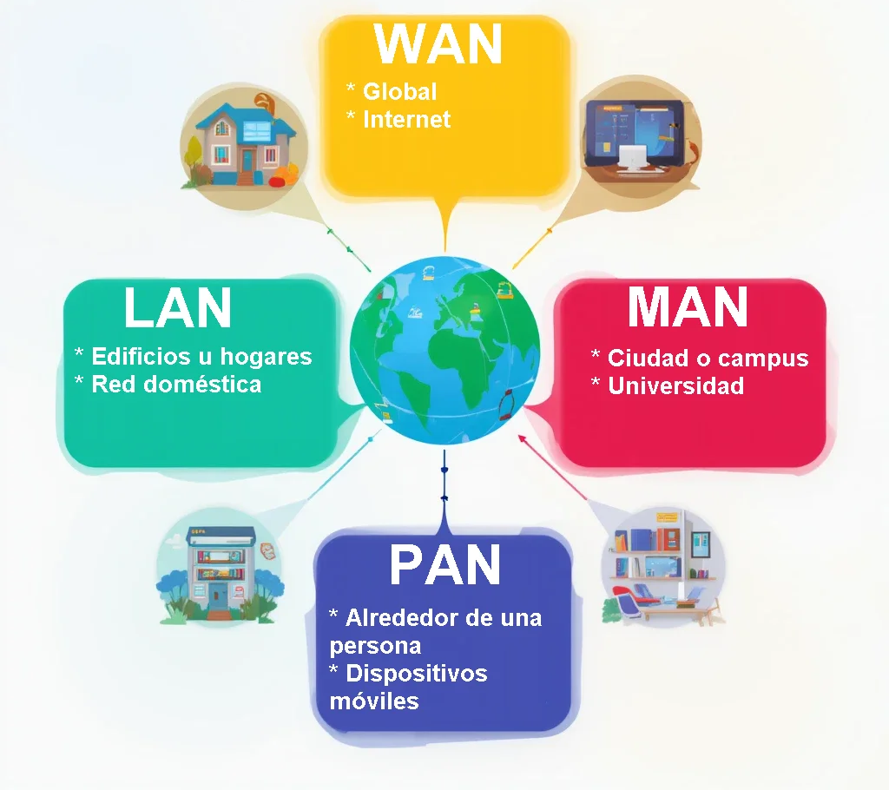

No todas las redes son iguales. Una red que conecta dos ordenadores en la misma habitación tiene poco que ver con la red que conecta las oficinas de una multinacional en distintos continentes, aunque ambas comparten el mismo principio básico: dispositivos que se comunican entre sí. La clasificación más habitual de las redes se basa en su **extensión geográfica**, es decir, en el área física que cubren.

Conocer estos tipos no es solo teoría: cuando trabajemos con direccionamiento IP, con routers o con configuraciones de red en Windows Server y Linux, necesitaremos saber en qué tipo de red estamos y qué implica eso para la configuración del sistema.

## PAN: Personal Area Network

Una **PAN** (*Personal Area Network* o red de área personal) es la red más pequeña que existe. Cubre el espacio inmediato alrededor de una persona, típicamente en un radio de unos pocos metros. Conecta los dispositivos personales entre sí: el móvil con los auriculares inalámbricos, el ordenador portátil con el ratón, el smartwatch con el teléfono...

<!-- IMG: diagrama de una PAN mostrando una persona rodeada de sus dispositivos conectados: móvil, auriculares, smartwatch, portátil -->
<figure markdown="span" align="center">
  { width="55%" }
  <figcaption>Red PAN: conecta los dispositivos personales en el espacio inmediato de una persona</figcaption>
</figure>

Las PAN usan principalmente tecnologías inalámbricas de corto alcance:

- **Bluetooth**: el estándar más universal para PAN. Auriculares, teclados, ratones, altavoces, dispositivos médicos wearables.
- **NFC** (*Near Field Communication*): comunicación a distancias de pocos centímetros. Pagos contactless, transporte público, etiquetas inteligentes.
- **Infrarrojo (IrDA)**: tecnología antigua, prácticamente en desuso. Requería línea de visión directa entre los dispositivos.

Aunque puede parecer el tipo de red menos importante, las PAN son fundamentales en el contexto del **IoT** (*Internet of Things*): sensores corporales, dispositivos médicos portátiles y wearables forman redes PAN que luego se conectan a redes mayores.

## LAN: Local Area Network

Una **LAN** (*Local Area Network* o red de área local) es la red más habitual en el entorno profesional y educativo. Conecta dispositivos dentro de un área geográfica limitada: una habitación, una planta de un edificio, un edificio completo o un campus universitario.

<!-- IMG: diagrama de una LAN de oficina con varios equipos, un switch central, impresoras y un servidor -->
<figure markdown="span" align="center">
  { width="70%" }
  <figcaption>Red LAN de oficina: equipos, impresoras y servidor conectados a través de un switch central</figcaption>
</figure>

Las LAN tienen características muy definidas:

- **Área geográfica**: limitada a un edificio o campus. Típicamente hasta unos pocos kilómetros.
- **Velocidad**: muy alta. Las LAN actuales funcionan habitualmente a **1 Gbps** (Gigabit Ethernet) y las más modernas a **10 Gbps**.
- **Latencia**: muy baja. Los datos viajan distancias cortas, por lo que el tiempo de respuesta es mínimo, por debajo de 1 ms en condiciones normales.
- **Gestión**: la gestiona la propia organización (empresa, instituto, universidad). No depende de un operador externo.
- **Coste**: relativamente bajo. El hardware necesario (switches, cableado) es asequible.

La LAN es el tipo de red que montaremos y administraremos durante este curso: la red del aula, la red de la empresa ficticia del proyecto, la red donde conectaremos el servidor Windows y los clientes.

!!! example "La red de este instituto"
    El instituto tiene una LAN que conecta todos los equipos del aula informática, los ordenadores de administración, los servidores del centro y los puntos de acceso Wi-Fi. Toda esta infraestructura es una LAN gestionada por el propio centro. Cuando el centro contrata una conexión a internet con un operador, lo que hace es conectar su LAN con una red exterior mucho más grande.

### WLAN: Wireless LAN

Una **WLAN** es simplemente una LAN que usa tecnología inalámbrica (Wi-Fi) en lugar de cables. En la práctica, la mayoría de LANs modernas son híbridas: tienen infraestructura cableada para los equipos fijos (servidores, ordenadores de sobremesa) y puntos de acceso Wi-Fi para dispositivos móviles y portátiles.

## MAN: Metropolitan Area Network

Una **MAN** (*Metropolitan Area Network* o red de área metropolitana) cubre un área geográfica mayor que una LAN: típicamente una ciudad o un área metropolitana. Puede extenderse desde unos pocos kilómetros hasta decenas de kilómetros.

<!-- IMG: mapa de una ciudad con varios edificios conectados formando una MAN -->
<figure markdown="span" align="center">
  { width="65%" }
  <figcaption>Red MAN: conecta múltiples edificios o instalaciones dentro de una misma ciudad o área metropolitana</figcaption>
</figure>

Las MAN son utilizadas por:

- **Administraciones públicas**: conectar los distintos edificios del ayuntamiento, las comisarías, los centros de salud de una ciudad.
- **Universidades**: conectar los distintos campus de una universidad dentro de la misma ciudad.
- **Empresas con múltiples sedes**: conectar las oficinas de una empresa distribuidas por la misma ciudad.
- **Operadores de telecomunicaciones**: como parte de su infraestructura para llegar al cliente final.

Las MAN suelen usar **fibra óptica** como medio de transmisión por su alta velocidad y capacidad para cubrir las distancias necesarias. Técnicamente, una MAN puede considerarse como varias LANs interconectadas.

## WAN: Wide Area Network

Una **WAN** (*Wide Area Network* o red de área extensa) es el tipo de red de mayor alcance geográfico. Conecta dispositivos y redes que están separados por grandes distancias: ciudades, países o continentes enteros. **Internet es la WAN más grande y conocida del mundo**, aunque no la única.

<!-- IMG: mapa mundial con líneas conectando continentes representando una WAN global -->
<figure markdown="span" align="center">
  { width="75%" }
  <figcaption>Red WAN: conecta redes y dispositivos a escala global a través de infraestructura de telecomunicaciones</figcaption>
</figure>

Las WAN tienen características muy diferentes a las LAN:

- **Área geográfica**: ilimitada. Pueden cubrir el planeta entero.
- **Velocidad**: variable y generalmente menor que una LAN para el usuario final, aunque la infraestructura troncal puede alcanzar velocidades de Tbps.
- **Latencia**: mayor que en una LAN por las distancias involucradas. Una petición a un servidor en otro continente puede tardar 150-300 ms solo en el viaje de ida y vuelta.
- **Gestión**: no la gestiona una única organización. Internet, por ejemplo, es gestionada de forma distribuida por miles de operadores e instituciones.
- **Coste**: alto. La infraestructura necesaria (cables submarinos, satélites, repetidores) es enormemente cara.

Las empresas que necesitan conectar sus sedes en distintas ciudades o países suelen contratar servicios WAN a operadores de telecomunicaciones. Existen varias tecnologías: líneas dedicadas, MPLS, SD-WAN o conexiones VPN sobre internet.

!!! info "Cables submarinos: la columna vertebral de internet"
    La mayor parte del tráfico de internet entre continentes viaja a través de **cables de fibra óptica submarinos** que recorren el fondo del océano. Existen más de 400 cables submarinos activos que conectan todos los continentes, con una longitud total de más de 1,3 millones de kilómetros. Cuando se habla de "internet en la nube", los datos físicamente viajan por estos cables. Puedes ver el mapa actual de cables submarinos en [submarinecablemap.com](https://www.submarinecablemap.com).

## Otros tipos de red

Además de PAN, LAN, MAN y WAN, existen otros tipos de red que conviene conocer aunque son menos habituales en el contexto de este curso:

| Tipo | Nombre | Cobertura | Uso típico |
|------|--------|-----------|-----------|
| **BAN** | Body Area Network | Cuerpo humano | Sensores médicos, wearables |
| **CAN** | Campus Area Network | Campus universitario o empresarial | Universidades, grandes empresas |
| **SAN** | Storage Area Network | Edificio o centro de datos | Almacenamiento en servidores |
| **GAN** | Global Area Network | Todo el mundo | Redes satelitales, internet móvil global |

## Comparativa resumen

<!-- IMG: diagrama comparativo de los tipos de red mostrando su cobertura geográfica de forma visual y proporcional -->
<figure markdown="span" align="center">
  { width="65%" }
  <figcaption>Comparativa de tipos de red según su cobertura geográfica, velocidad y gestión</figcaption>
</figure>

| Tipo | Cobertura | Velocidad típica | Gestión | Ejemplo |
|------|-----------|-----------------|---------|---------|
| **PAN** | Metros | Hasta 3 Gbps (BT 5.0) | Personal | Auriculares Bluetooth |
| **LAN** | Edificio / campus | 1 - 10 Gbps | Organización | Red del aula |
| **MAN** | Ciudad | 10 Mbps - 10 Gbps | Operador / organización | Red universitaria |
| **WAN** | País / mundo | Variable | Múltiples operadores | Internet |

---

## Actividad en clase

### 🖥️ Actividad conjunta: ¿qué redes tenemos a nuestro alrededor?

**Duración:** 15 minutos
**Dinámica:** exploración guiada + puesta en común

El objetivo es identificar los tipos de red presentes en el propio instituto en este momento.

**Parte 1 — Individualmente (5 min):**

Cada alumno responde en su cuaderno:

1. ¿A qué tipo de red pertenece la red del aula? ¿Por qué?
2. ¿Cuántas redes Wi-Fi ves disponibles desde tu dispositivo ahora mismo? ¿Cuáles crees que son del instituto y cuáles de otros edificios o personas?
3. ¿Qué dispositivos del aula están conectados en red? ¿Cómo lo sabes?
4. Cuando accedes a internet desde el aula, ¿por cuántos tipos de red crees que pasan tus datos antes de llegar al servidor destino?

**Parte 2 — Puesta en común (10 min):**

El profesor recoge las respuestas y las debate con el grupo. Se dibuja en la pizarra el esquema de red del instituto: desde el dispositivo del alumno hasta internet, pasando por el switch del aula, el router del centro, la línea del operador y la WAN.

!!! tip "Para el profesor"
    Es un buen momento para mostrar en el proyector `ipconfig` (Windows) o `ip a` (Linux) para ver la dirección IP asignada al equipo dentro de la LAN del aula. Conecta directamente con el tema de direccionamiento que veremos en UD03.