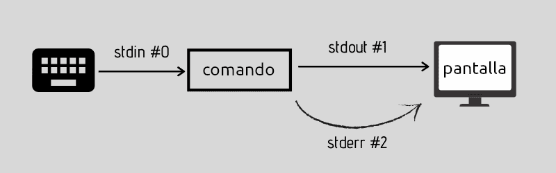
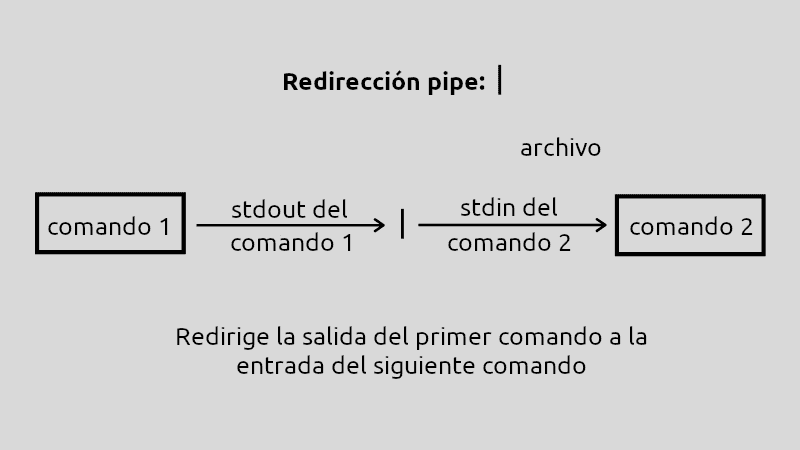

Una de las características más potentes de Linux es la capacidad de **conectar comandos** entre sí y **redirigir** su entrada y salida. Esto permite crear flujos de trabajo complejos combinando comandos simples.

## Dispositivos Estándar

En Linux, los dispositivos se tratan como archivos. Cada terminal tiene asociados tres dispositivos especiales para la comunicación:

### Dispositivos de Entrada/Salida

| Dispositivo | Nombre | Descriptor | Descripción | Enlace en /dev |
|-------------|--------|------------|-------------|----------------|
| **Entrada estándar** | stdin | 0 | Teclado (de donde se lee) | `/dev/stdin` |
| **Salida estándar** | stdout | 1 | Monitor (donde se escribe) | `/dev/stdout` |
| **Salida de error** | stderr | 2 | Monitor (donde se muestran errores) | `/dev/stderr` |

<figure markdown="span" align="center">
    { width="90%" }
    <figcaption>Dispositivos de entrada/salida.</figcaption>
</figure>


!!! info "Por defecto"
    - Los comandos **leen** del teclado (stdin)
    - Los comandos **escriben** en el monitor (stdout)
    - Los **errores** se muestran en el monitor (stderr)

### El dispositivo especial: `/dev/null`

Es un dispositivo especial que actúa como un **"agujero negro"**: todo lo que se envía ahí **desaparece**.

```bash
echo "Esto desaparece" > /dev/null       # No se muestra nada
```

!!! tip "Uso práctico"
    Se usa para descartar salidas que no nos interesan:
    ```bash
    comando 2> /dev/null                   # Oculta mensajes de error
    comando > /dev/null 2>&1               # Oculta todo (salida y errores)
    ```

---

## Operadores de Redireccionamiento

### `>` - Redirigir salida (sobrescribe)

Redirige la salida estándar a un archivo. Si el archivo existe, lo **sobrescribe**.

Sintaxis

```bash
comando > archivo
```

Ejemplos

```bash
ls > listado.txt                       # Guarda la lista en listado.txt
echo "Hola mundo" > saludo.txt        # Crea archivo con el texto
date > fecha.txt                      # Guarda la fecha actual
```

!!! warning "Sobrescribe el archivo"
    Si `listado.txt` ya existía, su contenido anterior se **pierde**.

!!!example "Ejemplo práctico"

    ```bash
    ls /home/juan > ficheros_juan.txt
    # El listado NO se muestra en pantalla, se guarda en el archivo
    ```

---

### `>>` - Redirigir salida (añade)

Redirige la salida estándar a un archivo. Si el archivo existe, **añade** al final sin borrar el contenido anterior.

Sintaxis

```bash
comando >> archivo
```

<figure markdown="span" align="center">
    { width="70%" }
    <figcaption>Redirección de salida.</figcaption>
</figure>

!!!example "Ejemplo comparando `>` con `>>` "

    ```bash
    echo "Primera línea" > log.txt         # Crea el archivo
    echo "Segunda línea" >> log.txt        # Añade al final
    echo "Tercera línea" >> log.txt        # Añade al final
    ```

    **Contenido de log.txt:**
    ```
    Primera línea
    Segunda línea
    Tercera línea
    ```

    Comparación

    === "Usando >"
        ```bash
        echo "Línea 1" > archivo.txt
        echo "Línea 2" > archivo.txt      # ❌ Sobrescribe, se pierde "Línea 1"
        cat archivo.txt
        # Resultado: Línea 2
        ```

    === "Usando >>"
        ```bash
        echo "Línea 1" > archivo.txt
        echo "Línea 2" >> archivo.txt     # ✅ Añade al final
        cat archivo.txt
        # Resultado:
        # Línea 1
        # Línea 2
        ```

---

### `<` - Redirigir entrada

Redirige la entrada estándar desde un archivo en lugar del teclado.

Sintaxis

```bash
comando < archivo
```

<figure markdown="span" align="center">
    { width="70%" }
    <figcaption>Redirección de entrada.</figcaption>
</figure>

!!!example "Ejemplo con `wc`"

    ```bash
    wc -l < archivo.txt                    # Cuenta líneas leyendo de archivo.txt
    ```

!!! info "Uso menos común"
    Este operador se usa menos porque la mayoría de comandos aceptan archivos como parámetros:
    ```bash
    wc -l archivo.txt          # Forma más común
    wc -l < archivo.txt        # Equivalente con redirección
    ```

!!!example "Ejemplo con `tr`"

    El comando `tr` no acepta archivos como parámetro, solo lee de stdin:

    ```bash
    tr "[a-z]" "[A-Z]" < alumnos.txt       # Convierte minúsculas a mayúsculas
    ```

---

### `2>` - Redirigir errores

Redirige la **salida de error** (stderr) a un archivo.

Sintaxis

```bash
comando 2> archivo_errores
```

!!!example "Ejemplos"

    ```bash
    ls /directorio_inexistente 2> errores.txt     # Solo guarda el error
    find / -name "*.txt" 2> errores.log           # Errores de permisos a log
    ```

!!!example "Ejemplo práctico"

    ```bash
    touch /root/prueba 2> errores.txt
    # Como no tenemos permisos, se guarda el error en errores.txt
    # La pantalla queda limpia
    ```

---

### `2>>` - Redirigir errores (añade)

Igual que `2>` pero **añade** al final del archivo sin sobrescribir.

```bash
comando1 2>> errores.log
comando2 2>> errores.log               # Añade al mismo archivo
```

---

### Combinar salida y errores

Redirigir ambos al mismo archivo

```bash
comando > salida.txt 2>&1              # Ambos al mismo archivo
```

**Explicación:**

- `> salida.txt`: Redirige stdout a salida.txt
- `2>&1`: Redirige stderr (2) a donde apunta stdout (1)

Forma moderna (Bash 4+)

```bash
comando &> salida.txt                  # Forma corta (ambos)
comando &>> salida.txt                 # Forma corta (ambos, añadiendo)
```

!!!example "Ejemplos prácticos"

    ```bash
    find / -name "*.conf" > resultados.txt 2>&1    # Todo a resultados.txt
    find / -name "*.conf" &> resultados.txt        # Equivalente (forma corta)
    ```

Separar salida y errores

```bash
comando > salida.txt 2> errores.txt    # Stdout y stderr a archivos diferentes
```

---

### `|` - Tubería (Pipe)

El **pipe** es el operador más potente. Conecta la **salida** de un comando con la **entrada** del siguiente.

Sintaxis

```bash
comando1 | comando2 | comando3
```

Estos tres comandos se ejecutarían de esta manera:

```
comando1 → salida → entrada comando2 → salida → entrada comando3 → salida final
```

<figure markdown="span" align="center">
    { width="80%" }
    <figcaption>Redirección de salida.</figcaption>
</figure>


!!!example "Ejemplos básicos"

    ```bash
    ls -l | less                           # Lista y pagina el resultado
    cat archivo.txt | grep "palabra"       # Busca "palabra" en el archivo
    ps aux | grep firefox                  # Busca proceso firefox
    ```

!!!example "Ejemplos con múltiples pipes"

    ```bash
    # Mostrar las 10 líneas más largas de un archivo
    cat archivo.txt | wc -L | sort -n | tail -10

    # Contar cuántos usuarios hay en el sistema
    cat /etc/passwd | wc -l

    # Ver los 5 procesos que más CPU consumen
    ps aux | sort -k3 -r | head -5
    ```

<figure markdown="span" align="center">
    { width="90%" }
    <figcaption>Redirección mediante tuberías</figcaption>
</figure>

---

## Ejemplos Prácticos Completos

!!!example "Ejemplo 1: Gestión de logs"

    ```bash
    # Guardar listado de archivos grandes
    ls -lh /var/log | grep "G" > archivos_grandes.txt

    # Añadir fecha al log
    date >> sistema.log
    df -h >> sistema.log

    # Ejecutar comando y guardar todo (salida y errores)
    apt update &>> actualizacion.log
    ```

!!!example "Ejemplo 2: Búsqueda y filtrado"

    ```bash
    # Buscar "Valencia" en alumnos.txt y guardar resultado ordenado
    cat alumnos.txt | grep "Valencia" | sort >> alumnos_valencia.txt

    # Listar archivos, mostrar página a página
    ls -la /usr/bin | less

    # Buscar procesos de apache
    ps aux | grep apache | grep -v grep
    ```

!!!example "Ejemplo 3: Procesamiento de texto"

    ```bash
    # Convertir texto a mayúsculas y guardar
    tr "[a-z]" "[A-Z]" < entrada.txt > salida.txt

    # Contar líneas que contienen "error"
    cat /var/log/syslog | grep "error" | wc -l

    # Mostrar usuarios únicos conectados
    who | cut -d' ' -f1 | sort | uniq
    ```

!!!example "Ejemplo 4: Suprimir errores"

    ```bash
    # Buscar archivos sin mostrar errores de permisos
    find / -name "*.conf" 2> /dev/null

    # Ejecutar comando silencioso (sin salida ni errores)
    comando > /dev/null 2>&1

    # Solo mostrar errores (ocultar salida normal)
    comando 1> /dev/null
    ```


## Comandos Útiles con Pipes

### `tee` - Duplicar salida

Muestra la salida en pantalla Y la guarda en archivo.

!!!example "ejemplos de `tee`"
    ```bash
    ls -la | tee listado.txt               # Muestra y guarda
    comando | tee -a log.txt               # Muestra y añade
    comando | tee file1.txt file2.txt      # Guarda en múltiples archivos
    ```

### `xargs` - Construir comandos

Convierte la entrada en argumentos para otro comando.

!!!example "Ejemplos de paso de parámetros mediante `|` y `xargs`"
    ```bash
    find . -name "*.tmp" | xargs rm        # Borra todos los .tmp encontrados
    cat urls.txt | xargs wget              # Descarga todas las URLs
    ls *.jpg | xargs -I {} cp {} backup/   # Copia cada jpg a backup
    ```


## Casos de Uso Reales

!!!example "Administración de sistemas"

    ```bash
    # Backup de configuración con log
    tar czf backup.tar.gz /etc &> backup.log

    # Monitorizar cambios en tiempo real
    tail -f /var/log/syslog | grep "error"

    # Listar procesos ordenados por memoria
    ps aux | sort -k4 -r | head -10 > procesos_memoria.txt
    ```

!!!example "Análisis de archivos"

    ```bash
    # Contar palabras únicas en un archivo
    cat texto.txt | tr ' ' '\n' | sort | uniq | wc -l

    # Buscar IPs en logs
    cat access.log | grep -oE '[0-9]{1,3}\.[0-9]{1,3}\.[0-9]{1,3}\.[0-9]{1,3}' | sort | uniq

    # Top 10 archivos más grandes
    du -ah /home | sort -h -r | head -10
    ```

!!!example "Procesamiento de datos"

    ```bash
    # Extraer emails de un archivo
    cat contactos.txt | grep -oE '[a-zA-Z0-9._%+-]+@[a-zA-Z0-9.-]+\.[a-zA-Z]{2,}' > emails.txt

    # Buscar duplicados en una lista
    cat lista.txt | sort | uniq -d > duplicados.txt

    # Contar ocurrencias de cada palabra
    cat texto.txt | tr ' ' '\n' | sort | uniq -c | sort -nr
    ```

---

## Tabla Resumen de Operadores

| Operador | Descripción | Ejemplo |
|----------|-------------|---------|
| `>` | Redirige salida (sobrescribe) | `ls > lista.txt` |
| `>>` | Redirige salida (añade) | `date >> log.txt` |
| `<` | Redirige entrada | `wc -l < archivo.txt` |
| `2>` | Redirige errores (sobrescribe) | `find / 2> errores.txt` |
| `2>>` | Redirige errores (añade) | `comando 2>> errores.log` |
| `&>` | Redirige todo (salida + errores) | `comando &> todo.txt` |
| `2>&1` | Redirige errores a salida | `comando > out.txt 2>&1` |
| `|` | Pipe (conecta comandos) | `cat file | grep "text"` |
| `> /dev/null` | Descarta salida | `comando > /dev/null` |
| `2> /dev/null` | Descarta errores | `comando 2> /dev/null` |

---

## Ejercicios Prácticos

!!! example "Ejercicio 1: Redirecciones básicas"
    1. Lista los archivos de tu home y guarda el resultado en `lista.txt`
    2. Añade la fecha actual al final de `lista.txt`
    3. Muestra el contenido de `lista.txt`

!!! example "Ejercicio 2: Gestión de errores"
    1. Intenta listar `/root` (sin permisos) y guarda el error en `error.txt`
    2. Busca archivos `.conf` en `/` guardando solo los resultados (sin errores)
    3. Ejecuta un comando cualquiera descartando toda salida

!!! example "Ejercicio 3: Tuberías"
    1. Lista los procesos y busca los que contengan "bash"
    2. Cuenta cuántos usuarios hay en `/etc/passwd`
    3. Muestra las últimas 10 líneas de `/var/log/syslog` filtrando por "error"

!!! example "Ejercicio 4: Combinado"
    1. Crea un archivo con los 20 directorios más grandes de tu home
    2. Busca archivos `.log` en `/var`, cuenta cuántos hay, guarda el resultado
    3. Lista todos los usuarios del sistema, ordénalos y elimina duplicados

---

## Patrones Comunes

!!!example "Ver logs en tiempo real filtrando"

    ```bash
    tail -f /var/log/syslog | grep --line-buffered "error"
    ```

!!!example "Buscar y contar"

    ```bash
    cat archivo.txt | grep "patrón" | wc -l
    ```

!!!example "Ordenar y mostrar únicos"

    ```bash
    cat lista.txt | sort | uniq
    ```

!!!example "Paginar resultados largos"

    ```bash
    comando_con_mucha_salida | less
    ```

!!!example "Guardar salida y mostrar en pantalla (`tee`)"

    ```bash
    comando | tee archivo.txt              # Muestra Y guarda
    comando | tee -a archivo.txt           # Muestra Y añade al archivo
    ```

---

## Buenas Prácticas

!!! success "Recomendaciones"
    - ✅ Usa `>>` en logs para no perder información anterior
    - ✅ Redirige errores a `/dev/null` cuando sean esperables
    - ✅ Usa pipes para combinar comandos simples
    - ✅ Prueba cada comando por separado antes de encadenarlos
    - ✅ Usa `tee` cuando quieras ver la salida Y guardarla

!!! tip "Consejos"
    - 💡 Los pipes son más eficientes que usar archivos temporales
    - 💡 Combina `grep` con pipes para filtrar resultados
    - 💡 Usa `less` al final de pipes largos para paginar
    - 💡 El orden de los comandos en un pipe importa

!!! warning "Precauciones"
    - ⚠️ Ten cuidado con `>`, sobrescribe sin avisar
    - ⚠️ Verifica rutas antes de redirigir a archivos importantes
    - ⚠️ `2>&1` debe ir después de `>`, no antes
    - ⚠️ Los pipes fallan silenciosamente si un comando falla

---
