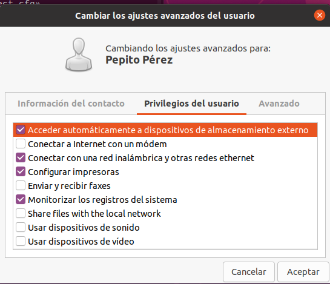

Aunque la línea de comandos es más potente y flexible, el **entorno gráfico** proporciona una forma intuitiva y visual de gestionar usuarios y grupos, especialmente útil para usuarios menos experimentados.

!!! info "Enfoque del apartado"
    Este apartado es una **referencia visual** para ubicarte en el entorno gráfico. En clase nos centraremos principalmente en la gestión por terminal, pero es importante conocer también esta opción.

---

## Herramientas según Distribución

La interfaz gráfica varía ligeramente entre distribuciones:

| Distribución | Acceso típico |
|--------------|---------------|
| **Ubuntu/Debian** | Configuración del sistema → Cuentas de usuario |
| **Ubuntu (clásico)** | Sistema → Administración → Usuarios y grupos |
| **Fedora/RHEL** | Configuración → Usuarios |
| **Linux Mint** | Preferencias del sistema → Cuenta de usuario |

---

## Gestión Básica de Usuarios en Ubuntu

Acceso a la gestión de usuarios: **Ruta:** Configuración del sistema → Cuentas de usuario

<figure markdown="span" align="center">
  { width="80%" }
  <figcaption>Ventana de Cuentas de usuario en Ubuntu</figcaption>
</figure>

!!! warning "Permisos necesarios"
    Para gestionar usuarios necesitas ser **administrador** o introducir la contraseña de administrador.

### Añadir un Nuevo Usuario

Pasos para crear un usuario:

1. **Pulsa el botón "Añadir usuario"** (icono +)
2. Se abrirá una ventana con los siguientes campos:

<figure markdown="span" align="center">
  { width="70%" }
  <figcaption>Formulario de creación de nuevo usuario</figcaption>
</figure>

Datos solicitados:

| Campo | Descripción | Ejemplo |
|-------|-------------|---------|
| **Nombre completo** | Nombre real del usuario (se mostrará en el sistema) | Juan Pérez López |
| **Nombre de usuario** | Login (sin espacios ni caracteres especiales) | jperez |
| **Tipo de cuenta** | Estándar o Administrador | Estándar |
| **Contraseña** | Contraseña o "indicar en el primer inicio" | ******** |

Opciones de contraseña

=== "Establecer ahora"
    Introduces la contraseña del usuario inmediatamente.
    ```
    Contraseña: ••••••••
    Confirmar: ••••••••
    ```

=== "Primer inicio de sesión"
    El usuario deberá establecer su contraseña la primera vez que inicie sesión.
    ```
    ☑ Permitir que el usuario establezca una contraseña en el primer inicio
    ```

=== "Sin contraseña"
    El usuario puede iniciar sesión sin contraseña (no recomendado).
    ```
    ☑ No requerir contraseña
    ```

!!! tip "Creación automática de grupo"
    Al crear un nuevo usuario, **automáticamente se crea un grupo** con el mismo nombre que el usuario, que será su grupo principal.

---

#### Tipos de Cuenta

- Usuario **Estándar**

    - ✅ Puede usar el sistema normalmente
    - ✅ Gestiona sus propios archivos
    - ❌ No puede instalar software
    - ❌ No puede modificar configuración del sistema
    - ❌ No puede gestionar otros usuarios

- Usuario **Administrador**

    - ✅ Todo lo que puede hacer un usuario estándar
    - ✅ Puede ejecutar `sudo` desde terminal
    - ✅ Puede instalar/desinstalar software
    - ✅ Puede modificar configuración del sistema
    - ✅ Puede gestionar usuarios (con su contraseña)

!!! warning "Seguridad"
    Solo convierte en administrador a usuarios de confianza. Un administrador puede dañar el sistema si no tiene cuidado.


### Eliminar un Usuario

Pasos:

1. Selecciona el usuario a eliminar
2. Pulsa el botón **"Suprimir"** (icono -)
3. El sistema preguntará:

<figure markdown="span" align="center">
  { width="60%" }
  <figcaption>Opciones al eliminar usuario</figcaption>
</figure>

### Opciones al eliminar

=== "Conservar archivos"
    ```
    ☑ Conservar los archivos del usuario
    ```

    - La cuenta se elimina
    - Los archivos de `/home/usuario` se conservan
    - Puedes acceder a ellos como root
    - Útil para recuperar datos

=== "Eliminar archivos"
    ```
    ☐ Eliminar todos los archivos del usuario
    ```

    - La cuenta se elimina
    - **Todos los archivos se borran** (irreversible)
    - Se libera espacio en disco
    - No hay vuelta atrás

!!! warning "Cuidado al eliminar"
    Si eliminas los archivos, **no hay forma de recuperarlos** (a menos que tengas backup). Asegúrate de hacer una copia de seguridad si contienen datos importantes.

---

## Gestión Avanzada: gnome-system-tools

Ubuntu no incluye por defecto herramientas avanzadas de gestión de usuarios. Para tenerlas, instala el paquete **gnome-system-tools**.

### Instalación

```bash
sudo apt update
sudo apt install gnome-system-tools
```

Tras la instalación, tendrás acceso a **"Usuarios y grupos"** que ofrece opciones avanzadas.

<figure markdown="span" align="center">
  { width="80%" }
  <figcaption>Herramienta avanzada de Usuarios y grupos</figcaption>
</figure>

### Funcionalidades adicionales

**Ajustes avanzados de usuario**

Al pulsar **"Ajustes avanzadas"** puedes modificar:

<figure markdown="span" align="center">
  { width="70%" }
  <figcaption>Configuración avanzada del usuario. Información del usuario</figcaption>
</figure>


<figure markdown="span" align="center">
  { width="70%" }
  <figcaption>Configuración avanzada del usuario. Privilegios del usuario</figcaption>
</figure>


<figure markdown="span" align="center">
  { width="70%" }
  <figcaption>Configuración avanzada del usuario. Opciones avanzadas del usuario</figcaption>
</figure>

**Opciones avanzadas:**

| Opción | Descripción |
|--------|-------------|
| **ID de usuario (UID)** | Cambiar el UID del usuario |
| **Grupo principal** | Cambiar el grupo primario |
| **Directorio personal** | Cambiar la ubicación de `/home/usuario` |
| **Shell** | Cambiar el intérprete de comandos (bash, sh, zsh, etc.) |
| **Grupos secundarios** | Añadir/quitar grupos adicionales |

!!! warning "Cambiar el UID"
    Cambiar el UID de un usuario existente puede causar problemas con los permisos de sus archivos. Solo hazlo si sabes lo que haces.

---

### Gestión de Grupos

Para gestionar grupos desde la interfaz gráfica, también necesitas **gnome-system-tools**.

Se tiene acceso a una interface similar, por lo que es muy sencilla su gestión


### Herramientas Adicionales en gnome-system-tools

El paquete **gnome-system-tools** incluye más herramientas gráficas:

| Herramienta | Función |
|-------------|---------|
| **Usuarios y grupos** | Gestión de cuentas |
| **Fecha y hora** | Configurar zona horaria y sincronización |
| **Red** | Configuración de interfaces de red |
| **Servicios** | Gestionar servicios del sistema |
| **Carpetas compartidas** | Configurar comparticiones NFS y Samba |

---

## Perfiles de Usuario

Cada usuario tiene su carpeta personal en `/home/nombreusuario` que contiene:

- Carpetas visibles: 

| Carpeta | Contenido |
|---------|-----------|
| **Escritorio** | Archivos del escritorio |
| **Documentos** | Documentos del usuario |
| **Descargas** | Archivos descargados |
| **Imágenes** | Fotos e imágenes |
| **Música** | Archivos de audio |
| **Vídeos** | Archivos de vídeo |
| **Plantillas** | Plantillas de documentos |
| **Público** | Archivos compartidos |

- Archivos y carpetas ocultos: Los archivos que empiezan por `.` (punto) son **ocultos** y contienen:

    - Configuraciones personalizadas del sistema
    - Configuraciones de aplicaciones
    - Caché de programas
    - Historial de terminal (`.bash_history`)
    - Configuración de bash (`.bashrc`)
    - Configuración de SSH (`.ssh/`)

<figure markdown="span" align="center">
  { width="80%" }
  <figcaption>Carpeta personal del usuario mostrando archivos ocultos</figcaption>
</figure>

!!! tip "Ver archivos ocultos"
    En el explorador de archivos: ++ctrl+"H"++ muestra/oculta archivos ocultos

!!!note "Creación del perfil"

    El perfil de un usuario se crea **la primera vez que inicia sesión**:

    1. Se crea `/home/nombreusuario`
    2. Se copian archivos de configuración base desde `/etc/skel/`
    3. Se crean las carpetas estándar (Documentos, Descargas, etc.)
    4. Se aplican las configuraciones por defecto

