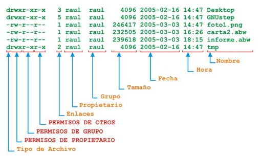
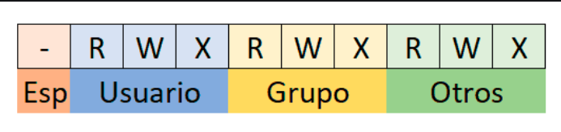
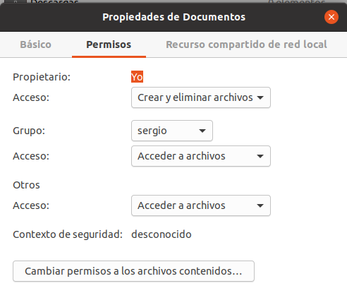

El **sistema de permisos UGO** (User, Group, Other) es el mecanismo por defecto en GNU/Linux para controlar **quién puede hacer qué** con cada archivo y directorio del sistema.

!!! info "¿Qué es UGO?"
    - **U**ser (Usuario): El propietario del archivo
    - **G**roup (Grupo): El grupo propietario del archivo
    - **O**ther (Otros): El resto de usuarios del sistema

Este sistema garantiza la **seguridad** y el **aislamiento** entre usuarios en un sistema multiusuario.

---

## Conceptos Fundamentales

**Propietarios de archivos**: Todo archivo o directorio en Linux pertenece a:

  1. **Un usuario propietario** (por defecto, quien lo crea)
  2. **Un grupo propietario** (por defecto, el grupo principal de quien lo crea)

Además existen **3 tipos de permisos** que se pueden otorgar:

| Permiso | Símbolo | Valor | Binario |  En archivos | En directorios |
|---------|---------|-------|---------|-------------|----------------|
| **Read**  | `r` | 4 | 100 | Ver el contenido | Listar el contenido (`ls`) |
| **Write** | `w` | 2 | 010 | Modificar/eliminar | Crear/eliminar archivos dentro |
| **eXecute** | `x` | 1 | 001 | Ejecutar el archivo | Entrar en el directorio (`cd`) |


Los permisos se definen para **3 entidades**:

1. **Usuario propietario (u)**: El dueño del archivo
2. **Grupo propietario (g)**: Los miembros del grupo del archivo
3. **Otros (o)**: El resto de usuarios del sistema


El comando `ls -l` muestra información detallada incluyendo los permisos:

```bash
ls -l
```

**Salida ejemplo:**
```
-rw-r--r-- 1 sergio profesores 1234 feb 10 10:30 documento.txt
drwxr-xr-x 2 sergio profesores 4096 feb 10 09:15 proyecto
-rwxr-xr-x 1 root   root        456 feb  9 14:20 script.sh
```

<figure markdown="span" align="center">
  { width="90%" }
  <figcaption>Estructura de la salida de ls -l</figcaption>
</figure>


**Desglose de la información**: Tomemos como ejemplo: 

```
-rw-r--r-- 1 sergio profesores 1234 feb 10 10:30 documento.txt
```

| Posición | Contenido | Significado |
|----------|-----------|-------------|
| **Carácter 1** | `-` | Tipo de archivo (- = archivo, d = directorio, l = enlace) |
| **Caracteres 2-4** | `rw-` | Permisos del **usuario** propietario (lectura y escritura) |
| **Caracteres 5-7** | `r--` | Permisos del **grupo** propietario (solo lectura) |
| **Caracteres 8-10** | `r--` | Permisos para **otros** usuarios (solo lectura) |
| **Número** | `1` | Número de enlaces duros |
| **Usuario** | `sergio` | Usuario propietario |
| **Grupo** | `profesores` | Grupo propietario |
| **Tamaño** | `1234` | Tamaño en bytes |
| **Fecha** | `feb 10 10:30` | Última modificación |
| **Nombre** | `documento.txt` | Nombre del archivo |


## Interpretar Permisos


<figure markdown="span" align="center">
  { width="90%" }
  <figcaption>Estructura de los permisos UGO</figcaption>
</figure>

- Primer carácter: Tipo de archivo, puede tener los siguientes valores

| Símbolo | Tipo |
|---------|------|
| `-` | Archivo regular |
| `d` | Directorio (directory) |
| `l` | Enlace simbólico (link) |
| `b` | Dispositivo de bloques (disco duro) |
| `c` | Dispositivo de caracteres (terminal) |
| `p` | Tubería con nombre (pipe) |
| `s` | Socket |

- Siguientes 9 caracteres: Permisos.  Se dividen en **3 grupos de 3**:

```
rwx  r-x  r--
└┴┘  └┴┘  └┴┘
 │    │    └─── Otros (o)  : lectura
 │    └──────── Grupo (g)  : lectura y ejecución
 └───────────── Usuario (u): lectura, escritura y ejecución
```

Cada posición puede tener:

- El permiso correspondiente (`r`, `w`, `x`)
- Un guión `-` si no tiene ese permiso

---

### Combinaciones Típicas de Permisos

Para archivos

| Permisos | Octal | Significado | Uso típico |
|----------|-------|-------------|------------|
| `---` | 0 | Sin permisos | Archivo bloqueado |
| `r--` | 4 | Solo lectura | Documentos protegidos |
| `rw-` | 6 | Lectura y escritura | Archivos de datos |
| `r-x` | 5 | Lectura y ejecución | Scripts de solo lectura |
| `rwx` | 7 | Todos los permisos | Scripts/programas editables |

Para directorios

| Permisos | Octal | Significado | Resultado |
|----------|-------|-------------|-----------|
| `---` | 0 | Sin permisos | No puedes ni ver ni entrar |
| `r--` | 4 | Solo listar | Puedes ver contenido pero no entrar |
| `r-x` | 5 | Leer y entrar | Puedes ver y acceder (común) |
| `rwx` | 7 | Control total | Puedes hacer cualquier cosa |
| `-wx` | 3 | Escribir y entrar | Buzón de entrega (no ver contenido) |

!!! tip "Directorio común"
    Para directorios, lo normal es tener `r-x` (5) o `rwx` (7). Sin el permiso `x` no puedes entrar dentro aunque tengas `r`.


### Ejemplos Interpretados

!!!example "Ejemplo 1: Archivo de texto"

    ```bash
    -rw-r--r-- 1 sergio profesores 1234 feb 10 10:30 documento.txt
    ```

    **Interpretación:**

    - **Tipo**: `-` (archivo regular)
    - **Usuario (sergio)**: `rw-` → Puede leer y modificar
    - **Grupo (profesores)**: `r--` → Pueden leer pero no modificar
    - **Otros**: `r--` → Pueden leer pero no modificar

    **Permisos en octal:** `644`

!!!example "Ejemplo 2: Directorio de proyecto"

    ```bash
    drwxr-xr-x 2 sergio profesores 4096 feb 10 09:15 proyecto
    ```

    **Interpretación:**

    - **Tipo**: `d` (directorio)
    - **Usuario (sergio)**: `rwx` → Control total (crear, borrar, entrar)
    - **Grupo (profesores)**: `r-x` → Pueden listar y entrar, pero no crear/borrar
    - **Otros**: `r-x` → Pueden listar y entrar, pero no crear/borrar

    **Permisos en octal:** `755`

!!!example "Ejemplo 3: Script ejecutable"

    ```bash
    -rwxr-xr-x 1 root root 456 feb 9 14:20 script.sh
    ```

    **Interpretación:**

    - **Tipo**: `-` (archivo regular)
    - **Usuario (root)**: `rwx` → Puede modificar y ejecutar
    - **Grupo (root)**: `r-x` → Puede leer y ejecutar, no modificar
    - **Otros**: `r-x` → Pueden leer y ejecutar, no modificar

    **Permisos en octal:** `755`

!!!example "Ejemplo 4: Directorio privado"

    ```bash
    drwx------ 2 sergio sergio 4096 feb 10 11:00 privado
    ```

    **Interpretación:**
    
    - **Tipo**: `d` (directorio)
    - **Usuario (sergio)**: `rwx` → Control total
    - **Grupo (sergio)**: `---` → Sin acceso
    - **Otros**: `---` → Sin acceso

    **Permisos en octal:** `700` (directorio completamente privado)

## Permisos Especiales

Además de `rwx`, existen permisos especiales:

### SetUID (s en posición de ejecución de usuario)

Cuando un archivo tiene **SetUID**, se ejecuta con los permisos de su **propietario**, no del usuario que lo ejecuta.

**Ejemplo:**
```bash
-rwsr-xr-x 1 root root 54256 /usr/bin/passwd
```

- La `s` en lugar de `x` indica SetUID
- Cualquier usuario que ejecute `passwd` lo hará como root
- Necesario para que los usuarios puedan cambiar su contraseña

!!! danger "Seguridad"
    SetUID es peligroso si no se usa correctamente. Un programa con SetUID de root mal diseñado puede ser un agujero de seguridad.

### SetGID (s en posición de ejecución de grupo)

Si se utiliza en **archivos**, el archivo se ejecuta con los permisos del **grupo propietario**.

Si se utiliza en **directorios**, los archivos creados dentro heredan el **grupo propietario** del directorio.

**Ejemplo:**
```bash
drwxrws--- 2 sergio profesores 4096 /compartido
```

- La `s` en lugar de `x` (posición grupo) indica SetGID
- Archivos creados en `/compartido` pertenecerán al grupo `profesores`

!!! tip "Uso práctico"
    SetGID en directorios es útil para carpetas compartidas de proyectos donde varios usuarios del mismo grupo colaboran.

### Sticky Bit (t en posición de ejecución de otros)

Solo el **propietario** de un archivo puede eliminarlo, aunque otros tengan permisos de escritura en el directorio.

**Ejemplo:**
```bash
drwxrwxrwt 10 root root 4096 /tmp
```

- La `t` en lugar de `x` (posición otros) indica Sticky Bit
- En `/tmp`, cualquiera puede crear archivos
- Pero solo el propietario puede borrar sus propios archivos

!!! info "Uso típico"
    El sticky bit es esencial en `/tmp` para evitar que usuarios borren archivos de otros.

---

## Notación Octal de Permisos

Los permisos también se representan con **números octales** (base 8).

Conversión binario → octal. Cada permiso tiene un valor:

- `r` (lectura) = **4**
- `w` (escritura) = **2**
- `x` (ejecución) = **1**

Se **suman** para obtener el valor de cada grupo:

| Permisos | Cálculo | Octal | Binario |
|----------|---------|-------|---------|
| `---` | 0 + 0 + 0 | **0** | 000 |
| `--x` | 0 + 0 + 1 | **1** | 001 |
| `-w-` | 0 + 2 + 0 | **2** | 010 |
| `-wx` | 0 + 2 + 1 | **3** | 011 |
| `r--` | 4 + 0 + 0 | **4** | 100 |
| `r-x` | 4 + 0 + 1 | **5** | 101 |
| `rw-` | 4 + 2 + 0 | **6** | 110 |
| `rwx` | 4 + 2 + 1 | **7** | 111 |

!!!example "Ejemplos de conversión"

    **`rw-r--r--`** → **644**

    - Usuario: `rw-` = 4+2+0 = **6**
    - Grupo: `r--` = 4+0+0 = **4**
    - Otros: `r--` = 4+0+0 = **4**

    --- 

    **`rwxr-xr-x`** → **755**

    - Usuario: `rwx` = 4+2+1 = **7**
    - Grupo: `r-x` = 4+0+1 = **5**
    - Otros: `r-x` = 4+0+1 = **5**

    ---

    **`rwx------`** → **700**

    - Usuario: `rwx` = 4+2+1 = **7**
    - Grupo: `---` = 0+0+0 = **0**
    - Otros: `---` = 0+0+0 = **0**

**Tabla rápida de permisos comunes**

| Octal | Simbólico | Uso típico |
|-------|-----------|------------|
| **644** | `rw-r--r--` | Archivos de datos (dueño puede editar, otros leen) |
| **755** | `rwxr-xr-x` | Directorios y ejecutables (todos pueden usar) |
| **700** | `rwx------` | Archivos/directorios privados |
| **666** | `rw-rw-rw-` | Archivo editable por todos (raro, inseguro) |
| **777** | `rwxrwxrwx` | Control total para todos (peligroso) |
| **600** | `rw-------` | Archivo privado (solo dueño puede leer/escribir) |

---

## Gestión de Permisos desde Terminal

### `chmod` - Cambiar permisos

Modifica los permisos de archivos y directorios.

Sintaxis

```bash
chmod [opciones] permisos archivo/directorio
```

Dos formas de especificar permisos

=== "Notación simbólica"
    Usa letras: `u` (user), `g` (group), `o` (other), `a` (all)
    
    **Operadores:**

    - `+` : Añadir permiso
    - `-` : Quitar permiso
    - `=` : Establecer permiso exacto
    
    !!!example "Ejemplos notación simbólica"
        ```bash
        chmod u+x script.sh          # Añade ejecución al usuario
        chmod g-w archivo.txt        # Quita escritura al grupo
        chmod o=r archivo.txt        # Otros solo lectura
        chmod a+r archivo.txt        # Todos pueden leer
        chmod ug+rw archivo.txt      # Usuario y grupo: leer y escribir
        ```

=== "Notación octal"
    Usa números de 3 dígitos (uno por cada entidad)
    
    !!! example "Ejemplos notación octal"
        ```bash
        chmod 644 documento.txt      # rw-r--r--
        chmod 755 script.sh          # rwxr-xr-x
        chmod 700 privado/           # rwx------
        chmod 777 publico/           # rwxrwxrwx (peligroso)
        ```

**Opciones de chmod**

| Opción | Descripción |
|--------|-------------|
| `-R` | Recursivo (aplica a todo el contenido) |
| `-v` | Verbose (muestra cambios) |
| `-c` | Solo muestra archivos que cambian |

Ejemplos prácticos

!!!Example "Hacer ejecutable un script:"
    ```bash
    chmod +x script.sh
    # o
    chmod 755 script.sh
    ```

!!!Example "Directorio privado:"
    ```bash
    chmod 700 ~/privado
    ```

!!!Example "Archivo solo lectura para todos:"
    ```bash
    chmod 444 importante.txt
    ```

!!!Example "Permisos recursivos:"
    ```bash
    chmod -R 755 /var/www/html
    ```

!!!Example "Dar permisos al grupo sin afectar al resto:"
    ```bash
    chmod g+w proyecto.txt
    ```

!!! tip "¿Simbólica u octal?"
    - **Simbólica**: Mejor para cambios pequeños (`u+x`, `g-w`)
    - **Octal**: Mejor para establecer permisos completos (`755`, `644`)

!!! warning "Uso de permisos 777 - PROHIBIDO"

    A menudo, hay usuarios que se esfuerzan en demostrar que no están controlando la situación y aplican permisos **777** totales a todo. En nuestro curso, esto estará prohibido salvo casos extremos o indicaciones del profesor.


#### Asignar **SetUID**, **SetGID** y **Sticky Bit**

Existen dos formas de aplicar estos permisos, tal como sucede con los permisos estándar.

=== "Notación simbólica"

    Para usar permisos especiales en modo octal, añadimos una **cuarta cifra a la izquierda** de las tres habituales (dueño, grupo, otros).

    * **SetUID:** `chmod 4755 archivo`
    * **SetGID:** `chmod 2755 archivo`
    * **Sticky Bit:** `chmod 1777 directorio`
    * **Combinados:** Si quieres SetUID (4) y SetGID (2), sumas ambos: `chmod 6755 archivo`.

=== "Notación octal"

    Se utilizan las letras `s` para SetUID/SetGID y `t` para el Sticky Bit.

    * **SetUID:** `chmod u+s archivo`
    * **SetGID:** `chmod g+s archivo`
    * **Sticky Bit:** `chmod o+t directorio`


Aquí tienes una propuesta de nota técnica, redactada de forma clara y profesional, para que tus alumnos de DAM entiendan esta importante excepción de seguridad en Linux:

!!!info "NOTA TÉCNICA: El 'Muro de Seguridad' en Scripts"

    Es fundamental entender que, aunque el comando `chmod` nos permita asignar bits especiales a cualquier archivo, el **Kernel de Linux se comporta de forma distinta** según el tipo de archivo:

    1. **SetUID (s) en archivos:** * **Binarios (Compilados):** Funciona perfectamente. El programa se ejecuta con los privilegios del dueño.
    * **Scripts (Bash, Python, etc.):** **NO funciona.** Por motivos de seguridad, Linux ignora el bit SetUID en archivos de texto interpretados para evitar ataques de suplantación (como las *race conditions*). Si un alumno de Sergio ejecuta un script de Pepe, el proceso seguirá siendo de Sergio.


    2. **SetGID (s) y Sticky Bit (t) en archivos:**
    * Al igual que el SetUID, se suelen ignorar en scripts por las mismas razones de seguridad.


    3. **SetGID (s) y Sticky Bit (t) en DIRECTORIOS:**
    * **¡AQUÍ SÍ FUNCIONAN SIEMPRE!** A diferencia de los archivos, en los directorios estos bits no afectan a quién "ejecuta" nada, sino a cómo se gestionan los archivos dentro:
    * El **SetGID** asegura que los nuevos archivos hereden el grupo del directorio.
    * El **Sticky Bit** asegura que solo el dueño pueda borrar su archivo.


### `chown` - Cambiar propietario

Cambia el usuario y/o grupo propietario de archivos y directorios.

Sintaxis

```bash
sudo chown [opciones] usuario[:grupo] archivo/directorio
```

!!! warning "Requiere sudo"
    Solo root puede cambiar el propietario de archivos. Necesitas usar `sudo`.

Ejemplos

!!!Example "Cambiar solo el usuario:"
    ```bash
    sudo chown sergio archivo.txt
    ```

!!!Example "Cambiar usuario y grupo:"
    ```bash
    sudo chown sergio:profesores archivo.txt
    ```

!!!Example "Cambiar solo el grupo (alternativa):"
    ```bash
    sudo chown :profesores archivo.txt
    ```

!!!Example "Recursivo (directorio completo):"
    ```bash
    sudo chown -R sergio:profesores /home/sergio/proyecto
    ```

!!!Example "Cambiar propietario de múltiples archivos:"
    ```bash
    sudo chown juan *.txt
    ```

---

### `chgrp` - Cambiar grupo

Cambia solo el grupo propietario (alternativa a `chown :grupo`).

Sintaxis

```bash
sudo chgrp [opciones] grupo archivo/directorio
```

Ejemplos

!!!Example "Ejemplos"
    ```bash
    sudo chgrp profesores documento.txt
    sudo chgrp -R alumnos /home/compartido
    ```

---

## Gestión de Permisos desde Entorno Gráfico

También puedes gestionar permisos desde el explorador de archivos.

Acceso

1. **Botón derecho** sobre el archivo/directorio
2. **Propiedades**
3. Pestaña **Permisos**

<figure markdown="span" align="center">
  { width="70%" }
  <figcaption>Permisos de archivo desde el entorno gráfico</figcaption>
</figure>

Las opciones disponibles son:

| Opción | Permisos equivalentes |
|--------|----------------------|
| **Ninguno** | `---` |
| **Solo lectura** | `r--` |
| **Lectura y escritura** | `rw-` |

Si marcas **"Permitir ejecutar este archivo como un programa"**:

- Solo lectura → `r-x`
- Lectura y escritura → `rwx`

Si hacemos lo mismo para establecer **Acceso a la carpeta** tenemos las siguientes opciones: 

| Opción | Permisos | Significado |
|--------|----------|-------------|
| **Ninguno** | `---` | No puedes acceder |
| **Solo listar archivos** | `r--` | Puedes ver qué hay pero no entrar |
| **Acceder a los ficheros** | `r-x` | Puedes ver y acceder |
| **Crear y eliminar archivos** | `rwx` | Control total |


## Casos Prácticos

!!! example "Caso 1: Script para todos"

    ```bash
    # Crear script
    echo '#!/bin/bash' > saludar.sh
    echo 'echo "Hola, $(whoami)!"' >> saludar.sh

    # Hacerlo ejecutable para todos
    chmod 755 saludar.sh

    # Verificar
    ls -l saludar.sh
    # -rwxr-xr-x 1 sergio sergio 45 feb 10 12:00 saludar.sh

    # Ejecutar
    ./saludar.sh
    ```

!!! example "Caso 2: Carpeta compartida de equipo"

    ```bash
    # Crear carpeta
    sudo mkdir /compartido/proyecto_x

    # Cambiar propietario y grupo
    sudo chown :proyecto_x /compartido/proyecto_x

    # Permisos: equipo puede todo, otros nada
    sudo chmod 770 /compartido/proyecto_x

    # SetGID para que archivos hereden el grupo
    sudo chmod g+s /compartido/proyecto_x

    # Verificar
    ls -ld /compartido/proyecto_x
    # drwxrws--- 2 root proyecto_x 4096 feb 10 12:00 /compartido/proyecto_x
    ```

!!! example "Caso 3: Documento confidencial"

    ```bash
    # Crear documento
    echo "Información confidencial" > secreto.txt

    # Solo el propietario puede leer y escribir
    chmod 600 secreto.txt

    # Verificar
    ls -l secreto.txt
    # -rw------- 1 sergio sergio 25 feb 10 12:00 secreto.txt

    # Nadie más puede leerlo (excepto root)
    ```

!!! example "Caso 4: Buzón de entregas"

    ```bash
    # Crear directorio
    sudo mkdir /entregas

    # Propietario: root, Grupo: alumnos
    sudo chown root:alumnos /entregas

    # Permisos: alumnos pueden crear, no listar
    sudo chmod 730 /entregas

    # Sticky bit: solo el creador puede borrar sus archivos
    sudo chmod +t /entregas

    # Verificar
    ls -ld /entregas
    # drwx-wx--T 2 root alumnos 4096 feb 10 12:00 /entregas
    ```


!!! example "Caso 5: El Proyecto Compartido. Uso de `SetGID`"

    Queremos que `sergio`, `juan` y `pepe` trabajen en una carpeta común llamada `/prog/proyecto_dam`. Lo ideal es que cualquier archivo que cree cualquiera de ellos pueda ser editado por los otros miembros del grupo sin tener que cambiar los permisos a mano cada vez.

    1. Primero creamos el entorno. Supondremos que el grupo común se llama `programadores`.

        ```bash
        # 1. Crear el grupo y añadir a los usuarios
        groupadd programadores
        usermod -aG programadores sergio
        usermod -aG programadores juan
        usermod -aG programadores pepe

        # 2. Crear la carpeta del proyecto
        mkdir -p /prog/proyecto_dam

        # 3. Cambiar el grupo dueño de la carpeta a "programadores"
        chown :programadores /prog/proyecto_dam

        # 4. Dar permisos totales al grupo y activar el SetGID (el 2 a la izquierda)
        chmod 2770 /prog/proyecto_dam

        ```

    2. Ahora, veamos qué pasa cuando los usuarios crean archivos dentro. Sergio crea un archivo:

        Si Sergio crea un archivo fuera de esa carpeta, el archivo pertenecería a su grupo primario (`sergio`). Pero mira qué pasa dentro:

        ```bash
        # Sergio entra y crea un script
        su - sergio
        cd /prog/proyecto_dam
        touch script_sergio.sh

        ls -l
        # Resultado: -rw-rw---- 1 sergio programadores ...

        ```

    3. Juan crea otro archivo:

        ```bash
        su - juan
        cd /prog/proyecto_dam
        touch nota_juan.txt

        ls -l
        # Resultado: -rw-rw---- 1 juan programadores ...

        ```

    Resultado: 

    1. El sistema "obliga" a que todo lo que nazca dentro de esa carpeta pertenezca al grupo `programadores`.
    2. Como los tres pertenecen a ese grupo, todos pueden leer y editar los archivos de los demás (siempre que el `umask` o el `chmod` den permiso al grupo, claro).


---

## Errores Comunes

!!!example "Error 1: Directorio sin x"

    ```bash
    chmod 644 carpeta/    # ❌ r-x necesario para entrar
    chmod 755 carpeta/    # ✅ Correcto
    ```

!!!example "Error 2: Script sin x"

    ```bash
    chmod 644 script.sh   # ❌ No se puede ejecutar
    ./script.sh           # Error: Permiso denegado
    chmod 755 script.sh   # ✅ Ahora sí
    ./script.sh           # ✅ Funciona
    ```

!!!example "Error 3: Permisos 777"

    ```bash
    chmod 777 archivo     # ❌ Peligroso: todos pueden hacer todo
    chmod 644 archivo     # ✅ Más seguro
    ```

    !!! danger "Nunca uses 777"
        `chmod 777` es un **grave error de seguridad**. Solo úsalo en casos muy específicos y temporales.

---

## Resumen de Comandos

| Comando | Función | Ejemplo |
|---------|---------|---------|
| `ls -l` | Ver permisos | `ls -l archivo.txt` |
| `chmod` | Cambiar permisos | `chmod 755 script.sh` |
| `chown` | Cambiar propietario | `sudo chown user:group file` |
| `chgrp` | Cambiar grupo | `sudo chgrp grupo archivo` |

---

## Tabla de Permisos Rápida

| Octal | Simbólico | Usuario | Grupo | Otros | Uso común |
|-------|-----------|---------|-------|-------|-----------|
| **644** | `rw-r--r--` | rw- | r-- | r-- | Archivos de datos |
| **755** | `rwxr-xr-x` | rwx | r-x | r-x | Ejecutables, directorios |
| **700** | `rwx------` | rwx | --- | --- | Privado |
| **777** | `rwxrwxrwx` | rwx | rwx | rwx | Todo para todos (peligroso) |
| **600** | `rw-------` | rw- | --- | --- | Archivos sensibles |


## Ejercicios Prácticos

!!! example "Ejercicio 1: Permisos básicos"
    1. Crea un archivo `test.txt`
    2. Establece permisos `rw-r--r--` (644)
    3. Verifica con `ls -l`
    4. Intenta ejecutarlo (debe fallar)
    5. Añade permiso de ejecución al propietario

!!! example "Ejercicio 2: Directorio compartido"
    1. Crea un directorio `equipo`
    2. Establece permisos 770
    3. Cambia el grupo a un grupo existente
    4. Aplica SetGID
    5. Verifica que funciona

!!! example "Ejercicio 3: Privacidad"
    1. Crea un archivo `secreto.txt`
    2. Escribe contenido sensible
    3. Establece permisos 600
    4. Intenta leerlo desde otro usuario
    5. Verifica que solo tú puedes acceder
