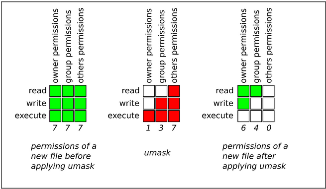
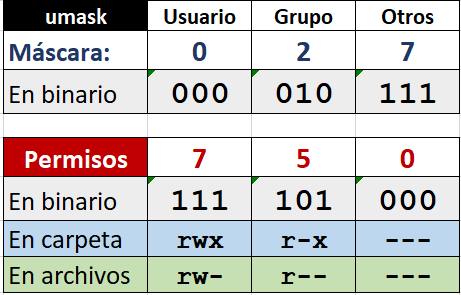
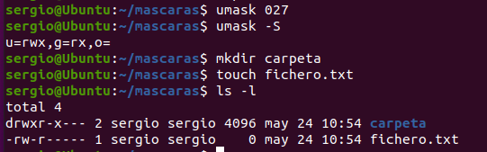
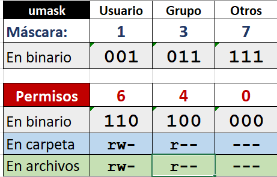
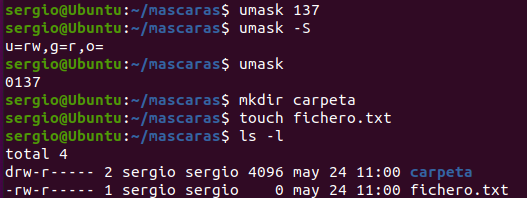
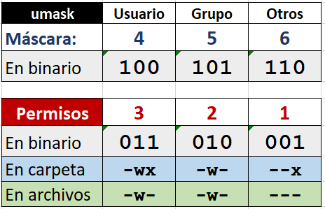
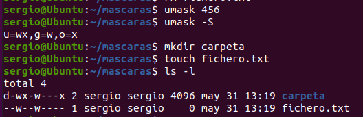

Cuando creas un archivo o directorio nuevo, ¿qué permisos tiene por defecto? La respuesta está en **umask**.

**umask** (user file creation mask) es una **máscara** que determina qué permisos se **quitan** a los archivos y directorios recién creados.

!!! info "Concepto clave"
    umask NO establece permisos, sino que define qué permisos **NO** se otorgarán por defecto.

---

## Funcionamiento de `umask`

Antes de aplicar `umask`, Linux tiene permisos base diferentes para archivos y directorios:

| Tipo | Permisos base | Octal | Razón |
|------|---------------|-------|-------|
| **Directorios** | `rwxrwxrwx` | 777 | Necesitan todos los permisos disponibles |
| **Archivos** | `rw-rw-rw-` | 666 | Por seguridad, NO tienen ejecución por defecto |

!!! question "¿Por qué 666 en archivos?"
    Los archivos normales NO deben ser ejecutables por defecto. La ejecución debe añadirse explícitamente si es necesario (por seguridad).

**La operación `umask`**

```
Permisos finales = Permisos base - umask
```

Más técnicamente (operación AND lógica):
```
Permisos finales = Permisos base AND (NOT umask)
```

Es decir, los permisos resultantes R son el resultado de conjunción bit a bit de los permisos predeterminados D y la negación bit a bit de la máscara del modo de creación de archivos. Se podría representar con el siguiente gráfico:

<figure markdown="span" align="center">
  { width="80%" }
  <figcaption>Gráfico de aplicación de máscara 137</figcaption>
</figure>

Otra forma de calcular la máscara, sería hacer la complementaria y después para los archivos tener en cuenta que no pueden tener el permiso de ejecución:

<figure markdown="span" align="center">
  { width="80%" }
  <figcaption>Cálculo de umask 0027</figcaption>
</figure>


---

## Ver y Establecer umask

Ver la umask actual

```bash
umask                 # Muestra en octal (ej: 0022)
umask -S             # Muestra en simbólico (ej: u=rwx,g=rx,o=rx)
```

**Salida típica:**
```bash
$ umask
0022

$ umask -S
u=rwx,g=rx,o=rx
```

!!! info "Formato de 4 dígitos"
    umask se muestra con 4 dígitos (ej: `0022`). El primer dígito (0) es para permisos especiales. Normalmente solo nos interesan los 3 últimos.

---

### Cálculo de Permisos con umask

Umask común: **0022**.Esta es la **umask por defecto** en la mayoría de sistemas Linux.

Para directorios

```
Permisos base:  777  (rwxrwxrwx)
umask:         -022  (----w--w-)
               ----
Resultado:      755  (rwxr-xr-x)
```

*En binario:*
```
111 111 111  (rwxrwxrwx = 777)
000 010 010  (umask 022)
-----------  (NOT umask y luego AND)
111 101 101  (rwxr-xr-x = 755)
```

Para archivos

```
Permisos base:  666  (rw-rw-rw-)
umask:         -022  (----w--w-)
               ----
Resultado:      644  (rw-r--r--)
```

*En binario:*
```
110 110 110  (rw-rw-rw- = 666)
000 010 010  (umask 022)
-----------  (NOT umask y luego AND)
110 100 100  (rw-r--r-- = 644)
```

---

## Interpretación de umask

La umask indica **qué permisos se quitan**:

**Umask 022 - Significado**

    ```
    0 2 2
    │ │ │
    │ │ └─ Otros: quitar escritura (2)
    │ └─── Grupo: quitar escritura (2)
    └───── Usuario: no quitar nada (0)
    ```

    **Resultado:**

    - **Usuario**: Todos los permisos disponibles (rwx para dirs, rw- para archivos)
    - **Grupo**: Sin escritura (r-x para dirs, r-- para archivos)
    - **Otros**: Sin escritura (r-x para dirs, r-- para archivos)

## Ejemplos de umask 

!!!example "umask 0022 (por defecto)"

    | Tipo | Base | umask | Resultado | Simbólico |
    |------|------|-------|-----------|-----------|
    | Directorio | 777 | 022 | **755** | `rwxr-xr-x` |
    | Archivo | 666 | 022 | **644** | `rw-r--r--` |

    **Uso:** Usuario normal, archivos visibles por todos
---

!!!example "umask 0027"

    ```
    0 2 7
    │ │ │
    │ │ └─ Otros: quitar rwx (7)
    │ └─── Grupo: quitar escritura (2)
    └───── Usuario: no quitar nada (0)
    ```

    | Tipo | Base | umask | Resultado | Simbólico |
    |------|------|-------|-----------|-----------|
    | Directorio | 777 | 027 | **750** | `rwxr-x---` |
    | Archivo | 666 | 027 | **640** | `rw-r-----` |

    <figure markdown="span" align="center">
      { width="80%" }
      <figcaption>Cálculo de umask 0027</figcaption>
    </figure>

    **Uso:** Archivos visibles por el grupo, ocultos al resto

    <figure markdown="span" align="center">
      { width="80%" }
      <figcaption>Ejemplo de umask 0027</figcaption>
    </figure>


!!!example "umask 0137 - No tiene mucho sentido de uso. Solo para uso didáctico"

    ```
    1 3 7
    │ │ │
    │ │ └─ Otros: quitar rwx (7)
    │ └─── Grupo: quitar escritura y ejecución (3)
    └───── Usuario: quitar ejecución (1)
    ```

    | Tipo | Base | umask | Resultado | Simbólico |
    |------|------|-------|-----------|-----------|
    | Directorio | 777 | 137 | **640** | `rw-r-----` |
    | Archivo | 666 | 137 | **640** | `rw-r-----` |

    <figure markdown="span" align="center">
      { width="80%" }
      <figcaption>Cálculo de umask 0137</figcaption>
    </figure>

    **Uso:** No tiene mucho sentido de uso. Solo para uso didáctico

    <figure markdown="span" align="center">
      { width="80%" }
      <figcaption>Ejemplo de umask 0137</figcaption>
    </figure>


!!!example "umask 0456 - No tiene mucho sentido de uso. Solo para uso didáctico"

    ```
    4 5 6
    │ │ │
    │ │ └─ Otros: quitar rwx (6)
    │ └─── Grupo: quitar escritura (5)
    └───── Usuario: no quitar nada (4)
    ```

    | Tipo | Base | umask | Resultado | Simbólico |
    |------|------|-------|-----------|-----------|
    | Directorio | 777 | 456 | **321** | `-wx-w---x` |
    | Archivo | 666 | 456 | **220** | `-w--w----` |

    <figure markdown="span" align="center">
      { width="80%" }
      <figcaption>Cálculo de umask 0456</figcaption>
    </figure>

    **Uso:** No tiene mucho sentido de uso. Solo para uso didáctico

    <figure markdown="span" align="center">
      { width="80%" }
      <figcaption>Ejemplo de umask 0456</figcaption>
    </figure>


!!!example "umask 0077"

    ```
    0 7 7
    │ │ │
    │ │ └─ Otros: quitar rwx (7)
    │ └─── Grupo: quitar rwx (7)
    └───── Usuario: no quitar nada (0)
    ```

    | Tipo | Base | umask | Resultado | Simbólico |
    |------|------|-------|-----------|-----------|
    | Directorio | 777 | 077 | **700** | `rwx------` |
    | Archivo | 666 | 077 | **600** | `rw-------` |

    **Uso:** Archivos completamente privados (máxima seguridad)


!!!example "umask 0002"

    ```
    0 0 2
    │ │ │
    │ │ └─ Otros: quitar escritura (2)
    │ └─── Grupo: no quitar nada (0)
    └───── Usuario: no quitar nada (0)
    ```

    | Tipo | Base | umask | Resultado | Simbólico |
    |------|------|-------|-----------|-----------|
    | Directorio | 777 | 002 | **775** | `rwxrwxr-x` |
    | Archivo | 666 | 002 | **664** | `rw-rw-r--` |

    **Uso:** Colaboración en grupo (grupo puede escribir)


!!!example "umask 0000"

    ```
    0 0 0 0
    │ │ │ │
    └─┴─┴─┴─ No quitar ningún permiso
    ```

    | Tipo | Base | umask | Resultado | Simbólico |
    |------|------|-------|-----------|-----------|
    | Directorio | 777 | 000 | **777** | `rwxrwxrwx` |
    | Archivo | 666 | 000 | **666** | `rw-rw-rw-` |

    !!! danger "Peligroso"
        **Nunca uses umask 0000** en producción. Todos los archivos serían modificables por cualquiera.


## Cambiar umask

### Temporal (solo sesión actual)

```bash
umask 0027                 # Establece umask a 027
```

Esta configuración se pierde al cerrar la terminal.

Verificar el cambio

```bash
umask                      # Debe mostrar 0027
umask -S                   # u=rwx,g=rx,o=
```


### Hacer umask Permanente

Para que la umask sea permanente, añádela a los archivos de configuración del shell.

#### Para Bash

Edita `~/.bashrc` (configuración personal) o `/etc/bash.bashrc` (para todos):

```bash
nano ~/.bashrc
```

Añade al final:
```bash
# Establecer umask personalizada
umask 0027
```

Guarda y recarga:
```bash
source ~/.bashrc
```

#### Para el sistema completo

Edita `/etc/profile` (afecta a todos los usuarios):

```bash
sudo nano /etc/profile
```

Añade:
```bash
umask 0022    # o el valor que necesites
```

!!! tip "Diferentes umask por usuario"
    Cada usuario puede tener su propia umask en su `~/.bashrc`. Esto permite políticas de seguridad diferentes según el rol.


## Tabla Resumen de umask Comunes

| umask | Directorios | Archivos | Uso típico |
|-------|-------------|----------|------------|
| **0022** | `rwxr-xr-x` (755) | `rw-r--r--` (644) | Por defecto, acceso público lectura |
| **0027** | `rwxr-x---` (750) | `rw-r-----` (640) | Grupo puede leer, otros nada |
| **0077** | `rwx------` (700) | `rw-------` (600) | Completamente privado |
| **0002** | `rwxrwxr-x` (775) | `rw-rw-r--` (664) | Colaboración en grupo |
| **0007** | `rwxrwx---` (770) | `rw-rw----` (660) | Solo usuario y grupo |
| **0000** | `rwxrwxrwx` (777) | `rw-rw-rw-` (666) | Sin restricciones (peligroso) |

---

## Casos de Uso Reales

!!!example "Caso 1: Desarrollador en solitario"

    ```bash
    umask 0077    # Todo privado
    ```

    **Resultado:**

    - Directorios: 700
    - Archivos: 600
    - Nadie más puede ver ni modificar

!!!example "Caso 2: Equipo de desarrollo"

    ```bash
    umask 0002    # Grupo puede colaborar
    ```

    **Resultado:**

    - Directorios: 775
    - Archivos: 664
    - El grupo puede leer y escribir

!!!example "Caso 3: Usuario normal"

    ```bash
    umask 0022    # Por defecto en Ubuntu
    ```

    **Resultado:**

    - Directorios: 755
    - Archivos: 644
    - Todos pueden leer, solo propietario escribe

!!!example "Caso 4: Datos sensibles"

    ```bash
    umask 0027    # Solo el grupo puede leer
    ```

    **Resultado:**

    - Directorios: 750
    - Archivos: 640
    - Otros usuarios no tienen acceso

---


!!!example "Script de prueba"

    ```bash
    #!/bin/bash

    echo "=== Prueba de umask ==="
    echo ""

    # Guardar umask original
    ORIGINAL=$(umask)

    # Probar diferentes umask
    for MASK in 0022 0027 0077 0002; do
        umask $MASK
        echo "umask: $MASK"
        
        # Crear archivo y directorio
        touch "test_file_$MASK.txt"
        mkdir "test_dir_$MASK"
        
        # Mostrar permisos
        ls -l "test_file_$MASK.txt" | awk '{print "  Archivo:", $1}'
        ls -ld "test_dir_$MASK" | awk '{print "  Directorio:", $1}'
        echo ""
    done

    # Restaurar umask original
    umask $ORIGINAL

    # Limpiar
    rm test_file_*.txt
    rmdir test_dir_*

    echo "umask restaurada a: $ORIGINAL"
    ```

    **Salida esperada:**
    ```
    === Prueba de umask ===

    umask: 0022
      Archivo: -rw-r--r--
      Directorio: drwxr-xr-x

    umask: 0027
      Archivo: -rw-r-----
      Directorio: drwxr-x---

    umask: 0077
      Archivo: -rw-------
      Directorio: drwx------

    umask: 0002
      Archivo: -rw-rw-r--
      Directorio: drwxrwxr-x

    umask restaurada a: 0022
    ```

## Ejercicios Prácticos

!!! example "Ejercicio 1: Experimentar con umask"
    1. Comprueba tu umask actual
    2. Cambia a umask 0027
    3. Crea un archivo y un directorio
    4. Verifica los permisos con `ls -l`
    5. Restaura la umask original

!!! example "Ejercicio 2: Cálculo manual"
    Calcula los permisos resultantes para:

    1. umask 0037 en directorios
    2. umask 0037 en archivos
    3. umask 0002 en directorios
    4. umask 0002 en archivos

!!! example "Ejercicio 3: umask permanente"
    1. Edita tu `~/.bashrc`
    2. Añade `umask 0027` al final
    3. Recarga con `source ~/.bashrc`
    4. Abre nueva terminal y verifica que se mantiene
    5. Crea archivos y verifica permisos

