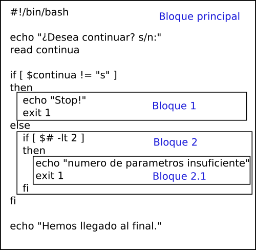

## Control de flujo de programa. Estructura `if`.

La estructura `if` permite tomar decisiones de una forma sencilla en el programa, normalmente para decidir si en función de una u otra situación ejecutaremos un código u otro. La estructura es la siguiente:

!!!info "Sintaxis `if`"
    ```bash
    if [ condición ]
    then
        # instrucciones a ejecutar si se cumple la condición
    fi
    ```

De esta forma podemos incluir en el programa un conjunto de instrucciones que sólo se ejecutarán si la condición impuesta se cumple. Si no se cumple, no ejecutará ninguna instrucción que haya inmediatamente después de la palabra `then`.


<figure markdown="span" align="center">
  { width="80%" }
  <figcaption>Estructura IF.</figcaption>
</figure>


Hay una manera de que ejecute una serie de instrucciones cuando no se cumpla la condición. De esta forma podemos ejecutar instrucciones cuando se cumple la condición, y cuando no se cumple ejecutar otras.

!!!info "Sintaxis `if`- `else`"
    ```bash
    if [ condición ]
    then
        # instrucciones a ejecutar si se cumple la condición
    else
        # instrucciones a ejecutar si no se cumple la condición
    fi
    ```

La condición `else`no es obligatoria si no se necesita. Después de la palabra `else` no se debe poner `then`.

<figure markdown="span" align="center">
  { width="80%" }
  <figcaption>Estructura IF-ELSE.</figcaption>
</figure>

Por último, si queremos que cuando una condición se cumpla ejecutar unas instrucciones, cuando se cumpla otra, ejecutar otras, y así podemos hacer lo siguiente:

!!!info "Sintaxis `if`- `elif`"
    ```bash
    if [ condición1 ]
    then
        # instrucciones a ejecutar si se cumple la condición1
    elif [ condición2 ]
    then
        # instrucciones a ejecutar si se cumple la condición2
    else
        # instrucciones a ejecutar si no se cumple ninguna condición
    fi
    ```

Puede haber tantas instrucciones `elif` como creamos necesario, pero sólo una instrucción `else` como máximo (puede no haber ninguna), ya que es lo que se ejecutará cuando no se haya cumplido ninguna de las anteriores condiciones.

<figure markdown="span" align="center">
  { width="80%" }
  <figcaption>Estructura IF-ELIF.</figcaption>
</figure>

Después de cada condición `elif` también se pone la palabra `then` en la siguiente línea.

Existe una instrucción nula que se representa con dos puntos `:`. La podemos usar cuando no queremos que se ejecute nada en un punto de la estructura `if` por ejemplo.

!!!info "Sintaxis `if` con instrucción nula"
    ```bash
    if [ condición ]
    then
        # Si no queremos ejecutar nada si es verdadera, podemos poner la instrucción nula
    :
    else
        #instrucciones a ejecutar si no se cumple la condición (falsa)
    fi
    ```

### Ejemplos

!!!Example "Script que comprueba si recibe como mínimo 2 parámetros. Si recibe menos, muestra un mensaje de error y sale."

    ```bash 
    #!/bin/bash
    if [ $# -lt 2 ]
    then
    echo ”El programa necesita 2 parámetros al menos”
    exit 1
    fi
    ```

!!!Example "Script igual que el anterior, pero además comprueba que el primer parámetro sea igual a “s”, o a “n”, porque sino también dará error."

    ```bash
    #!/bin/bash
    if [ $# -lt 2 ]
    then
        echo “El programa necesita 2 parámetros al menos”
        exit 1
    else
        if [ $1 != “s” -a $1 != “n” ]
        then
            echo “El primer parámetro debe ser 's' o 'n'. ”
            exit 1
        fi
    fi
    ```

!!!Example "Script que pregunte por el nombre de 2 ficheros. Después comprueba si existe el primer fichero, y si existe, escribe el contenido del directorio dentro. Si no existe el primero, comprueba si existe el segundo como alternativa para hacer lo mismo. En caso de que no exista ninguno de los 2 mostrará un mensaje de error y terminará el programa."

    ```bash
    #!/bin/bash
    echo “Teclea nombre para el primer fichero a escribir: ”
    read fich1
    echo “Teclea nombre de un fichero alternativo, por si no existe el primero: ”
    read fich2
    if [ -e $fich1 ]
    then
        ls -l >> $fich1
        echo “He escrito la información en $fich1”
    elif [-e $fich2 ]
    then
        ls -l >> $fich2
        echo “He escrito la información en $fich2”
    else
        echo “Ninguno de los 2 ficheros recibidos existe”
        exit 1
    fi
    ```

En el caso de que queramos tener más de una condición utilizamos los operadores lógicos `&&` y `-a` (y), `||` y `-o` (o) y `!` (negado) tal y como hemos visto antes.

!!!Example "ejemplo con más de una condición" 

    ```bash
    #!/bin/bash
    valor1=55
    valor2=22
    valor3=36

    # comprueba si valor1 es el mayor de todos los valores
    if [ $valor1 -ge $valor2 ] || [ $valor2 -ge $valor3 ]
    then
        echo "el valor mayor de todos es $valor1"
    fi

    # Comprueba si valor1 es par o impar realizando una operación en la propia condición.
    if [[ $(($valor1 % 2)) == 0 ]]
    then
        echo Par
    else
        echo Impar
    fi

    ```

!!!Example "ejemplo con un comando más complejo. El siguiente script nos dice si un usuario dado se encuentra en el sistema"

    ```bash
    #!/bin/bash

    if $(grep -q ^$1: /etc/passwd); then
        echo “El usuario $1 existe”
    else
        echo “El usuario $1 NO existe”
    fi
    ```

!!!question "RETO"
    A partir del script anterior genera un script que le pases dos nombres con una letra "y" u "o" en medio y nos devuelva si existen los dos usuarios (si se ha pasado una "y") o no, o hay uno de los dos (si se ha pasado una "o"). Un ejemplo de ejecución sería `./hayUsuarios.sh sergio y gustavo`

!!!question "RETO2"
    
    Verifica que hay una "y" o una "o" antes de hacer nada más.

### Bloques dentro de un programa

Antes de continuar, y para aclarar del todo el funcionamiento de una estructura como `if`, y otras que veremos más adelante. Vamos a ver lo que es un bloque de instrucciones dentro de un programa y lo que puede significar.

Un **bloque de instrucciones** se puede decir que es un conjunto de instrucciones que se ejecutan una detrás de otra, y además, ese bloque está siempre delimitado por una instrucción o palabra clave que marca su inicio y por otra que marca su fin, excepto en el caso del bloque principal de programa. En el caso del bloque principal del programa, el inicio y el final de dicho bloque están
marcados por el inicio y el final del fichero.

<figure markdown="span" align="center">
  { width="80%" }
  <figcaption>Estructura IF con bloques.</figcaption>
</figure>

Como se puede observar en la figura anterior, se pueden meter bloques de instrucciones, unos dentro de otros. A esto se le llama anidar bloques. De esta forma cuando un bloque contiene otro dentro, se puede decir que el que contiene es el bloque padre, y el contenido es el bloque hijo.

Excepto el bloque principal, el resto de bloques, hemos visto que comienzan con una palabra clave y no terminan hasta que aparece otra para finalizarlo. En el caso de la estructura `if`, cuando aparece la palabra `then`, se abre un bloque nuevo dentro de este (que se ejecutará sólo cuando se cumpla la condición). Este bloque finalizará cuando aparezca una nueva condición con `elif`, la palabra `else`, o la palabra de fin de estructura `fi`.

!!!tip "Consejo"
    Cada vez que se abra un nuevo bloque, es aconsejable que las instrucciones comiencen un mínimo de 2 o 3 espacios después que las instrucciones del bloque padre. De esta forma diferenciaremos sin problema que instrucciones pertenecen a cada bloque.


## Recordando el Redireccionamiento

Ya hemos visto que podemos construir expresiones del tipo:

```bash 
echo “una frase” > archivo
ls -l >> archivo
```

Este tipo de expresiones, lo que hacen es redirigir la salida del programa, es decir, el texto que normalmente mostraría por pantalla, a un archivo que nosotros le especifiquemos.

Ya hemos visto que hay 2 formas de redirigir la salida de un comando o programa. La primera es mediante `>`, que sustituye todo lo que hubiera anteriormente en el archivo por el texto de salida del programa (también crea el archivo si no existía antes). La segunda es mediante `>>`, que hace exactamente lo mismo, sólo que no borra los contenidos anteriores del archivo de texto, sino que
añade el nuevo texto al final del mismo.

Tambien sabemos distinguir entre la salida estándar y la salida de error. La salida estándar son los mensajes que el programa envía
cuando todo funciona de la forma esperada, es decir, correctamente. La salida de error son los mensajes que el programa envía cuando algo ha fallado. Un script puede generar ambas salidas si algunos comandos funcionan correctamente mientras que otros fallan (si no las redireccionamos, ambas aparecerán siempre por pantalla, juntas).

- `>`, `>>` Redireccionan la salida estandar a algún archivo que indiquemos
- `2>`, `2>>` Redireccionan la salida de error a algún archivo que indiquemos
- `&>`, `&>>` Redireccionan las 2 salidas a algún archivo que indiquemos

!!!example "Ejemplo"

    ```bash
    # El directorio dir ya existe
    mkdir dir
    # Producirá la salida: mkdir: no se puede crear el directorio «dir»: El fichero ya existe
    # Esta salida es de error porque el comando ha fallado.
    mkdir dir > salida.txt
    # Como estamos redireccionando sólo la salida estandar y el mensaje era de error, nos seguirá apareciendo lo mismo de antes.
    mkdir dir 2> salida.txt
    mkdir dir &> salida.txt
    # En estos casos si que se guardará el mensaje de error porque redireccionamos la salida correcta
    ```

Con esto también podemos llevar la salida normal de un programa a un archivo y la salida de error a otro archivo diferente y así analizar los mensajes por separado por ejemplo:

```bash
sh script.sh > salida.txt 2> error.txt
```

La salida estándar se numera como 1 (esto quiere decir que aunque podemos utilizar el símbolo `>` para redireccionar la salida estándar, lo más correcto sería usar `1>`), y la de error como salida `2>`.

Dentro de un script, podemos hacer por ejemplo, que la salida de un comando echo, salga por la salida de error, esto se hace de la siguiente forma.

!!!example "Ejemplo"

    ```bash
    #!/bin/bash
    echo “elige un número del 1 al 3”
    read opcion
    if [ $opcion = “1” ]
    then
        echo “Has elegido el número 1”
    elif [ $opcion = “2” ]
    then
        echo “Has elegido el número 2”
    elif [ $opcion = “3” ]
    then
        echo “Has elegido el número 3”
    else
        echo “numero incorrecto” 1>&2
    fi
    ```

De esta forma, el mensaje “numero incorrecto” saldrá por la salida de error, que además es lo que queremos, ya que es un mensaje de error. La expresión `1>&2` se podría interpretar como redireccionar el mensaje que normalmente aparecería por la salida estándar (1), a la salida de error (2).

A lo mejor nos interesa que alguna de las salidas (o ambas) no aparezca ni por pantalla, ni se guarde en ningún archivo. Esto se puede conseguir redireccionando la salida de un programa al fichero especial `/dev/null`. Este fichero, es como un agujero negro, que se tragará todos los mensajes que le enviemos y desaparecerán. De esta forma:

```bash
mkdir dir 2> /dev/null
```

Estamos redirigiendo la salida de error a `/dev/null`, lo que quiere decir que el comando no mostrará mensajes de error. En este caso, esto significa, que si ya existe el directorio 'dir' no se mostrará un mensaje de error.

Otra forma de saber, por ejemplo, si existe un fichero, además de `[ -e fichero ]`, es ejecutar el comando ls sobre ese fichero. Si existe el fichero el comando funcionará bien, y si no existe dará un error. Como hemos visto, eso es equivalente a devolver verdadero o falso.


!!!example "Ejemplo"
    ```bash
    # opción 1
    if [ -e fichero]
    then
        echo “fichero ya existe”
    else
        echo “fichero no existe”
    fi

    # opción equivalente. En este caso redirigimos para no obtener mensajes.
    if ls fichero &> /dev/null
    then
        echo “fichero ya existe”
    else
        echo “fichero no existe”
    fi
    ```

Como se observa, al ejecutar el comando `ls fichero`, no nos interesa ni mensaje con el listado con el fichero, ni el mensaje de error que pueda dar, solamente si funciona o no. Por eso redirigimos ambas salidas a `/dev/null` , para que no nos muestre ningún mensaje por pantalla


## Estructura `case`

Esta estructura es muy fácil de entender una vez entendido como funciona la estructura `if`. Ya que el funcionamiento es similar, pero más limitado. La estructura es la siguiente:


!!!info "Sintaxis"
    ```bash
    # Se pueden poner tantas opciones como se quieran
    case valor in
    valor1)
        # ordenes a ejecutar si el valor coincide con valor1
        ;;
    valor2)
        # ordenes a ejecutar si el valor coincide con valor2
        ;;
    valor3)
        # ordenes a ejecutar si el valor coincide con valor3
        ;;
    esac
    ```

!!!warning "Importante" 
    Las instrucciones a ejecutar se pueden poner inmediatamente a continuación del valor o en la línea siguiente, eso no importa, lo que sí hay que tener en cuenta es que después de la última instrucción dentro de un valor debe haber siempre dos punto y coma '`;;`' seguidos, justo después de la instrucción o en la línea de abajo, como se prefiera.

En este caso lo que evaluaremos siempre es el valor que tiene una variable, y dependiendo del valor, se ejecutaran unas acciones u otras, algo similar a cuando realizábamos un menú con la estructura if, pero más claro. Aquí podemos ver la equivalencia.

!!!example "Ejemplo version `case`"
    ```bash
    echo “1) opcion1”
    echo “2) opcion2”
    echo -e -n “\tElige una opción: ”
    read opcion

    case $opcion in
    1)
        echo “Opción 1 elegida”;;
    2)
        echo “Opción 2 elegida”;;
    *)
        echo “Opción no válida” 1>&2;;
    esac
    ```


!!!example "Ejemplo versión `if`"

    ```bash
    echo “1) opcion1”
    echo “2) opcion2”
    echo -e -n “\tElige una opción: ”
    read opcion

    if [ $opcion = “1” ]
    then
        echo “Opción 1 elegida”
    elif [ $opcion = “2”]
        echo “Opción 2 elegida”
    else
        echo “Opción no válida” 1>&2
    fi
    ```

En este caso, las estructuras son idénticas, aunque la opción `case` es la más limpia. Esta se evalúa de la misma forma que los `if` y `elif`, es decir va comprobando de arriba a abajo las condiciones, y cuando encuentra una válida, ejecuta las ordenes que hay a continuación.

Como ya hemos visto los metacaracteres `*`, `?`, y `[]`, podemos intuir que si ponemos `*` como valor significará cualquier cosa, y entrará ahí siempre que no haya entrado antes en ninguno de los otros valores (como en el caso de `if`, sólo entrará en uno de los valores cuando se ejecuta, nunca en más). Por este motivo, se puede decir que el valor `*`, se comporta exactamente igual que `else`, es decir, si no ha encontrado antes una condición válida, entrará ahí siempre.

Aquí podemos ver un ejemplo, simple utilizando metacaracteres. En este caso vamos a preguntar al usuario por la confirmación de algo, y vamos a comprobar si el usuario ha contestado afirmativa o negativamente. A nosotros nos da igual si el usuario contesta “s”, “si”, “S”, “Si”, “si quiero”, “n”, “NO”, etc... Lo que nos interesa para evaluar la opción es saber si la primera letra es una 's' o una 'n' (mayúscula o minúscula), y el resto del texto nos da igual. Lo podemos hacer así:


!!!example "Ejemplo `case` verificando solo la primera letra"
    ```bash
    echo “¿Desea continuar?:”
    read resp
    case $resp in
        [sS]*) #Si la respuesta es una s o una S seguido de 'lo que sea'
            echo “Ha elegido continuar”;;
        [nN]*) #Si la respuesta es una n o una N seguido de 'lo que sea'
            echo “Ha elegido no continuar”
            exit;;
        *)
            echo “Respuesta no válida” 1>&2;;
    esac
    ```
