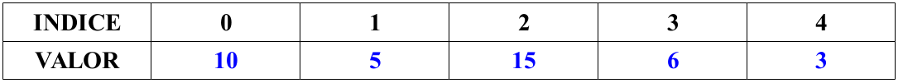
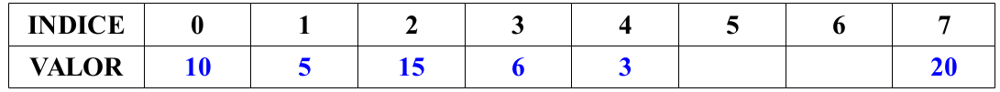

## Saltos de línea en los scripts: '`;`' y '`\`'

En ocasiones, tal vez por elegancia, o por pura claridad (aunque suele ser subjetivo), nos podría interesar tener más de 1 instrucción que irían en líneas separadas, en una misma línea o viceversa.

Tener una instrucción de 1 sola línea dividida en varias debido a su longitud.

El símbolo punto y coma '`;`', se utiliza para poder poner a continuación, lo que pondríamos el la línea siguiente. Se podría decir que es como introducir un salto de línea de forma artificial, aunque hay excepciones: detrás de las palabras especiales then y do, por ejemplo, aunque normalmente hagamos un salto de línea este no es obligatorio, y por lo tanto, no se puede poner punto y coma
entre la palbara y la primera instrucción.

!!!example "Ejemplo"

    ```bash
    #!/bin/bash
    echo -n "dime tu edad: "; read edad
    if [ $edad -lt 18 ]; then echo "menor de edad"; else echo "mayor de edad"; fi
    ```

Por el contrario, la barra invertida '`\`' puede servir para lo contrario. Ya hemos explicado que la barra invertida sirva para que un carácter especial sea interpretado como si fuera texto normal. Pues bien, esto también es válido para el salto de línea, considerado un carácter especial. Cuando justo delante de un salto de línea se pone una barra invertida este pasa a ser como un espacio normal y
corriente o como un tabulador, es decir, lo que haya en la línea de abajo es como si siguiera estando en la línea superior.

!!!example "Ejemplo"

    ```bash
    #!/bin/bash
    echo "Este es un mensaje muy largo, y por eso voy a dividirlo \
    en dos partes. Y así me cabe sin problemas, o tal vez debiera \
    dividirlo en más. Lo que no hay que olvidar es que a continuación \
    de la barra invertida es donde tiene que estar el salto de línea."

    for dir in dir1 dir2 dir3 dir4 dir5 dir6 dir7 dir8 dir9 \
    dir10 dir11 dir12 dir13 dir14 dir15 dir16
    do
        mkdir $dir
    done
    ```

## Vectores (Arrays)

Un **vector** o **array**, básicamente se puede decir que es una variable que en lugar de contener un sólo valor, puede contener varios. Para acceder a cada valor, se utiliza un índice, que es el número que indica la posición que ocupan dentro del vector.

La forma más común de asignar valores inicialmente a un vector es similar a la que se utilizaría para asignar un valor a una variable normal, simplemente hay que encerrar todos los valores entre paréntesis.

!!!info "Sintaxis"

    ```bash
    vector=( valor1 valor2 valor3 valor4 )
    ```

Los valores, al igual que en una lista de valores deben de estar separados por un espacio entre si. Para acceder a cada valor, simplemente hay que poner el índice entre corchetes después del nombre de la variable. El índice del primer valor siempre es 0. El índice del último es el número de valores – 1. Es decir, en un vector con 4 elementos, los índices irían del 0 al 3.

!!!example "Ejemplo"

    ```bash
    #!/bin/bash
    vector=( 10 5 2 6 )
    echo "Primer elemento: ${vector[0]}"
    echo "Segundo elemento: ${vector[1]}"
    echo "Tercer elemento: ${vector[2]}"
    echo "Ultimo elemento: ${vector[3]}"
    echo "Elemento no existente: ${vector[5]}"
    ```

Como se ve, si intentamos acceder a un elemento que no existe, el que tiene índice 5 en este ejemplo, es como acceder a una variable a la que no hemos dado valor todavía, estaría vacía.

Digamos que la estructura de la variable vector en este caso se podría representar así.

<figure markdown="span" align="center">
  { width="80%" }
  <figcaption>Ejemplo vector</figcaption>
</figure>

Podemos añadir un elemento adicional al vector, o modificar uno existente, de la misma forma que accedemos a él.

!!!example ""

    ```bash
    vector[2]=15
    vector[4]=3
    ```

<figure markdown="span" align="center">
  { width="80%" }
  <figcaption>Ejemplo vector</figcaption>
</figure>

Podemos asignar un valor a un índice, por ejemplo el 7, dejando índices vacíos en medio, aunque esta no es un práctica muy aconsejable en la mayoría de las ocasiones.

!!!example ""

    ```bash
    vector[7]=20
    ```

<figure markdown="span" align="center">
  { width="80%" }
  <figcaption>Ejemplo vector</figcaption>
</figure>

Hay un propiedad muy útil en la vectores, y es el hecho de que si utilizamos '`*`' como índice, nos muestra el vector como si fuera una lista.

!!!example "Ejemplo"

    ```bash
    #!/bin/bash
    vector=( uno dos tres cuatro cinco seis )

    # Vamos a mostrar los valores del vector por pantalla
    echo "${vector[*]}"
    ```

Gracias a esto podemos recorrer un vector de la siguiente forma:

!!!example "Ejemplo"

    ```bash
    #!/bin/bash
    vector=( uno dos tres cuatro cinco seis )
    for valor in ${vector[*]}
    do
        echo -n "$valor "
    done
    ```

Otra propiedad es como obtener el número de elementos que contiene un vector:

!!!example "Ejemplo"

    ```bash
    #!/bin/bash
    vector=( uno dos tres cuatro cinco seis )

    # Vamos a mostrar el número de elementos del vector por pantalla
    echo "Numero de elementos: ${#vector[*]} "
    ```

Y por ello sería equivalente recorrer los valores del vector de la siguiente forma:

!!!example "Ejemplo"

    ```bash
    #!/bin/bash
    vector=( uno dos tres cuatro cinco seis )

    # De esta manera debemos saber que hay 6 elementos en el vector
    for (( i = 0; i < 6; i++ ))
    do
        echo "Elemento ${i}: ${vector[$i]} "
    done

    # Aquí no hace falta saber cuantos elementos tenemos
    for (( i = 0; i < ${#vector[*]}; i++ ))
    do
        echo "Elemento ${i}: ${vector[$i]} "
    done
    ```

!!!note "Nota" 

    Se puede borrar el valor de una posición del vector con el comando `unset` visto anteriormente. Asimismo también se puede borrar el valor asignado a una variable (es como si ya no existiese).

    ```bash
    vector=( 4 5 3 6 7 )
    unset vector[4]
    ```
    Ahora vector tendrá 4 elementos en lugar de 5, ya que hemos eliminado el último (índice 4).

También podemos inicialmente dar los valores uno a uno, en lugar de asignarle varios valores a la vez. En este caso, el orden no importa, pero no es aconsejable dejar indices sin valor.

!!!example "Ejemplo"
    ```bash
    vector[0]=”uno”
    vector[2]=”tres”
    vector[1]=”dos”

    # lo anteior es lo mismo que la siguiente línea
    vector=( “uno” “dos” “tres” )
    ```


## Funciones

Aunque no vamos a profundizar demasiado en este tema, vamos a aprender lo que es una **función** y su utilidad de forma muy básica.

Una **función** se puede describir como un trozo del código o conjunto de instrucciones que se agrupan para realizar alguna función específica dentro del programa. Esta función específica puede ser una operación matemática, una búsqueda, ordenación, etc...

<figure markdown="span" align="center">
  { width="80%" }
  <figcaption>Estructura de una función</figcaption>
</figure>

Una función se define con un nombre seguido de '`()`' y '`{`'. A continuación se escriben las instrucciones que formarán parte de la función y se terminará cerrando la llave '`}`'.

Para llamar a esa función simplemente hay que poner el nombre de la función en algún lugar del código y cuando se ejecute, nos trasladará al código dentro de la función. Cuando la función acabe volveremos al programa principal después de la llamada a la función.

!!!example "Ejemplo función básica"

    ```bash
    #!/bin/bash
    # Aquí sólo estamos definiendo la función,
    # no se ejecutará hasta que se la llame
    funcion () {
        echo "Soy una función"
    }

    echo "Vamos a llamar a la función..."
    funcion
    ```

Una función, al igual que el programa principal cuando se ejecuta, puede recibir **parámetro**, y trabaja con ellos de forma idéntica. Es decir el primer **parámetro** se accederá con `$1`, el segundo con `$2`, el número de parámetros con `$#,` la lista con `$*,` etc...

Hay que tener en cuenta, que debido a ello, ***una función no tiene acceso directamente a los parámetros que recibe el programa***, sino solamente a los parámetros con los cuales se llama a la función.

!!!example "Ejemplo función con parámetros"

    ```bash
    #!/bin/bash
    # Aquí sólo estamos definiendo la función,
    # no se ejecutará hasta que se la llame
    funcion () {
        echo "He recibido $# parámetros"
        echo "Parametro 1: $1"
        echo "Parametro 2: $2"
    }

    # y la llamada a la función con sus dos parámetros
    funcion "par1" "par2"
    ```

La palabra `return` dentro de una función tiene una función similar a `exit` en el programa, sale de la función **devolviendo** un número que puede ser un **valor entre 0 y 255**. El valor de retorno de la última función llamada queda guardada en la variable `$?`.

!!!example "Ejemplo uso de `return`"

    ```bash
    #!/bin/bash
    FALSO=0
    VERDADERO=1

    # Esta función comprueba si un archivo existe.
    # Si existe devuelve 1->Verdadero, y si no 0->Falso
    existe () {
        if [ -e $1 ]
        then
            return $VERDADERO
        else
            return $FALSO
        fi
    }

    # ahora llamamos a la función creada
    existe "archivo1.txt"

    # Comprobamos el valor devuelto por la función
    if [ $? -eq $VERDADERO ]
    then
        echo "El archivo existe."
    else
        echo "El archivo NO existe."
    fi
    ```

Por último, y bastante importante ya que no tiene nada que ver con la gran mayoría de los lenguajes de programación y muestra una vez más las limitaciones que tiene `bash` script con las funciones, hablamos de las variables dentro de una función.

**Las variables que se crean dentro de una función son globales**, es decir, pueden ser accedidas posteriormente desde el programa principal y mantendrán el valor dado dentro de la función. Si queremos que una variable sólo exista dentro de una función, es decir sea local a la función, simplemente hay que poner la palabra `local` delante cuando le demos valor. De esta forma, la variable local dejará de existir cuando salgamos de la función (sería como ejecutar unset variable al salir de la función).

!!!example "Ejemplo ámbito de las variables"

    ```bash
    #!/bin/bash
    suma () {
        local num1=$1
        local num2=$2
        let "resultado = $num1 + $num2"
    }

    # llamamos a la función
    suma 4 6

    # num1 y num2 no existen fuera de la función al ser locales
    # así que no los mostrará por pantalla. Resultado sin embargo
    # no ha sido definida como local, así que estará accesible desde fuera.
    echo "$num1 + $num2 = $resultado"

    ```

Es importante saber que la funciones en un script de `bash` están más limitadas y se saltan algunas reglas que deben cumplir en otros lenguajes de programación, y que cuando sea posible se deberían intentar respetar:

- **La funciones deberían tener un nombre único**, es decir, no debería haber ninguna variable que se llamase igual. En bash script, sin embargo, te permite hacer esto ( para acceder a la variable pones '$' delante, y si no, accedes a la función.
- **Las variables utilizadas en las funciones deberían ser locales**, es decir, existir sólo para esa función, y sin embargo en bash script a menos que nosotros le digamos que son locales, todas las variables serán globales ( accesibles y modificables en cualquier parte del programa).
- Las funciones deberían poder **devolver un valor** de cualquier tipo básico que soporte el lenguaje (numérico, cadena de texto, etc...). Sin embargo aquí estamos **limitados a un número entero entre 0 y 255** solamente.
- Normalmente se define la cantidad de parámetros que puede (y debe) recibir una función (y muchas veces el tipo de parámetro también). Este no es el caso de `bash` script, en el cual **podemos enviar a una función cualquiera una cantidad indeterminada de parámetros**.
